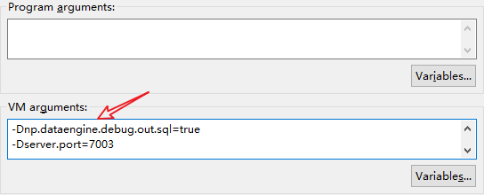

# Springboot开启不同的端口

**-Dserver.port=7003**



**Eclipse Debug配置**

```纯文本
-Dspring.config.location=C:\Users\rensiyu\Desktop\source-property\XBB_JM.properties
-Djava.io.tmpdir=C:\Users\rensiyu\Desktop\server-log\XBB_JM
-Dnp.dataengine.debug=true
-Dnp.dataengine.debug.out.sql=true
-Dserver.port=8190
```
