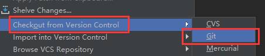
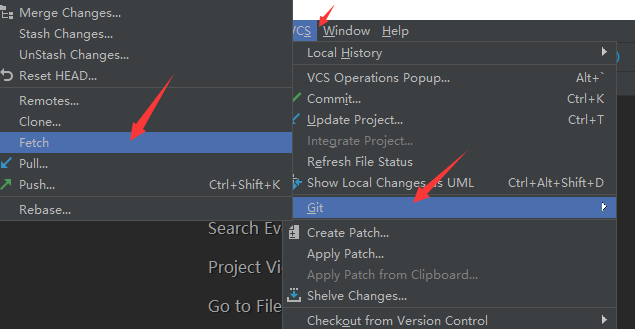
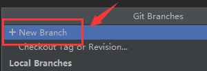
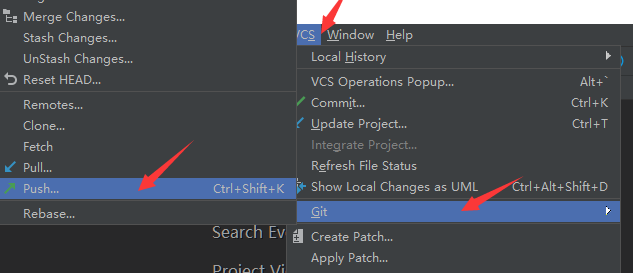
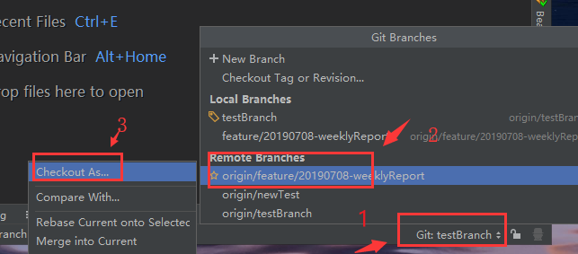
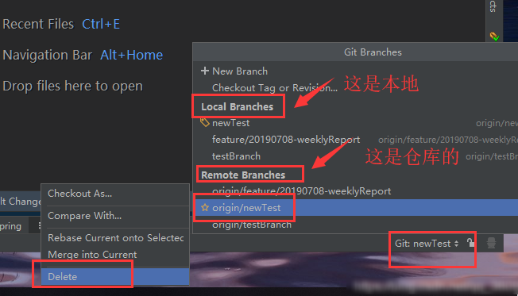
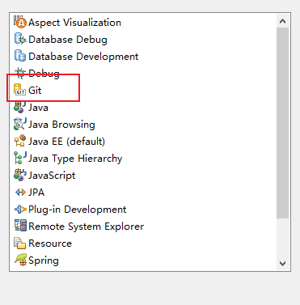
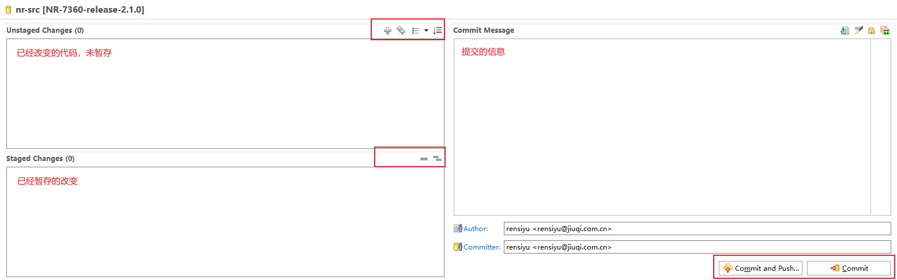

# Git实际操作

## 目录

*   [idea](#idea)

*   [eclipse](#eclipse)

## idea

1.  从远程仓库克隆到本地

    

2.  拉取远程仓库分支到本地
    该步骤主要是方便切换分支，考虑到项目实际需求，有可能会从其他分支拉（除了master外的）取到新的分支

    

3.  新建分支
    idea会自动从我们当前所选的远程分支拉取代码到我们新建的分支

    

4.  切换分支，这个时候我们查看远程分支，是看不到当前分支的，因为还没有push

5.  push新建分支到远程

    

6.  切换到其他远程分支
    直接选择我们想要切换到分支，checkout即可（**如何此处查看不到远程分支，请先进行步骤2的操作，拉取远程分支到本地**）

    

7.  合并分支merge
    如何想要merge成功，对应的分支，必须是从远程上拉取下来的，因为git对于merger操作，它自动去对比项目的提交历史，如果对比不上，就会merge失败。

    合并分支会牵涉到两个分支，比如说需要**把分支A（小编此处就是：testBranch**）合并到分支B（小编此处就是：newTest），那么我们先将本地分支checkout到分支B，再去选择分支A，**merge into current**

8.  删除分支

    

## eclipse

1.  点击Open Perspective

    

2.  选择Git

    

