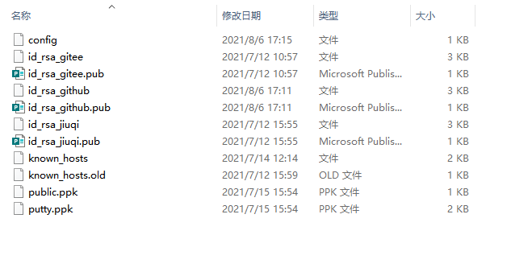

# Git操作Github、Gitee、GitLab

1.  由于你的本地 Git 仓库和 GitHub 仓库之间的传输是通过SSH加密的，所以我们需要配置验证信息：

    使用以下命令生成 SSH Key：

    `ssh-keygen -t rsa -C "761472239@qq.com"`

    ```powershell
    $ ssh-keygen -t rsa -C "761472239@qq.com"
    Generating public/private rsa key pair.
    # 这里是给秘钥文件命名
    Enter file in which to save the key (/Users/tianqixin/.ssh/id_rsa): id_rsa_github
    Enter passphrase (empty for no passphrase):    # 直接回车
    Enter same passphrase again:                   # 直接回车
    Your identification has been saved in /Users/tianqixin/.ssh/id_rsa.
    Your public key has been saved in /Users/tianqixin/.ssh/id_rsa.pub.
    The key fingerprint is:
    SHA256:MDKVidPTDXIQoJwoqUmI4LBAsg5XByBlrOEzkxrwARI 761472239@qq.com
    The key's randomart image is:
    +---[RSA 3072]----+
    |E*+.+=**oo       |
    |%Oo+oo=o. .      |
    |%**.o.o.         |
    |OO.  o o         |
    |+o+     S        |
    |.                |
    |                 |
    |                 |
    |                 |
    +----[SHA256]-----+
    ```

2.  将.pub文件的内容 添加到github平台上

## 配置文件

添加config配置文件，创建config文件

```powershell
AddKeysToAgent yes
IdentityFile ~/.ssh/id_rsa_jiuqi
IdentityFile ~/.ssh/id_rsa_gitee
IdentityFile ~/.ssh/id_rsa_github

Host gitee
  User rsy
  Hostname gitee.com


Host gitlab
  User rensiyu@jiuqi.com.cn
  Hostname nvwa.jiuqi.com.cn
  Port 2222
  
  
Host github
  User rsy
  Hostname github.com
  

```


