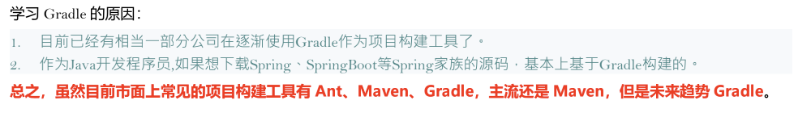
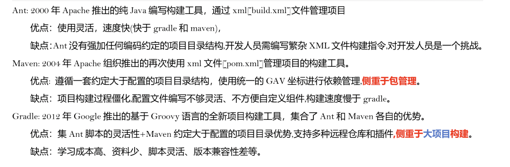
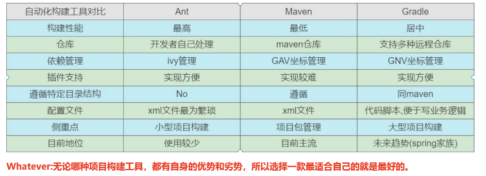
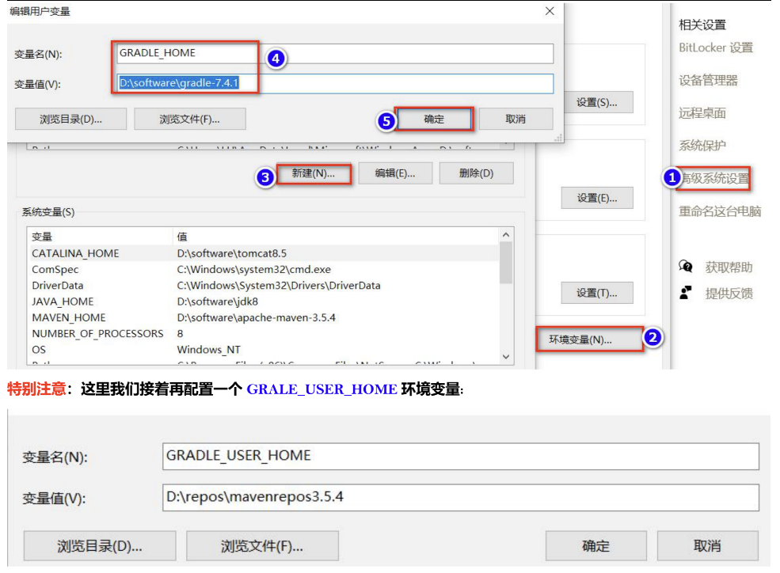
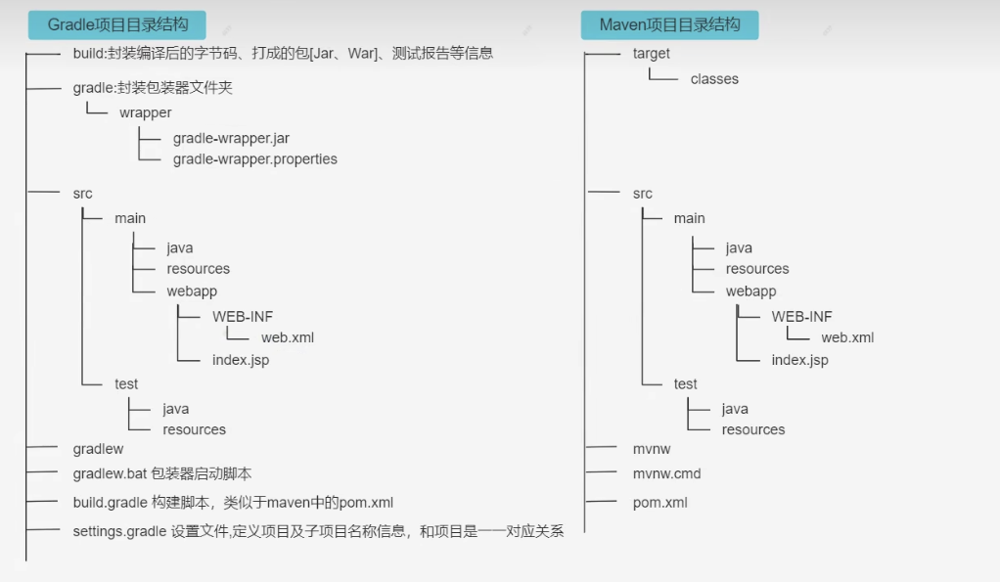
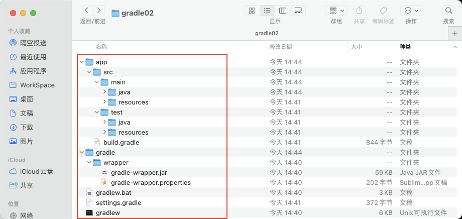
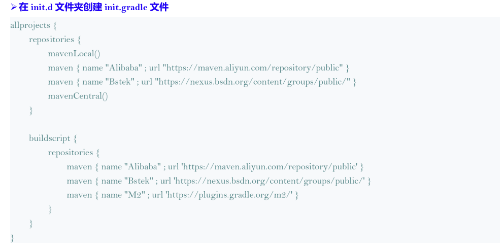
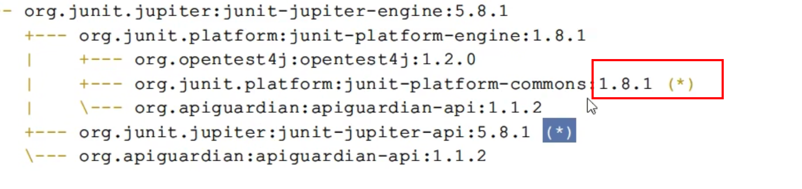

# Gradle学习笔记

## 目录

* [1、Gradle入门](#1gradle入门)
  
  * [1.1、Gradle简介](#11gradle简介)
  
  * [1.2、常见的项目构建工具](#12常见的项目构建工具)
  
  * [1.3、Gradle安装](#13gradle安装)
  
  * [1.4、Gradle项目目录结构](#14gradle项目目录结构)
  
  * [1.5、Gradle创建第一个项目](#15gradle创建第一个项目)
    
    * [1.5.1、Gradle常见的指令](#151gradle常见的指令)
    
    * [1.5.2、修改maven下载源](#152修改maven下载源)
  
  * [buildScript、allprojects、根级别中的repositories属性有何区别](#buildscriptallprojects根级别中的repositories属性有何区别)
  
  * [Wrapper包装器](#wrapper包装器)

# 1、Gradle入门

## 1.1、Gradle简介

* Gradle 是一款 Google 推出的基于 JVM、通用灵活的项目构建工具，支持 Maven，JCenter 多种第三方仓库

* 支持传递性 依赖管理、废弃了繁杂的 xml 文件，转而使用简洁的、支持多种语言(例如：java、groovy 等)的 build 脚本文件。&#x20;

* 官网地址: [https://gradle.org/](https://gradle.org/ "https://gradle.org/")



## 1.2、常见的项目构建工具





## 1.3、Gradle安装

SpringBoot 官方文档明确指出,目前 SpringBoot 的 Gradle 插件需要 gradle6.8 版本及以上，所以我们这里选择 7.x 版本。

其中 SpringBoot 与 Gradle 存在版本兼容问题，Gradle 与 Idea 也存在兼容问题，所以考虑到 java 程序员会使用 SpringBoot， 所以要选择 6.8 版本及高于 6.8 版本的 Gradle,那么相应的 idea 版本也要升级,不能太老哦。 具体参考文档:[https://docs.spring.io/spring-boot/docs/2.5.0/gradle-plugin/reference/htmlsingle/#getting-started](https://docs.spring.io/spring-boot/docs/2.5.0/gradle-plugin/reference/htmlsingle/#getting-started "https://docs.spring.io/spring-boot/docs/2.5.0/gradle-plugin/reference/htmlsingle/#getting-started")

**配置环境变量**：



**GRALE\_USER\_HOME 相当于配置 Gradle 本地仓库位置和 Gradle Wrapper 缓存目录。**

**检测是否安装成功**：

gradle -v 或者 gradle --version: 通过gradle -v或者 gradle --version检测是否安装成功

## 1.4、Gradle项目目录结构

Gradle 项目默认目录结构和 Maven 项目的目录结构一致,都是基于约定大于配置【Convention Over Configuration】



1. gradlew\.bat 是windows系统的执行脚本。

2. gradlew 是其他系统的执行脚本，实际上是执行的是wrapper目录下的指定版本的gradle的指令，不是本地的gradle的指令。如果要执行本地的gradle指令，那么wrapper文件夹和gradlew以及gradlew\.bat就没有用，可以删除。

3. 只有war工程才有webapp目录，对于普通的jar工程并没有webapp目录

4. gradlew与gradlew\.bat执行的指定wrapper版本中的gradle指令,不是本地安装的gradle指令哦。

## 1.5、Gradle创建第一个项目

使用命令创建

```纯文本
rsy@localhost gradle-test % gradle init
Starting a Gradle Daemon (subsequent builds will be faster)

Select type of project to generate:
  1: basic
  2: application
  3: library
  4: Gradle plugin
Enter selection (default: basic) [1..4] 2

Select implementation language:
  1: C++
  2: Groovy
  3: Java
  4: Kotlin
  5: Scala
  6: Swift
Enter selection (default: Java) [1..6] 3

Split functionality across multiple subprojects?:
  1: no - only one application project
  2: yes - application and library projects
Enter selection (default: no - only one application project) [1..2] 1

Select build script DSL:
  1: Groovy
  2: Kotlin
Enter selection (default: Groovy) [1..2] 1

Select test framework:
  1: JUnit 4
  2: TestNG
  3: Spock
  4: JUnit Jupiter
Enter selection (default: JUnit 4) [1..4] 1

Project name (default: gradle-test): gradle02
Source package (default: gradle02): com.rty.gradle 

> Task :init
Get more help with your project: https://docs.gradle.org/6.8.3/samples/sample_building_java_applications.html

BUILD SUCCESSFUL in 1m 26s
2 actionable tasks: 2 executed
```



### 1.5.1、Gradle常见的指令

1. gradle clean 清空build目录

2. gradle classes 编译业务代码和配置文件（main目录下的所有代码和配置文件）

3. gradle test 编译测试代码，生成测试报告

4. gradle build 构建项目，项目的编译测试打包部署等整个流程

5. gradle build -x test 跳过测试构建

> PS: **gradle 的指令要在含有 build.gradle 的目录执行**。

### 1.5.2、修改maven下载源

在gradle的init.d目录下创建以.gradle结尾的文件。

.gradle 文件可以实现在 build 开始之前执行，所以你可以在 这个文件配置一些你想预先加载的操作。



## buildScript、allprojects、根级别中的repositories属性有何区别

* buildscript里是gradle脚本执行所需依赖，分别是对应的maven库和插件，主要是为了 Gradle 脚本自身执行，获取脚本依赖插件，buildscript中的声明是gradle脚本自身需要使用的资源。可以声明的资源包括依赖项、第三方插件、maven仓库地址等。

* allprojects里是项目本身需要的依赖，比如我现在要依赖我自己maven库的toastutils库，那么我应该将maven {url '[https://dl.bigitntray.com/calvinning/maven](https://dl.bigitntray.com/calvinning/maven‘ "https://dl.bigitntray.com/calvinning/maven")'}写在这里，而不是buildscript 中,不然找不到。

* allprojects块的 repositories 多用于项目构建，为所有项目提供共同的依赖包。子项目也可以配置自己的repositories以获取自己独需的依赖包 ，声明的依赖项、仓库地址等信息是项目自身需要的资源。

## Wrapper包装器

1. gradle clean 清空build目录

2. gradle classes 编译业务代码和配置文件（main目录下的所有代码和配置文件）

3. gradle test 编译测试代码，生成测试报告

4. gradle build 构建项目，项目的编译测试打包部署等整个流程

5. gradle build -x test 跳过测试构建

> PS: **gradle 的指令要在含有 build.gradle 的目录执行**。



其中有✳️的表示有jar包冲突的，优先使用高版本的jar

gradle.properties 文件是，当前项目的全局配置；init.gradle是所有项目的全局配置

CompileJava 就是将src下的main/java    目录下的代码编译

processResources将src下main/resources 下，业务逻辑代码执行所需要的配置文件进行编译处理
