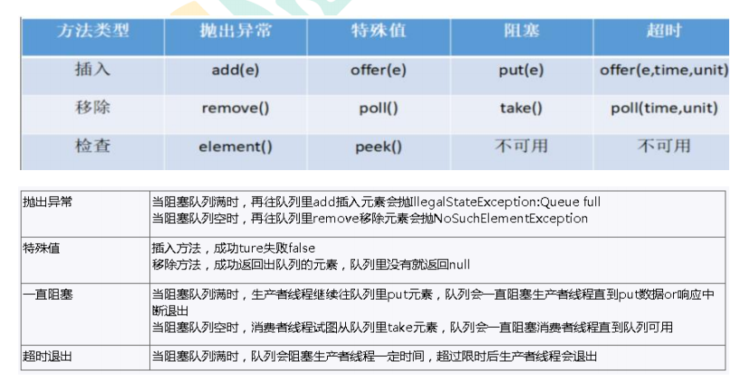

# 10、阻塞队列

## 目录

* [BlockingQueue核心方法](#blockingqueue核心方法)

* [ArrayBlockingQueue(常用)](#arrayblockingqueue常用)
  
  * [ ArrayBlockingQueue(常用)](#-arrayblockingqueue常用)
  
  * [LinkedBlockingQueue(常用)](#linkedblockingqueue常用)
  
  * [DelayQueue](#delayqueue)
  
  * [PriorityBlockingQueue](#priorityblockingqueue)
  
  * [SynchronousQueue](#synchronousqueue)
  
  * #linkedtransferqueue
  
  * [LinkedBlockingDeque](#linkedblockingdeque)

## BlockingQueue核心方法

## ArrayBlockingQueue(常用)

### ArrayBlockingQueue(常用)

基于数组的阻塞队列实现

一句话总结: 由数组结构组成的有界阻塞队列。

### LinkedBlockingQueue(常用)

基于链表的阻塞队列

ArrayBlockingQueue 和 LinkedBlockingQueue 是两个最普通也是最常用的阻塞队列，一般情况下，在处理多线程间的生产者消费者问题，使用这两个类足以。

一句话总结: 由链表结构组成的有界（但大小默认值为integer.MAX\_VALUE）阻塞队列。

### DelayQueue

DelayQueue 中的元素只有当其指定的延迟时间到了，才能够从队列中获取到
该元素。DelayQueue 是一个没有大小限制的队列，因此往队列中插入数据的
操作（生产者）永远不会被阻塞，而只有获取数据的操作（消费者）才会被阻
塞。

一句话总结: 使用优先级队列实现的延迟无界阻塞队列。

### PriorityBlockingQueue

基于优先级的阻塞队列（优先级的判断通过构造函数传入的 Compator 对象来
决定），但需要注意的是 PriorityBlockingQueue 并不会阻塞数据生产者，而
只会在没有可消费的数据时，阻塞数据的消费者。
因此使用的时候要特别注意，生产者生产数据的速度绝对不能快于消费者消费
数据的速度，否则时间一长，会最终耗尽所有的可用堆内存空间。
在实现 PriorityBlockingQueue 时，内部控制线程同步的锁采用的是公平锁。

一句话总结: 支持优先级排序的无界阻塞队列。

### SynchronousQueue

### LinkedTransferQueue

### LinkedBlockingDeque
