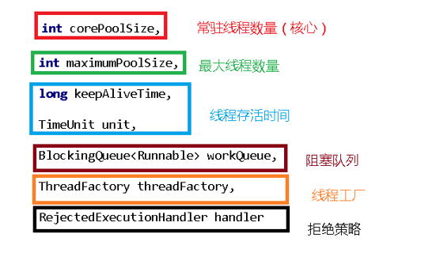
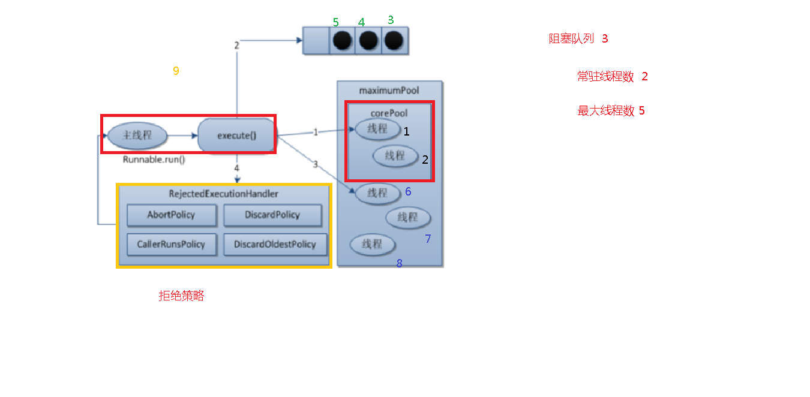
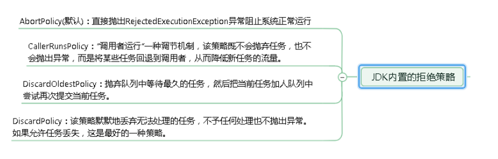
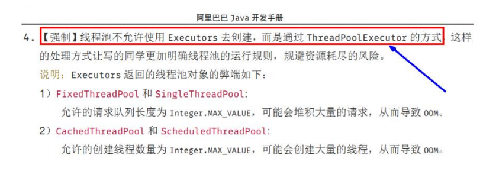

# 11、ThreadPool 线程池

## 目录

* [线程池的使用](#线程池的使用)

* [线程池七个参数](#线程池七个参数)

* [工作流程](#工作流程)

* [拒绝策略](#拒绝策略)

* [自定义线程池](#自定义线程池)

## 线程池的使用

**Executors**工具类

```java
newFixedThreadPool(int nThreads)
```

**可以创建一个有固定数量的线程池**

```java
newSingleThreadExecutor()
```

创建一个使用单个 worker 线程的 Executor，以无界队列方式来运行该线程。（注意，如果因为在关闭前的执行期间出现失败而终止了此单个线程，那么如果需要，一个新线程将代替它执行后续的任务）。可保证顺序地执行各个任务，并且在任意给定的时间不会有多个线程是活动的。与其他等效的 newFixedThreadPool(1) 不同，可保证无需重新配置此方法所返回的执行程序即可使用其他的线程。

**一个任务一个任务的执行，一个线程池一个线程**

```java
newCachedThreadPool()
```

线程池根据需求创建线程，可以扩容

## 线程池七个参数



## 工作流程



1. 创建了线程池后，线程池中的线程数为0；

2. 当调用execute()方法添加一个请求任务时，线程池判断
   
   1. 如果正在运行的线程数量小于 corePoolSize，马上创建线程运行这个任务；
   
   2. 如果正在运行的线程数量大于或等于 corePoolSize，那么将这个任务放入队列；
   
   3. 如果这个时候队列满了且正在运行的线程数量并且小于maximumPoolSize，那么还是要创建非核心线程立刻运行这个任务；
   
   4. 如果队列满了且正在运行的线程数量大于或等于 maximumPoolSize，那么线程池会启动饱和拒绝策略来执行。

3. 当一个线程完成任务时，它会从队列中取下一个任务来执行

4. 当一个线程无事可做超过一定的时间（keepAliveTime）时，线程会判断：
   
   1. &#x20;如果当前运行的线程数大于 corePoolSize，那么这个线程就被停掉。
   
   2. 线程池的所有任务完成后，它最终会收缩到 corePoolSize 的大小。

## 拒绝策略



## 自定义线程池

实际开发中一般使用自定义的线程池

创建线程池推荐适用 ThreadPoolExecutor 及其 7 个参数手动创建

* corePoolSize 线程池的核心线程数

* maximumPoolSize 能容纳的最大线程数

* keepAliveTime 空闲线程存活时间

* unit 存活的时间单位

* workQueue 存放提交但未执行任务的队列

* threadFactory 创建线程的工厂类

* handler 等待队列满后的拒绝策略

为什么不允许适用不允许 Executors.的方式手动创建线程池，如下图



```java
package com.atguigu.pool;

import java.util.concurrent.*;

//自定义线程池创建
public class ThreadPoolDemo2 {
    public static void main(String[] args) {
        ExecutorService threadPool = new ThreadPoolExecutor(
                2,
                5,
                2L,
                TimeUnit.SECONDS,
                new ArrayBlockingQueue<>(3),
                Executors.defaultThreadFactory(),
                new ThreadPoolExecutor.AbortPolicy()
        );

        //10个顾客请求
        try {
            for (int i = 1; i <=10; i++) {
                //执行
                threadPool.execute(()->{
                    System.out.println(Thread.currentThread().getName()+" 办理业务");
                });
            }
        }catch (Exception e) {
            e.printStackTrace();
        }finally {
            //关闭
            threadPool.shutdown();
        }
    }
}
```
