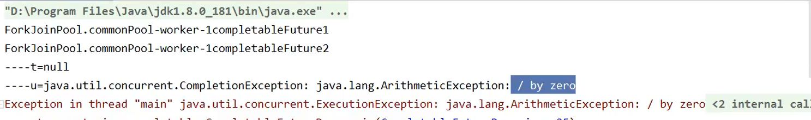

# 13、异步回调CompletableFuture

## 目录

*   [使用 CompletableFuture](#使用-completablefuture)

*   [没有返回值的异步任务](#没有返回值的异步任务)

## 使用 CompletableFuture

场景:主线程里面创建一个 CompletableFuture，然后主线程调用 get 方法会

阻塞，最后我们在一个子线程中使其终止。

```java
/**
* 主线程里面创建一个 CompletableFuture，然后主线程调用 get 方法会阻塞，最后我们
在一个子线程中使其终止
* @param args
*/
public static void main(String[] args) throws Exception{
    CompletableFuture<String> future = new CompletableFuture<>();
    new Thread(() -> {
    try{
        System.out.println(Thread.currentThread().getName() + "子线程开始干活");
        //子线程睡 5 秒
        Thread.sleep(5000);
        //在子线程中完成主线程
        future.complete("success");
      }catch (Exception e){
        e.printStackTrace();
      }
    }, "A").start();
    //主线程调用 get 方法阻塞
    System.out.println("主线程调用 get 方法获取结果为: " + future.get());
    System.out.println("主线程完成,阻塞结束!!!!!!");
}
```

## 没有返回值的异步任务

```java
package com.atguigu.completable;

import java.util.concurrent.CompletableFuture;
import java.util.concurrent.ExecutionException;

//异步调用和同步调用
public class CompletableFutureDemo {
    public static void main(String[] args) throws Exception {
        //同步调用
        CompletableFuture<Void> completableFuture1 = CompletableFuture.runAsync(()->{
            System.out.println(Thread.currentThread().getName()+" : CompletableFuture1");
        });
        completableFuture1.get();

        //mq消息队列
        //异步调用
        CompletableFuture<Integer> completableFuture2 = CompletableFuture.supplyAsync(()->{
            System.out.println(Thread.currentThread().getName()+" : CompletableFuture2");
            //模拟异常
            int i = 10/0;
            return 1024;
        });
        completableFuture2.whenComplete((t,u)->{
            System.out.println("------t="+t);
            System.out.println("------u="+u);
        }).get();

    }
}

```


