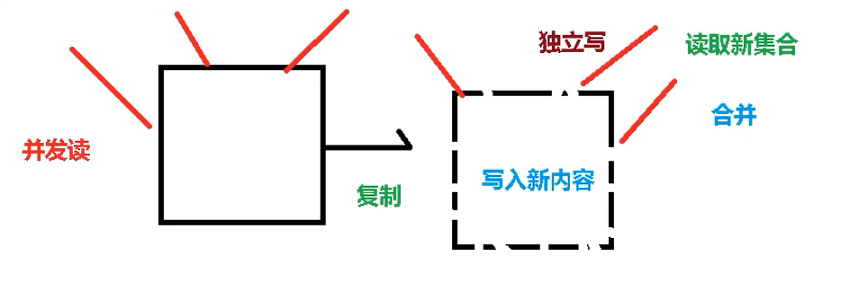
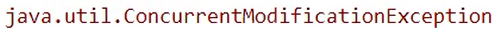

# 5、集合的线程安全

## 目录

*   [1. ArrayList集合线程不安全演示](#1-arraylist集合线程不安全演示)

*   [2. 解决方案Vector](#2-解决方案vector)

*   [3. 解决方案Collections](#3-解决方案collections)

*   [4. 解决方案CopyOnWriteArrayList](#4-解决方案copyonwritearraylist)

*   [5. HashSet和HashMap线程不安全](#5-hashset和hashmap线程不安全)

## 1. ArrayList集合线程不安全演示

list集合线程不安全

比如ArrayList线程不安全，其add函数没有加synchronize关键字


那么如何解决线程不安全问题？方案有三种

## 2. 解决方案Vector

使用`List list = new Vector();`，可以创建一个线程安全的集合，

但是这个方案比较古老，是JDK1.0的时候的解决方案，不推荐！！！

## 3. 解决方案Collections

方案古老，不推荐！！！

`public static <T> List<T> synchronizedList(List<T> list)`

返回指定列表支持的同步（线程安全的）列表。

```java
  List list = Collections.synchronizedList(new ArrayList());
      ...
  synchronized(list) {
      Iterator i = list.iterator(); // Must be in synchronized block
      while (i.hasNext())
          foo(i.next());
  }
```

## 4. 解决方案CopyOnWriteArrayList

`List list = new CopyOnWriteArrayList<>();`

CopyOnWriteArrayList 原理

copy 和 write ，可以理解为（写时复制技术）

“并发读，独立写”

> 理解：读的时候是并发的读，如果需要写，先要复制一份原来的内容，独立写，之后合并或者覆盖，最后读取新的集合



**源码分析**


## 5. HashSet和HashMap线程不安全

在多线程的情况下，它俩也会出现**并发修改问题**



HashSet底层是一个HashMap

**解决方案：**

`Set set = new CopyOnWriteHashSet<>();`

`Map map = new CopyOnWriteHashMap<>()`
