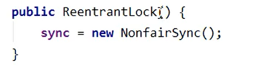
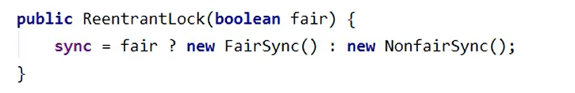
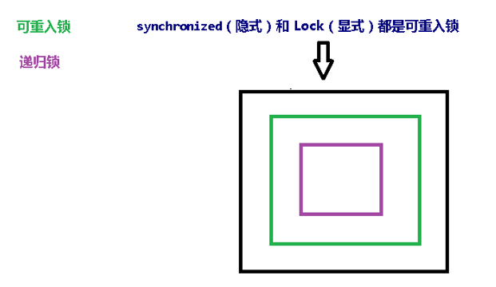
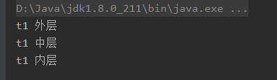
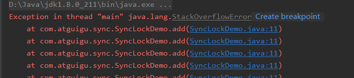

# 6、多线程锁

## 目录

*   [1. Synchronized锁的八种情况](#1-synchronized锁的八种情况)

*   [2. 公平锁和非公平锁](#2-公平锁和非公平锁)

*   [3. 可重入锁](#3-可重入锁)

    *   [3.1 代码案例](#31-代码案例)

    *   [3.2 层层上锁、层层释放](#32-层层上锁层层释放)

*   [4. 死锁](#4-死锁)

## 1. Synchronized锁的八种情况

一个对象里面如果有多个 synchronized 方法，某一个时刻内，只要一个线程去调用其中的
一个 synchronized 方法了，
其它的线程都只能等待，换句话说，某一个时刻内，只能有唯一一个线程去访问这些
synchronized 方法
锁的是当前对象 this，被锁定后，其它的线程都不能进入到当前对象的其它的
synchronized 方法
加个普通方法后发现和同步锁无关
换成两个对象后，不是同一把锁了，情况立刻变化。
synchronized 实现同步的基础：Java 中的每一个对象都可以作为锁。
具体表现为以下 3 种形式。
**对于普通同步方法，锁是当前实例对象。
对于静态同步方法，锁是当前类的 Class 对象。
对于同步方法块，锁是 Synchonized 括号里配置的对象**
当一个线程试图访问同步代码块时，它首先必须得到锁，退出或抛出异常时必须释放锁。
也就是说如果一个实例对象的非静态同步方法获取锁后，该实例对象的其他非静态同步方
法必须等待获取锁的方法释放锁后才能获取锁，
可是别的实例对象的非静态同步方法因为跟该实例对象的非静态同步方法用的是不同的锁，
所以毋须等待该实例对象已获取锁的非静态同步方法释放锁就可以获取他们自己的锁。
所有的静态同步方法用的也是同一把锁——类对象本身，这两把锁是两个不同的对象，所
以静态同步方法与非静态同步方法之间是不会有竞态条件的。
但是一旦一个静态同步方法获取锁后，其他的静态同步方法都必须等待该方法释放锁后才
能获取锁，而不管是同一个实例对象的静态同步方法之间，还是不同的实例对象的静态同
步方法之间，只要它们同一个类的实例对象！

## 2. 公平锁和非公平锁

比如这种锁，默认是不公平的，在构造器中传参（布尔类型的可以设置锁的类型）





*   非公平锁：容易线程饿死，效率高

*   公平锁：每个线程都有用到，效率低，多了一些判断操作

## 3. 可重入锁

*   可重入锁也叫（递归锁）

*   通过一把锁可以进入里面的各个区域

    

### 3.1 代码案例

*   可重入锁：

```java
Object o = new Object();
new Thread(()->{
    synchronized(o) {
        System.out.println(Thread.currentThread().getName()+" 外层");

        synchronized (o) {
            System.out.println(Thread.currentThread().getName()+" 中层");

            synchronized (o) {
                System.out.println(Thread.currentThread().getName()+" 内层");
            }
        }
    }

},"t1").start();
```



*   递归调用同步方法：

```java
package com.atguigu.sync;

import java.util.concurrent.locks.Lock;
import java.util.concurrent.locks.ReentrantLock;
import java.util.concurrent.locks.ReentrantReadWriteLock;

//可重入锁
public class SyncLockDemo {

    public synchronized void add() {
        add();
    }

    public static void main(String[] args) {
       new SyncLockDemo().add();
       // synchronized

    }

}

```



> 1）如果说，add方法的锁不是可重入锁，那么就不存在递归调用，也就不会报错
> 2）synchronized锁是一个隐式锁，不需要关心上锁解锁

### 3.2 层层上锁、层层释放

上几层锁，就要释放几层锁

```java
//Lock演示可重入锁
        Lock lock = new ReentrantLock();
        //创建线程
        new Thread(() -> {
            try {
                //上锁
                lock.lock();
                System.out.println(Thread.currentThread().getName() + " 外层");
                try {
                    //上锁
                    lock.lock();
                    System.out.println(Thread.currentThread().getName() + " 内层");
                } finally {
                    //释放锁
                    lock.unlock();
                }
            } finally {
                //释放做
                lock.unlock();
            }
        }, "t1").start();

        //创建新线程
        new Thread(() -> {
            lock.lock();
            System.out.println("aaaa");
            lock.unlock();
        }, "aa").start();
```

## 4. 死锁

判断发生死锁

`jps -l`
