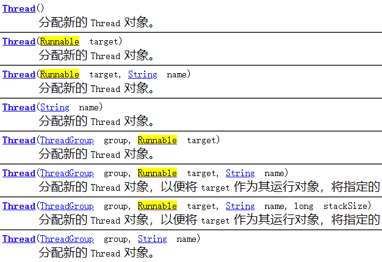
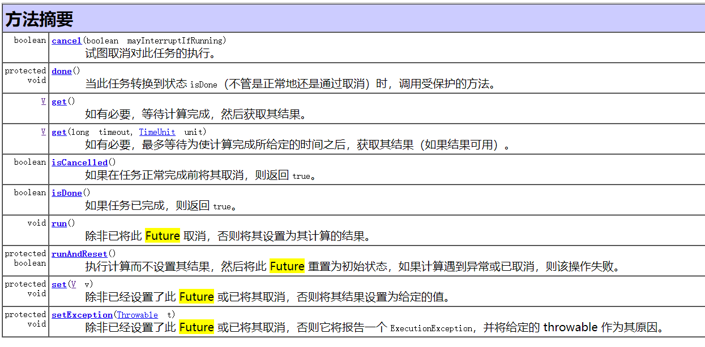
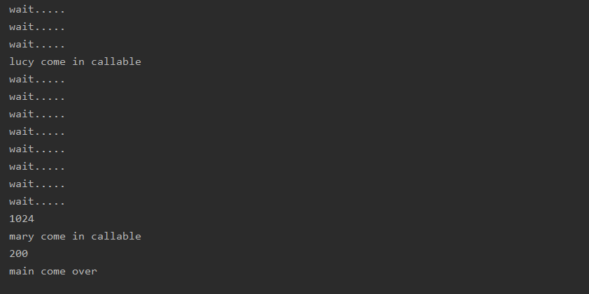

# 7、Callable接口

## 目录

*   [1. 创建线程的几种方法](#1-创建线程的几种方法)

*   [2. FutureTask概述](#2-futuretask概述)

*   [3. FutureTask原理](#3-futuretask原理)

*   [4. 创建线程](#4-创建线程)

## 1. 创建线程的几种方法

1）继承Thread类

2）实现Runnable接口

3）Callable接口

4）线程池方式


## 2. FutureTask概述

1）为了实现 Runnable，需要实现不返回任何内容的 run（）方法，而对于
Callable，需要实现在完成时返回结果的 call（）方法。

2）call（）方法可以引发异常，而 run（）则不能。

3）为实现 Callable 而必须重写 call 方法。

4）不能直接替换 runnable，因为 Thread 类的构造方法根本没有 Callable



```java
//创建新类 MyThread 实现 runnable 接口
class MyThread implements Runnable{
  @Override
  public void run() {
  }
}
//新类 MyThread2 实现 callable 接口
class MyThread2 implements Callable<Integer>{
  @Override
  public Integer call() throws Exception {
    return 200; 
  }
}
```

## 3. FutureTask原理

FutureTask未来任务

> 理解：
> 1\. 老师上课口渴了，自己去买水不合适，上课的线程继续。
> 开启一个单线程找到班长去帮老师买水，班长买完水，老师需要水的时候执行`get()` 方法。
> 2\. `get()`方法一般都是将函数方法最后执行的结果返回。



## 4. 创建线程

创建方式：

```java
// 方式一：FutureTask
FutureTask<Integer> futureTask1 = new FutureTask<>(new MyThread2());

// 方式二：lam表达式
FutureTask<Integer> futureTask2 = new FutureTask<>(()->{
    System.out.println(Thread.currentThread().getName()+" come in callable");
    return 1024;
});
```

详细案例：

```java
//实现Callable接口
class MyThread1 implements Callable {
    @Override
    public Integer call() throws Exception {
        System.out.println(Thread.currentThread().getName()+" come in callable");
        return 200;
    }
}

public class Demo1 {
    public static void main(String[] args) throws ExecutionException, InterruptedException {
        //FutureTask
        FutureTask<Integer> futureTask1 = new FutureTask<>(new MyThread1());
        //lam表达式
        FutureTask<Integer> futureTask2 = new FutureTask<>(()->{
            System.out.println(Thread.currentThread().getName()+" come in callable");
            return 1024;
        });

        //创建一个线程
        new Thread(futureTask2,"lucy").start();
        new Thread(futureTask1,"mary").start();

        while(!futureTask2.isDone()) {
            System.out.println("wait.....");
        }
        //调用FutureTask的get方法
        System.out.println(futureTask2.get());

        System.out.println(futureTask1.get());

        System.out.println(Thread.currentThread().getName()+" come over");
        //FutureTask原理  未来任务
        /**
         * 1、老师上课，口渴了，去买票不合适，讲课线程继续。
         *   单开启线程找班上班长帮我买水，把水买回来，需要时候直接get
         *
         * 2、4个同学， 1同学 1+2...5   ，  2同学 10+11+12....50， 3同学 60+61+62，  4同学 100+200
         *      第2个同学计算量比较大，
         *     FutureTask单开启线程给2同学计算，先汇总 1 3 4 ，最后等2同学计算位完成，统一汇总
         *
         * 3、考试，做会做的题目，最后看不会做的题目
         *
         * 汇总一次
         *
         */
    }
}

```


