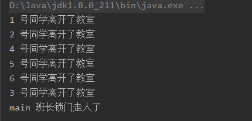

# 8、JUC辅助类

## 目录

*   [1. 减少计数器CountDownLatch](#1-减少计数器countdownlatch)

    *   [使用场景](#使用场景)

*   [2. 循环栅栏 CyclicBarrier](#2-循环栅栏-cyclicbarrier)

    *   [使用场景](#使用场景-1)

*   [3. 信号灯 Semaphore](#3-信号灯-semaphore)

    *   [使用场景](#使用场景-2)

## 1. 减少计数器CountDownLatch

CountDownLatch类可以设置一个计数器，然后通过countDown方法来进行减1的操作，使用await方法等待计数器不大于0，然后继续执行await方法之后的语句。

*   CountDownLatch主要有两个方法，当一个或多个线程调用await方法时，这些线程会阻塞，其他线程调用countDown方法会将计数器减1（调用countDown方法的线程不会阻塞）

*   当计数器的值变为 0 时，因 await 方法阻塞的线程会被唤醒，继续执行

### 使用场景

1）6个同学陆续离开教室之后，班长锁门

```java
package com.atguigu.juc;

import java.util.concurrent.CountDownLatch;

//演示 CountDownLatch
public class CountDownLatchDemo {
    //6个同学陆续离开教室之后，班长锁门
    public static void main(String[] args) throws InterruptedException {

        //创建CountDownLatch对象，设置初始值
        CountDownLatch countDownLatch = new CountDownLatch(6);

        //6个同学陆续离开教室之后
        for (int i = 1; i <=6; i++) {
            new Thread(()->{
                System.out.println(Thread.currentThread().getName()+" 号同学离开了教室");

                //计数  -1
                countDownLatch.countDown();

            },String.valueOf(i)).start();
        }

        //等待
        countDownLatch.await();

        System.out.println(Thread.currentThread().getName()+" 班长锁门走人了");
    }
}

```



## 2. 循环栅栏 CyclicBarrier

一个同步辅助类，它允许一组线程互相等待，直到到达某个公共屏障点 (common barrier point)。在涉及一组固定大小的线程的程序中，这些线程必须不时地互相等待，此时 CyclicBarrier 很有用。因为该 barrier 在释放等待线程后可以重用，所以称它为循环 的 barrier。

CyclicBarrier 看英文单词可以看出大概就是循环阻塞的意思，在使用中CyclicBarrier 的构造方法第一个参数是目标障碍数，每次执行 CyclicBarrier 一次障碍数会加一，如果达到了目标障碍数，才会执行 cyclicBarrier.await()之后的语句。可以将 CyclicBarrier 理解为加 1 操作。

`CyclicBarrier(int parties, Runnable barrierAction)`

创建一个新的 CyclicBarrier，它将在给定数量(`parties`)的参与者（线程）处于等待状态时启动，并在启动 barrier 时执行给定的屏障操作，该操作由最后一个进入 barrier 的线程执行。

### 使用场景

集齐 7 颗龙珠就可以召唤神龙

```java
//集齐7颗龙珠就可以召唤神龙
public class CyclicBarrierDemo {

    //创建固定值
    private static final int NUMBER = 7;

    public static void main(String[] args) {
        //创建CyclicBarrier
        CyclicBarrier cyclicBarrier =
                new CyclicBarrier(NUMBER,()->{
                    System.out.println("*****集齐7颗龙珠就可以召唤神龙");
                });

        //集齐七颗龙珠过程
        for (int i = 1; i <=7; i++) {
            new Thread(()->{
                try {
                    System.out.println(Thread.currentThread().getName()+" 星龙被收集到了");
                    //等待
                    cyclicBarrier.await();
                } catch (Exception e) {
                    e.printStackTrace();
                }
            },String.valueOf(i)).start();
        }
    }
}

```

## 3. 信号灯 Semaphore

Semaphore 的构造方法中传入的第一个参数是最大信号量（可以看成最大线程池），每个信号量初始化为一个最多只能分发一个许可证。使用 acquire 方法获得许可证，release 方法释放许可

### 使用场景

&#x20;抢车位, 6 部汽车 3 个停车位

```java
//6辆汽车，停3个车位
public class SemaphoreDemo {
    public static void main(String[] args) {
        //创建Semaphore，设置许可数量
        Semaphore semaphore = new Semaphore(3);

        //模拟6辆汽车
        for (int i = 1; i <=6; i++) {
            new Thread(()->{
                try {
                    //抢占
                    semaphore.acquire();

                    System.out.println(Thread.currentThread().getName()+" 抢到了车位");

                    //设置随机停车时间
                    TimeUnit.SECONDS.sleep(new Random().nextInt(5));

                    System.out.println(Thread.currentThread().getName()+" ------离开了车位");
                } catch (InterruptedException e) {
                    e.printStackTrace();
                } finally {
                    //释放
                    semaphore.release();
                }
            },String.valueOf(i)).start();
        }
    }
}

```
