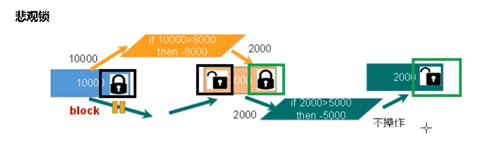
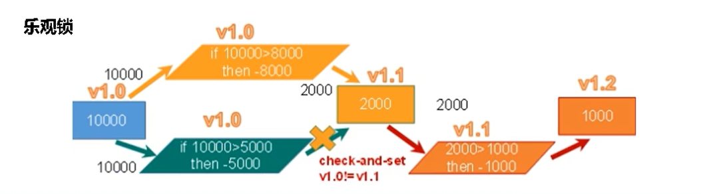
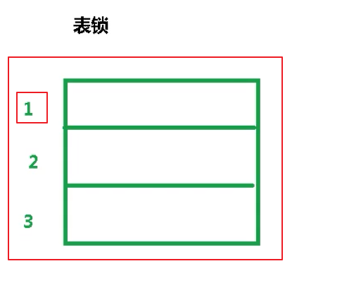
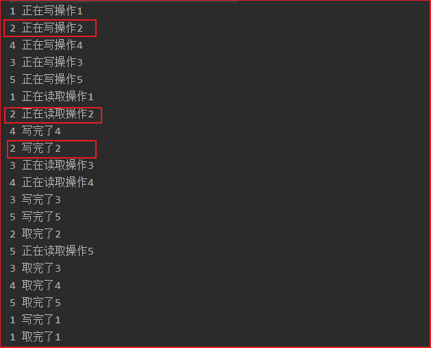
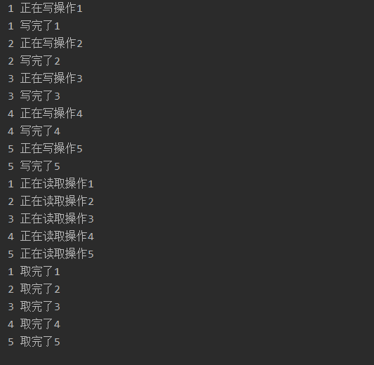
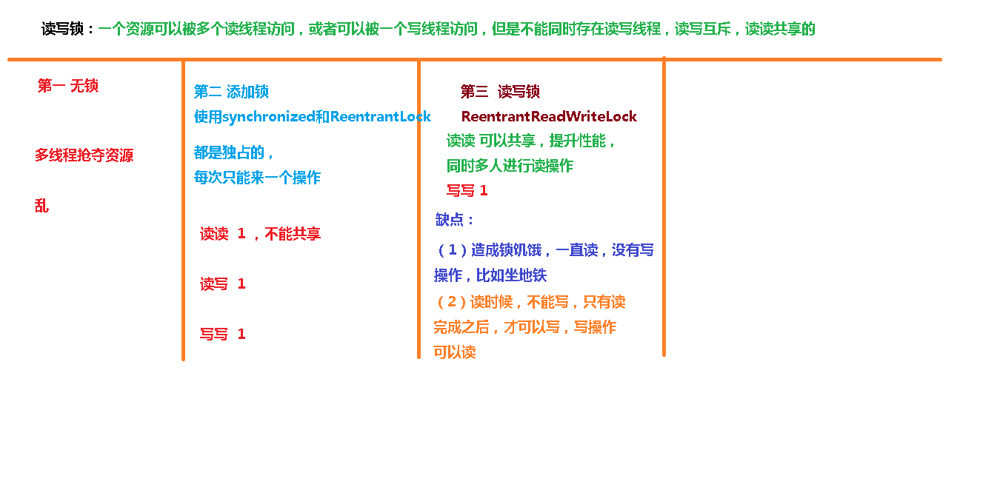

# 9、读写锁

## 目录

*   [悲观锁](#悲观锁)

*   [乐观锁](#乐观锁)

*   [表锁](#表锁)

*   [行锁](#行锁)

*   [读写锁ReadWriteLock](#读写锁readwritelock)

*   [读写锁案例实现](#读写锁案例实现)

*   [读写锁的演变](#读写锁的演变)

*   [读写锁的降级](#读写锁的降级)

## 悲观锁



一个人操作账户，先上锁，别人不能操作，等这个人操作完之后，解锁，然后别人操作，上锁，然后解锁。
这样一些系列过程上锁、解锁，就是悲观锁。

*   优点：能解决并发中的各种问题
    悲观并发控制采取的是保守策略：**“先取锁，成功了才访问数据”，这保证了数据获取和修改都是有序进行的**，因此适合在写多读少的环境中使用。当然使用悲观锁无法维持非常高的性能，但是在乐观锁也无法提供更好的性能前提下，悲观锁却可以做到**保证数据的安全性。**

*   缺点：
    依赖数据库锁，效率低；
    处理加锁的机制会让数据库产生额外的开销，还有增加产生死锁的机会；
    降低了并行性，一个事务如果锁定了某行数据，其他事务就必须等待该事务处理完才可以处理那行数据。

参考：[浅析悲观锁与乐观锁 - Debug客栈](https://www.debuginn.cn/4579.html "浅析悲观锁与乐观锁 - Debug客栈")

## 乐观锁



添加了版本号，支持并发

*   【**优点**】
    乐观锁相信事务之间的数据竞争(data race)的概率是比较小的，因此尽可能直接做下去，直到提交的时候才去锁定，所以不会产生任何锁和死锁；
    可以快速响应事务，随着并发量增加，但会出现大量回滚出现；
    效率高，但是要控制好锁的力度。

*   **【缺点】**
    如果直接简单这么做，还是有可能会遇到不可预期的结果，例如两个事务都读取了数据库的某一行，经过修改以后写回数据库，这时就遇到了问题；
    随着并发量增加，但会出现大量回滚出现。

## 表锁

当操作第一条记录的时候，对整张表都进行上锁。



## 行锁

当操作第一条记录的时候，别人可以操作其他记录。

**表锁不会死锁，行锁会发生死锁**

## 读写锁ReadWriteLock

现实中有这样一种场景：对共享资源有读和写的操作，且写操作没有读操作那
么频繁。在没有写操作的时候，多个线程同时读一个资源没有任何问题，所以
应该允许多个线程同时读取共享资源；但是如果一个线程想去写这些共享资源，
就不应该允许其他线程对该资源进行读和写的操作了。

针对这种场景，**JAVA 的并发包提供了读写锁 ReentrantReadWriteLock，
它表示两个锁，一个是读操作相关的锁，称为共享锁；一个是写相关的锁，称
为排他锁**


两条线程，都对同一数据进行先读后写，读是共享锁不影响同时进锁，但在写（排它锁）之前必须没有锁，所以同时等待，于是死锁

## 读写锁案例实现

【未加锁】



【加锁】



【代码】

```java
package com.atguigu.readwrite;

import java.util.HashMap;
import java.util.Map;
import java.util.concurrent.TimeUnit;
import java.util.concurrent.locks.Lock;
import java.util.concurrent.locks.ReadWriteLock;
import java.util.concurrent.locks.ReentrantReadWriteLock;

//资源类
class MyCache {
    //创建map集合
    private volatile Map<String,Object> map = new HashMap<>();

    //创建读写锁对象
    private ReadWriteLock rwLock = new ReentrantReadWriteLock();

    //放数据
    public void put(String key,Object value) {
        //添加写锁
        rwLock.writeLock().lock();

        try {
            System.out.println(Thread.currentThread().getName()+" 正在写操作"+key);
            //暂停一会
            TimeUnit.MICROSECONDS.sleep(300);
            //放数据
            map.put(key,value);
            System.out.println(Thread.currentThread().getName()+" 写完了"+key);
        } catch (InterruptedException e) {
            e.printStackTrace();
        } finally {
            //释放写锁
            rwLock.writeLock().unlock();
        }
    }

    //取数据
    public Object get(String key) {
        //添加读锁
        rwLock.readLock().lock();
        Object result = null;
        try {
            System.out.println(Thread.currentThread().getName()+" 正在读取操作"+key);
            //暂停一会
            TimeUnit.MICROSECONDS.sleep(300);
            result = map.get(key);
            System.out.println(Thread.currentThread().getName()+" 取完了"+key);
        } catch (InterruptedException e) {
            e.printStackTrace();
        } finally {
            //释放读锁
            rwLock.readLock().unlock();
        }
        return result;
    }
}

public class ReadWriteLockDemo {
    public static void main(String[] args) throws InterruptedException {
        MyCache myCache = new MyCache();
        //创建线程放数据
        for (int i = 1; i <=5; i++) {
            final int num = i;
            new Thread(()->{
                myCache.put(num+"",num+"");
            },String.valueOf(i)).start();
        }

        TimeUnit.MICROSECONDS.sleep(300);

        //创建线程取数据
        for (int i = 1; i <=5; i++) {
            final int num = i;
            new Thread(()->{
                myCache.get(num+"");
            },String.valueOf(i)).start();
        }
    }
}

```

## 读写锁的演变



## 读写锁的降级

读的时候不能写，写的时候可以读

**【锁降级】**：将写入锁降级为读锁

JDK8说明：


> 不同线程之间，读写互斥，同一个线程可以先获取写锁，再获取读锁，反过来不行

【锁升级】：读锁升级为写锁，不可行

**【代码实现】**

```java
//可重入读写锁对象
ReentrantReadWriteLock rwLock = new ReentrantReadWriteLock();
ReentrantReadWriteLock.ReadLock readLock = rwLock.readLock();//读锁
ReentrantReadWriteLock.WriteLock writeLock = rwLock.writeLock();//写锁

//锁降级
//1 获取写锁
writeLock.lock();
System.out.println("---write");

//2 获取读锁
readLock.lock();
System.out.println("---read");

//3 释放写锁
writeLock.unlock();

//4 释放读锁
readLock.unlock();
```


```java
//锁升级
//2 获取读锁
readLock.lock();
System.out.println("---read");

//1 获取写锁
writeLock.lock();
System.out.println("---write");

```


