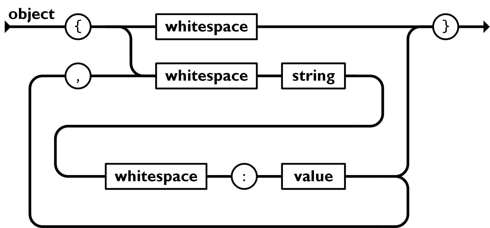
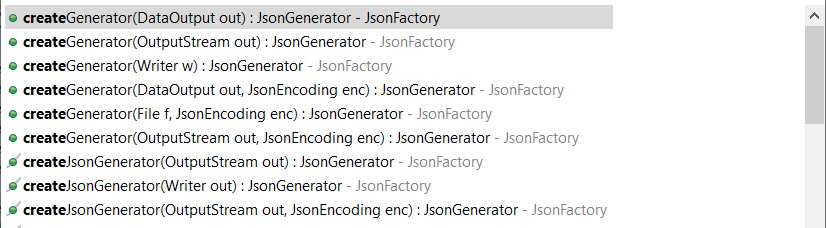
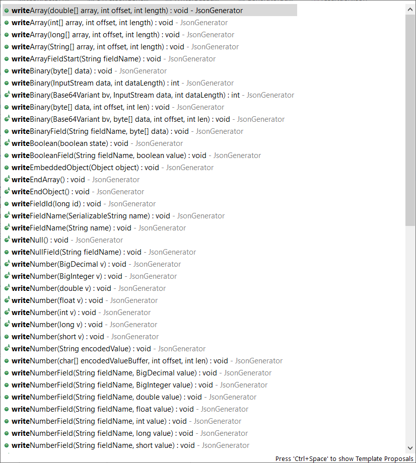
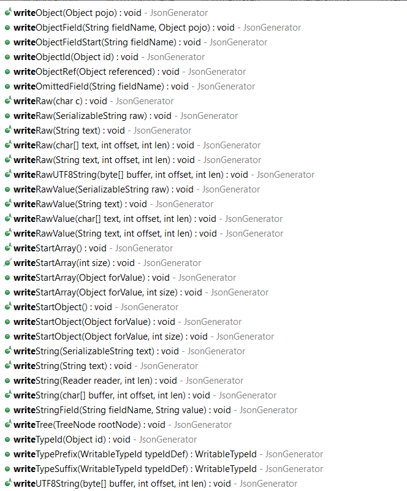
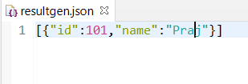

# Jackson JsonGenerator

## 目录

*   [1. 概述](#1-概述)

*   [2. JsonGenerator](#2-jsongenerator)

*   [3. 依赖](#3-依赖)

*   [4. Create a Jackson JsonGenerator](#4-create-a-jackson-jsongenerator)

*   [5. Generate JSON structure using Jackson JsonGenerator](#5-generate-json-structure-using-jackson-jsongenerator)

*   [6. Close the JsonGenerator](#6-close-the-jsongenerator)

## 1. 概述

此类是一个低级JSON生成器，提供公共API来生成JSON，并将生成的JSON内容写入指定文件或覆盖文件内容。

## 2. JsonGenerator

JSON提供了两种数据结构：

1.  Object – a collection of key/value pairs

2.  Array – an ordered list of values

Key可以是string，Value可以是String、Number、Object、Array、Boolean(TRUE or FALSE)、Null

The `JsonGenerator` provides various public APIs to construct the above [JSON structure](https://www.json.org/json-en.html "JSON structure").

JSON官网：[https://www.json.org/json-en.html](https://www.json.org/json-en.html "https://www.json.org/json-en.html")



## 3. 依赖

```xml
<dependency>
    <groupId>com.fasterxml.jackson.core</groupId>
    <artifactId>jackson-core</artifactId>
</dependency>
```

## 4. Create a Jackson JsonGenerator

作为第一步，创建一个JsonFactory实例，它是Jackson包的主要工厂类，用于配置和构造JsonGenerator实例。

```java
JsonFactory factory = new JsonFactory();
JsonGenerator generator = factory.createGenerator(
    new File("data/output.json"), JsonEncoding.UTF8);
```

The `JsonFactory` provides `createGenerator` overloaded methods to create the instance of `JsonGenerator`. It can take `OutputStream`, `File`, `Writer`, `DataOutput` as JSON destionations and optionally `JsonEncoding` as well.



JsonFactory提供createGenerator重载方法来创建JsonGenerator实例。它可以将OutputStream、File、Writer、DataOutput作为JSON目标，也可以选择JsonEncoding。

## 5. Generate JSON structure using Jackson JsonGenerator

The `JsonGenerator` provides a collection of `write` methods to write the JSON structure.





使用JSON生成器：

```java
JsonFactory factory = new JsonFactory();
JsonGenerator generator = factory.createGenerator(
            new File("resultgen.json"), JsonEncoding.UTF8);
        
generator.writeStartArray();
generator.writeStartObject();
generator.writeObjectField("id", 101);
generator.writeObjectField("name", "Praj");
generator.writeEndObject();
generator.writeEndArray();
        
generator.close();
```

In the above code, we performed the following steps to create an array of object:

1.  writeStartArray - 向输出中写入`[`

2.  writeStartObject - 将`{`写入输出

3.  writeObjectField(fild, value) - writes key-value pair to the output. Here, the first parameter is the field or key and second is the value.

4.  writeEndObject - 写入一个`}`

5.  writeEndArray - 写入一个`]`



## 6. Close the JsonGenerator

JSON生成完成后，使用close（）方法关闭JsonGenerator，这样就不能再写入更多内容了。

关闭JsonGenerator也会关闭目标，比如file或OutputStream。
