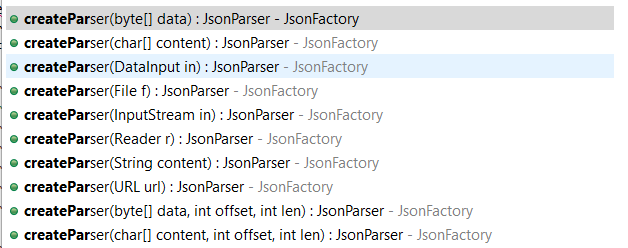
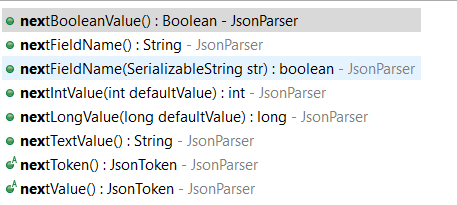
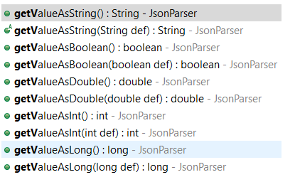

# Jackson JsonParser

## 目录

*   [1. 概述](#1-概述)

*   [2. 解析器](#2-解析器)

*   [3. 添加依赖](#3-添加依赖)

*   [4. 创建一个生成器](#4-创建一个生成器)

*   [4. 使用Jackson JsonParser解析JSON](#4-使用jackson-jsonparser解析json)

*   [5. 将值转换为其他数据类型](#5-将值转换为其他数据类型)

## 1. 概述

这是一个低级JSON解析器，它提供公共api来读取JSON内容。

## 2. 解析器

要从JSON创建java对象，请考虑使用对象ObjMpper-API，它是一种更简单的方法，并为您处理所有JSON解析逻辑。

要了解有关ObjectMapper的更多信息，请参阅本文[Jackson ObjectMapper - TedBlob](https://tedblob.com/jackson-objectmapper/ "Jackson ObjectMapper - TedBlob")

ObjectMapper在内部使用JsonParser实例解析JSON内容。

这个Jackson JsonParser直接使用起来很麻烦，但是你可以比Jackson ObjectMapper对JSON解析逻辑有更多的控制。

## 3. 添加依赖

```xml
<dependency>
    <groupId>com.fasterxml.jackson.core</groupId>
    <artifactId>jackson-core</artifactId>
</dependency>
```

## 4. 创建一个生成器

首先要创建一个JsonFactory的实例，它是Jackson包的主要工厂类，用于配置和构造JsonGenerator实例。

```java
JsonFactory factory = new JsonFactory();
JsonGenerator generator = factory.createGenerator(new File("data/output.json"), JsonEncoding.UTF8);
```



The `JsonFactory` provides `createParser` overloaded methods to create the instance of `JsonParser`.

This `createParser` method accepts the following JSON content sources as argument for parsing:

1.  `InputStream`

2.  bytes

3.  char array

4.  DataInput

5.  `File`

6.  `Reader`

7.  `String`

8.  URL

Note: The JsonFactory `createJsonParser` methods are deprecated in 2.2 and to be removed from 3.x. So this article uses `createParser` methods for constructing the `JsonParser`.

In the below code, we invoke the `createParser(String content)` overloaded method that takes the Json string as the source to create the `JsonParser`.

```java
JsonParser parser = factory.createParser("{\"id\":101,\"studentName\":\"John\"}");

```

## 4. 使用Jackson JsonParser解析JSON

```java
JsonFactory factory = new JsonFactory();
JsonParser parser = factory.createParser("{\"id\":101,\"studentName\":\"John\"}");
while (!parser.isClosed()) {
    JsonToken jsonToken = parser.nextToken();
    System.out.println("jsonToken = " + jsonToken);
     /*
        prints jsonToken = START_OBJECT
        jsonToken = FIELD_NAME
        jsonToken = VALUE_NUMBER_INT
        jsonToken = FIELD_NAME
        jsonToken = VALUE_STRING
        jsonToken = END_OBJECT
        jsonToken = null
    */
}
```

JsonParser支持以下JsonToken常量：

*   START\_OBJECT: `{`

*   END\_OBJECT: `}`

*   START\_ARRAY: `[`

*   END\_ARRAY: `]`

*   FIELD\_NAME: Object key

*   VALUE\_EMBEDDED\_OBJECT: Raw objects applicable for JsonNode based JSON trees, Maps, Lists and such

*   VALUE\_STRING: String value

*   VALUE\_NUMBER\_INT: Integer number

*   VALUE\_NUMBER\_FLOAT: Floating point or exponent (Other than integer number)

*   VALUE\_TRUE:  `true`

*   VALUE\_FALSE: `false`

*   VALUE\_NULL: `null`

通过调用isclosed（）方法，您可以检查JSON内容的末尾。如果它返回false，那么它意味着没有更多的json令牌\内容来解析。

这些JsonToken常量帮助我们确定当前标记并进行相应的解析。

```java
@Test
public void test1() throws IOException {
    JsonFactory factory = new JsonFactory();
    JsonParser parser = factory.createParser("{\"id\":101,\"studentName\":\"John\"}");
    Student student = new Student();
    while (!parser.isClosed()) {
        JsonToken jsonToken = parser.nextToken();
        if (jsonToken == JsonToken.FIELD_NAME) {
            String key = parser.getCurrentName();
            if (key.equalsIgnoreCase("id")) {
                student.setId(parser.nextIntValue(0));
            } else if (key.equalsIgnoreCase("studentName")) {
                student.setStudentName(parser.nextTextValue());
            }
        }
    }
    System.out.println(student);
}
```

例如，上面的代码通过解析JSON内容来构造student对象。每当我们遇到FIELD\_NAME JsonToken时，我们都会检查对象Key名称，用相应的数据更新学生对象。

`getCurrentName()`方法可以获取当前对象当Key名称。

If the field name or object key is `"id"`, then we update the `student` id variable by calling the `nextIntValue` method that returns the `id` value. The `nextIntValue` fetches the next token of type VALUE\_NUMBER\_INT or uses the specified default parameter.



## 5. 将值转换为其他数据类型

如果学生的id为Long类型的值，那就需要使用JsonParser提供的`getValueAsLong()`。

```java
JsonFactory factory = new JsonFactory();
JsonParser parser = factory.createParser("{\"id\":\"101\",\"studentName\":\"John\"}");
Student student = new Student();
while(!parser.isClosed()){
    JsonToken jsonToken = parser.nextToken();
    if (jsonToken == JsonToken.FIELD_NAME ) {
            String key = parser.getCurrentName();
                
        parser.nextToken();
        if (key.equalsIgnoreCase("id")) {
            student.setId(parser.getValueAsLong());
        } else if (key.equalsIgnoreCase("studentName")) {
            student.setStudentName(parser.getValueAsString());
        }            
    }
}
System.out.println(student);
```


