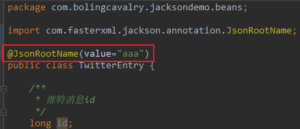

# Jackson常用配置

## 目录

*   [常用配置](#常用配置)

*   [特殊配置：在json对象最外层再包裹一层](#特殊配置在json对象最外层再包裹一层)

## 常用配置

序列化结果格式化：

```java
mapper.enable(SerializationFeature.INDENT_OUTPUT);
```

空对象不要抛出异常：

```java
mapper.disable(SerializationFeature.FAIL_ON_EMPTY_BEANS);
```

```java
Date、Calendar等序列化为时间格式的字符串(如果不执行以下设置，就会序列化成时间戳格式)：
mapper.disable(SerializationFeature.WRITE_DATES_AS_TIMESTAMPS);

反序列化时，遇到未知属性不要抛出异常：
mapper.disable(DeserializationFeature.FAIL_ON_UNKNOWN_PROPERTIES);

反序列化时，空字符串对于的实例属性为null：
mapper.enable(DeserializationFeature.ACCEPT_EMPTY_STRING_AS_NULL_OBJECT);

允许C和C++样式注释：
mapper.configure(JsonParser.Feature.ALLOW_COMMENTS, true);

允许字段名没有引号（可以进一步减小json体积）：
mapper.configure(JsonParser.Feature.ALLOW_UNQUOTED_FIELD_NAMES, true);

允许单引号：
mapper.configure(JsonParser.Feature.ALLOW_SINGLE_QUOTES, true);
```

```java
 //这个特性，决定了解析器是否将自动关闭那些不属于parser自己的输入源。
// 如果禁止，则调用应用不得不分别去关闭那些被用来创建parser的基础输入流InputStream和reader；
//默认是true
objectMapper.configure(JsonParser.Feature.AUTO_CLOSE_SOURCE, true);
//是否允许解析使用Java/C++ 样式的注释（包括'/'+'*' 和'//' 变量）
objectMapper.configure(JsonParser.Feature.ALLOW_COMMENTS, true);
//设置为true时，属性名称不带双引号
objectMapper.configure(JsonGenerator.Feature.QUOTE_FIELD_NAMES, false);
//反序列化是是否允许属性名称不带双引号
objectMapper.configure(JsonParser.Feature.ALLOW_UNQUOTED_FIELD_NAMES, true);
//是否允许单引号来包住属性名称和字符串值
objectMapper.configure(JsonParser.Feature.ALLOW_SINGLE_QUOTES, true);
//是否允许JSON字符串包含非引号控制字符（值小于32的ASCII字符，包含制表符和换行符）
objectMapper.configure(JsonParser.Feature.ALLOW_UNQUOTED_CONTROL_CHARS, true);
//是否允许JSON整数以多个0开始
objectMapper.configure(JsonParser.Feature.ALLOW_NUMERIC_LEADING_ZEROS, true);
//null的属性不序列化
objectMapper.setSerializationInclusion(JsonInclude.Include.NON_NULL);
//按字母顺序排序属性,默认false
objectMapper.configure(MapperFeature.SORT_PROPERTIES_ALPHABETICALLY,true);
//是否以类名作为根元素，可以通过@JsonRootName来自定义根元素名称,默认false
objectMapper.configure(SerializationFeature.WRAP_ROOT_VALUE,true);
//是否缩放排列输出,默认false
objectMapper.configure(SerializationFeature.INDENT_OUTPUT,false);
//序列化Date日期时以timestamps输出，默认true
objectMapper.configure(SerializationFeature.WRITE_DATES_AS_TIMESTAMPS,true);
//序列化枚举是否以toString()来输出，默认false，即默认以name()来输出
objectMapper.configure(SerializationFeature.WRITE_ENUMS_USING_TO_STRING, true);
//序列化枚举是否以ordinal()来输出，默认false
objectMapper.configure(SerializationFeature.WRITE_ENUMS_USING_INDEX,false);
//序列化单元素数组时不以数组来输出，默认false
objectMapper.configure(SerializationFeature.WRITE_ENUMS_USING_TO_STRING,true);
//序列化Map时对key进行排序操作，默认false
objectMapper.configure(SerializationFeature.ORDER_MAP_ENTRIES_BY_KEYS,true);
//序列化char[]时以json数组输出，默认false
objectMapper.configure(SerializationFeature.WRITE_CHAR_ARRAYS_AS_JSON_ARRAYS,true);
//序列化BigDecimal时是输出原始数字还是科学计数，默认false，即以toPlainString()科学计数方式来输出
objectMapper.configure(SerializationFeature.WRITE_BIGDECIMAL_AS_PLAIN,true);
```

## 特殊配置：在json对象最外层再包裹一层

需要达到这种效果：

```java
{
  "aaa" : {
    "id" : 1,
    "text" : "aabbcc",
    "fromUserId" : 456,
    "toUserId" : 0,
    "languageCode" : "zh"
  }
}

```

1）首先，是给上述json对应的实例类添加一个注解，如下图红框：



2）执行以下配置：

是否以类名作为根元素，可以通过@JsonRootName来自定义根元素名称，默认false

```java
mapper.enable(SerializationFeature.WRAP_ROOT_VALUE);

```

3）然后再次执行TwitterEntry实例的序列化，得到的结果如下，可见和之前的序列化结果相比，之前的整个json都变成了一个value，此value对应的key就是注解JsonRootName的value属性：
