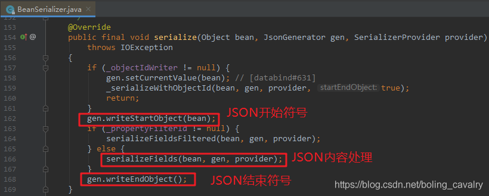

# jackson学习之一：基本信息

## 目录

*   [三个核心模块](#三个核心模块)

*   [低阶API库的作用](#低阶api库的作用)

## 三个核心模块

括号内是maven的artifactId：

1.  Streaming（jackson-core）：低阶API库，提供流式解析工具**JsonParser**，流式生成工具JsonGenerator；

2.  Annotations（jackson-annotations）：jackson注解；

3.  Databind (jackson-databind)：基于java对象的**序列化**、**反序列化**能力，需要前面两个模块的支持才能实现；

## 低阶API库的作用

1.  当我们用jackson做JSON操作时，常用的是Databind模块的ObjectMapper类，对处于核心位置的jackson-core反倒是很少直接用到，那么该模块有什么作用呢？

2.  如下图，beanSerializer是jackson-databind的功能类，其serialize方法负责将java对象转为JSON，方法中的处理逻辑就是调用JsonGenerator的API，而JsonGenerator就是jackson-core中负责序列化的主要功能类：

    

3.  可见databind模块的ObjectMapper类提供给我们的API，其底层操作是基于jackson-core实现的；
    至此，我们对jackson已有了基本了解，接下来的文章会开始一系列的实战，通过实战来掌握和理解这套优秀的工具；
