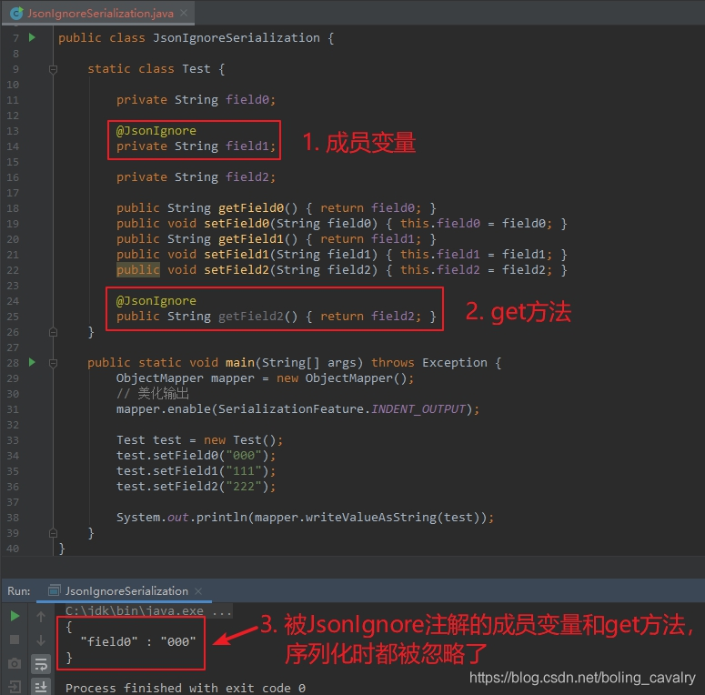

# jackson学习之七：常用Field注解

## 目录

*   [Field注解介绍](#field注解介绍)

*   [JsonProperty](#jsonproperty)

*   [JsonIgnore](#jsonignore)

*   [JacksonInject](#jacksoninject)

*   [JsonSerialize](#jsonserialize)

*   [JsonDeserialize](#jsondeserialize)

*   [JsonRawValue](#jsonrawvalue)

## Field注解介绍


虽然标题说是常用Field注解，其实上图中的这些注解也能用在方法上，只不过多数情况下这些注解修饰在field上更好理解一些，例如JsonIgnore，放在field上和get方法上都是可以的。

## JsonProperty

1）JsonProperty可以作用在成员变量和方法上，作用是在序列化和反序列化操作中指定json字段的名称。

2）先来看序列化操作，如下所示，JsonProperty修饰了私有成员变量和公共方法`getField1`，并且`field0`没有get和set方法，是通过构造方法设置的，另外还要注意JsonProperty注解的index属性，用来指定序列化结果中的顺序，这里故意将field1的顺序设置得比field0靠前：

```java
  static class Test {

      @JsonProperty(value="json_field0", index = 1)
      private String field0;

      @JsonProperty(value="json_field1", index = 0)
      public String getField1() {
          return "111";
      }

      public Test(String field0) {
          this.field0 = field0;
      }
  }

```

3）执行结果如下图红框所示，可见JsonProperty的value就是序列化后的属性名，另外带有JsonProperty注解的成员变量，即使是私有而且没有get和set方法，也能被成功序列化，而且顺序也和index属性对应：


4）接下来看反序列化操作，注解相关代码如下，field0是私有且没有get和set方法，另外setField1方法也有JsonProperty注解：

```java
  static class Test {

      @JsonProperty(value = "json_field0")
      private String field0;

      private String field1;

      @JsonProperty(value = "json_field1")
      public void setField1(String field1) {
          this.field1 = field1;
      }

      @Override
      public String toString() {
          return "Test{" +
                  "field0='" + field0 + '\'' +
                  ", field1='" + field1 + '\'' +
                  '}';
      }
  }


```

5）用json字符串尝试反序列化，结果如下，可见field0和field1都能被正确赋值：


## JsonIgnore

1.  JsonIgnore好理解，作用在成员变量或者方法上，指定被注解的变量或者方法不参与序列化和反序列化操作；

2.  先看序列化操作（JsonIgnoreSerialization.java），如下所示，Test类的field1字段和getField2方法都有JsonIgnore注解：

    ```java
        static class Test {

            private String field0;

            @JsonIgnore
            private String field1;

            private String field2;

            public String getField0() { return field0; }
            public void setField0(String field0) { this.field0 = field0; }
            public String getField1() { return field1; }
            public void setField1(String field1) { this.field1 = field1; }
            public void setField2(String field2) { this.field2 = field2; }

            @JsonIgnore
            public String getField2() { return field2; }
        }

    ```

3.  给field0、field1、field2三个字段都赋值，再看序列化结果，如下图，可见field0和field2都被忽略了：

    

4.  再来尝试JsonIgnore注解在反序列化场景的作用，注意反序列化的时候，JsonIgnore作用的方法应该是set了，如下图：

    

5.  另外实测发现，反序列化的时候，JsonIgnore注解在get方法上也可以让对应字段被忽略；

## JacksonInject

1.  JacksonInject的作用是在反序列化的时候，将配置好的值注入被JacksonInject注解的字段；

2.  如下所示，Test类的field1和field2都有JacksonInject注解，不同的是field1指定了注入值的key为defaultField1，而field2由于没有指定key，只能按照类型注入：

    ```java
      static class Test {
          private String field0;
          @JacksonInject(value = "defaultField1")
          private String field1;
          @JacksonInject
          private String field2;

    ```

3.  注入时所需的数据来自哪里呢？如下所示，通过代码配置的，可以指定key对应的注入值，也可以指定类型对应的注入值：

    ```java
      InjectableValues.Std injectableValues = new InjectableValues.Std();
      // 指定key为"defaultField1"对应的注入参数
      injectableValues.addValue("defaultField1","field1 default value");
      // 指定String类型对应的注入参数
      injectableValues.addValue(String.class,"String type default value");
      ObjectMapper mapper = new ObjectMapper();        // 把注入参数的配置设置给mapper
      mapper.setInjectableValues(injectableValues);

    ```

4.  反序列化结果如下图，可见field1和field2的值都是被注入的：

    

## JsonSerialize

1.  JsonSerialize用于序列化场景，被此注解修饰的字段或者get方法会被用于序列化，并且using属性指定了执行序列化操作的类；

2.  执行序列化操作的类，需要继承自JsonSerializer，如下所示，Date2LongSerialize的作用是将Date类型转成long类型：

    ```java
        static class Date2LongSerialize extends JsonSerializer<Date> {

            @Override
            public void serialize(Date value, JsonGenerator gen, SerializerProvider serializers) throws IOException {
                gen.writeNumber(value.getTime());
            }
        }


    ```

3.  Test类的field0字段是私有的，且没有get和set方法，但是添加了注释JsonDeserialize就能被反序列化了，并且使用Date2LongSerialize类对将json中的long型转成field0所需的Date型：

    ```java
        static class Test {
            @JsonDeserialize(using = Long2DateDeserialize.class)
            private Date field0;
            @Override
            public String toString() { return "Test{" + "field0='" + field0 + '\'' + '}'; }
        }

    ```

4.  执行结果如下：


## JsonDeserialize

1.  JsonDeserialize用于反序列化场景，被此注解修饰的字段或者set方法会被用于反序列化，并且using属性指定了执行反序列化操作的类；

2.  执行反序列化操作的类需要继承自JsonDeserializer，如下所示，Long2DateDeserialize的作用是将Long类型转成field0字段对应的Date类型：

    ```java
        static class Long2DateDeserialize extends JsonDeserializer<Date> {

            @Override
            public Date deserialize(JsonParser p, DeserializationContext ctxt) throws IOException, JsonProcessingException {

                if(null!=p && null!=ctxt && p.getLongValue()>0L ) {
                    return new Date(p.getLongValue());
                }

                return null;
            }
        }

    ```

3.  测试反序列化，结果如下：

    

## JsonRawValue

最后要介绍的是JsonRawValue，使用该注解的字段或者方法，都会被序列化，但是序列化结果是原始值，例如字符串是不带双引号的：


至此，常用的Filed注解就操作完毕了&#x20;
