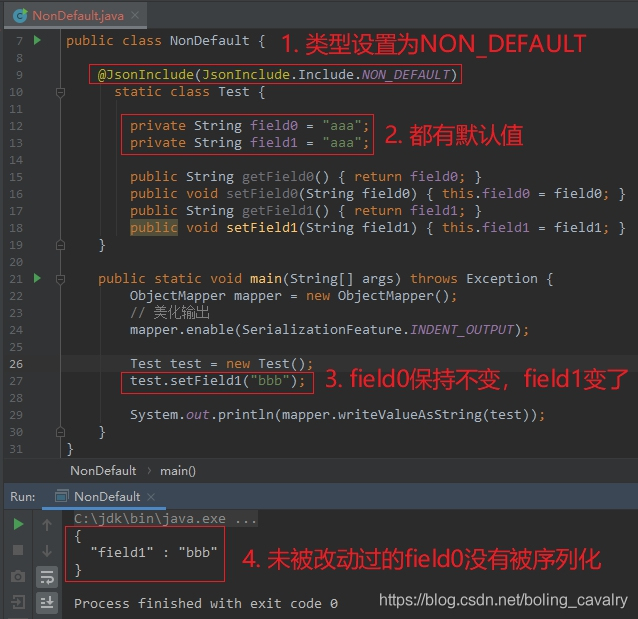
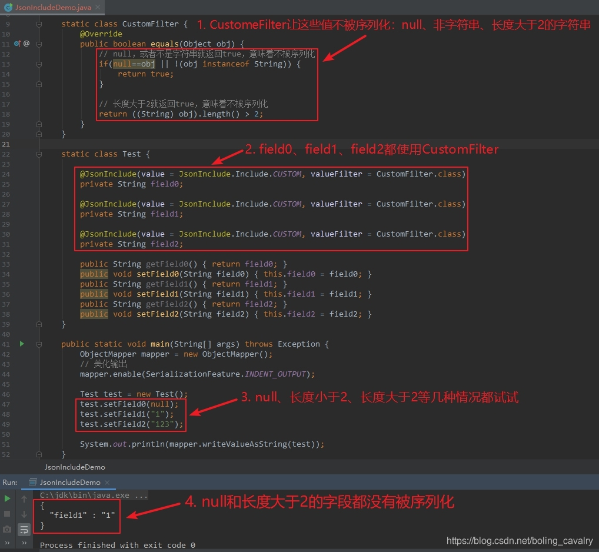
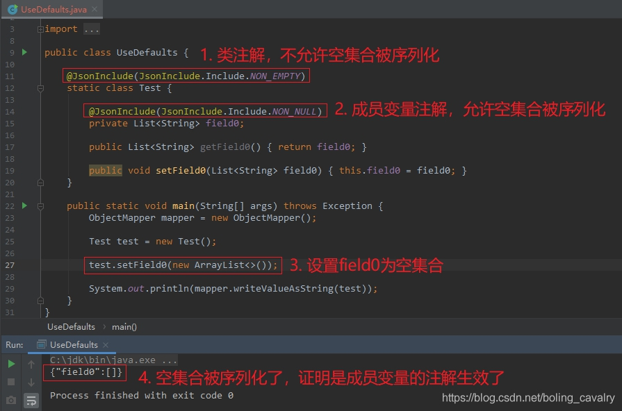
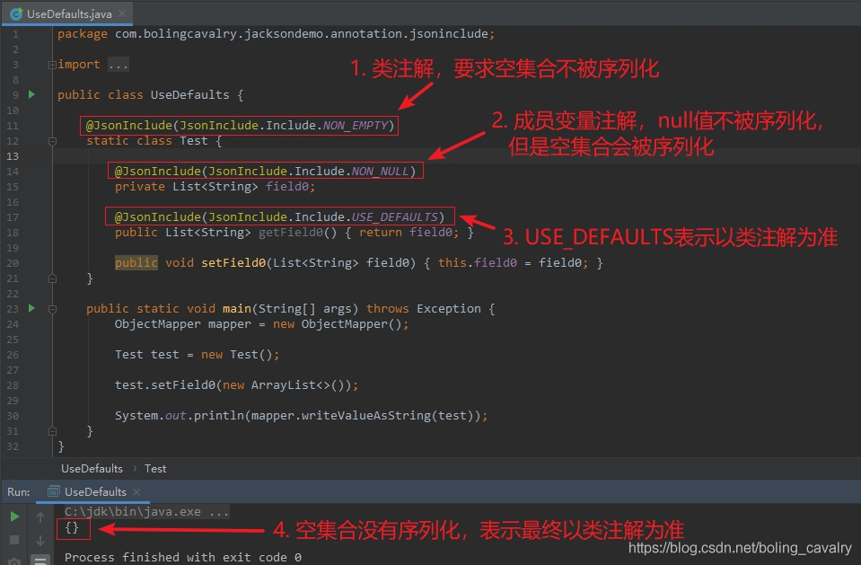

# jackson学习之五：JsonInclude注解

## 目录

*   [NON\_ABSENT](#non_absent)

*   [NON\_EMPTY](#non_empty)

*   [NON\_DEFAULT](#non_default)

*   [CUSTOM](#custom)

*   [USE\_DEFAULTS](#use_defaults)

## NON\_ABSENT

a. 自身为null的字段不会被序列化； &#x20;
b. Optional类型的字段，如果引用值为null，该字段不会被序列化； &#x20;
c. AtomicReference类型的字段，如果引用值为null，该字段不会被序列化；

## NON\_EMPTY

NON\_EMPTY好理解，以下情况都不会被序列化：

null
空字符串
空集合
空数组
Optional类型的，其引用为空
AtomicReference类型的，其引用为空

## NON\_DEFAULT

设置为NON\_DEFAULT后，对保持默认值的字段不做序列化



## CUSTOM

1）相对其他类型，CUSTOM略为复杂，这个值要配合valueFilter属性一起使用。

2）如下所示，JsonInclude的value等于CUSTOM时，在序列化的时候会执行CustomFilter的equals方法，该方法的入参就是field0的值，如果equals方法返回true，field0就不会被序列化，如果equals方法返回false时field0才会被序列化。

```java
@JsonInclude(value = JsonInclude.Include.CUSTOM, valueFilter = CustomFilter.class)
private String field0;

```

3）来看看CustomFilter类的代码，如下所示，只有equals方法，可见：null、非字符串、长度大于2这三种情况都返回true，也就是说这三种情况下都不会被序列化：

```java
static class CustomFilter {
      @Override
      public boolean equals(Object obj) {
          // null，或者不是字符串就返回true，意味着不被序列化
          if(null==obj || !(obj instanceof String)) {
              return true;
          }

          // 长度大于2就返回true，意味着不被序列化
          return ((String) obj).length() > 2;
      }
  }

```

4）下面贴出完整代码和结果



**再次强调：valueFilter的equals方法返回true，意味着该字段不会被序列化！！！**

## USE\_DEFAULTS

1）代码如下所示，在类和成员变量上都有JsonInclude注解，序列化field0的时候，是哪个注解生效呢？

```java
  @JsonInclude(JsonInclude.Include.NON_EMPTY)
  static class Test {

      @JsonInclude(JsonInclude.Include.NON_NULL)
      private List<String> field0;

      public List<String> getField0() { return field0; }

      public void setField0(List<String> field0) { this.field0 = field0; }
  }

```

2）把field0设置为空集合，运行代码试试，如果类上的注解生效，那么field0就不会被序列化（NON\_EMPTY会过滤掉空集合），如果成员变量上的注解生效，field0就会被序列化（NON\_NULL只过滤null，空集合不是null），执行结果如下图，可见是成员变量上的注解生效了：



3）接下来保持上述代码不变，仅在getField0方法上添加JsonInclude注释，值是USE\_DEFAULTS，这样在序列化过程中，调用getField0方法时，就用类注解JsonInclude的值了，即NON\_EMPTY：

```java
@JsonInclude(JsonInclude.Include.USE_DEFAULTS)
public List<String> getField0() { 
  return field0; 
}

```

4）执行修改后的代码，如下图所示，此时用的成员变量field0上的注解就不生效了，而是类注解生效，导致空集合不被序列化：



5）小结

小结USE\_DEFAULTS的作用如下：
a. 类注解和成员变量注解同时存在时，以成员变量注解为准；
b. 如果对应的get方法也使用了JsonInclude注解，并且值是USE\_DEFAULTS，此时以类注解为准；
