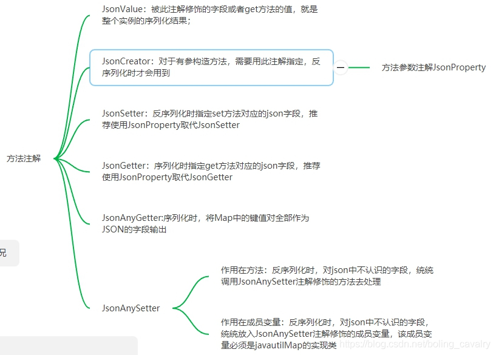
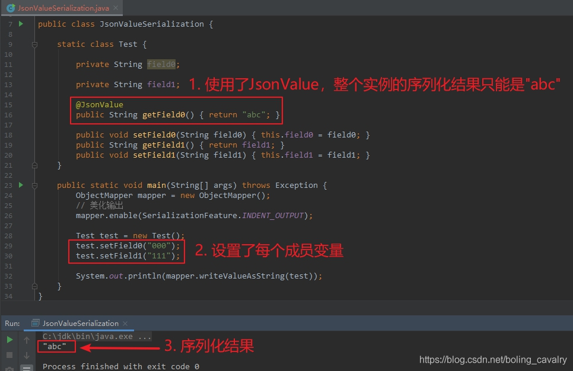
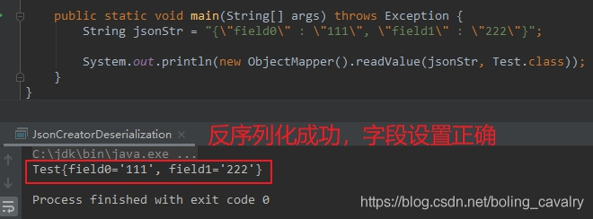
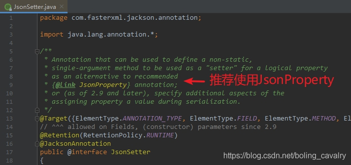
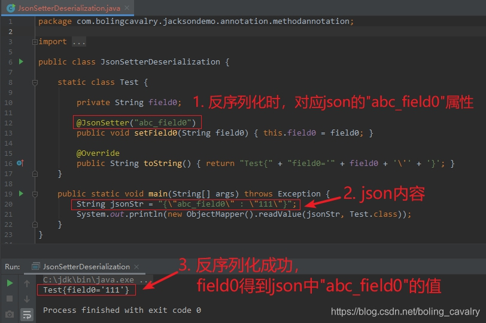
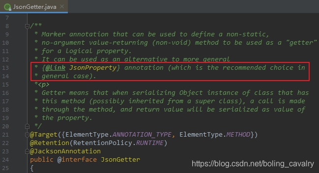
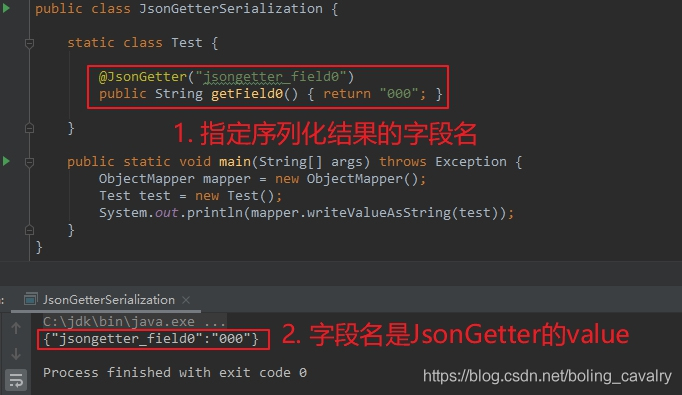
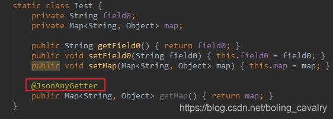

# jackson学习之八：常用方法注解

## 目录

*   [方法注解](#方法注解)

*   [JsonValue](#jsonvalue)

*   [JsonCreator](#jsoncreator)

*   [JsonSetter](#jsonsetter)

*   [JsonGetter](#jsongetter)

*   [JsonProperty](#jsonproperty)

*   [JsonAnyGetter](#jsonanygetter)

*   [JsonAnySetter](#jsonanysetter)

## 方法注解



## JsonValue

1.  在序列化时起作用，可以用来注解get方法或者成员变量；

2.  一个类中，JsonValue只允许出现一次；

3.  如果注解的是get方法，那么该方法的返回值就是整个实例的序列化结果；

4.  如果注解的是成员变量，那么该成员变量的值就是整个实例的序列化结果；

5.  下面是用来测试的Pojo类，JsonValue注解放在getField0方法上，此方法的返回值已经写死了"abc"：

    ```java
        static class Test {

            private String field0;

            private String field1;

            @JsonValue
            public String getField0() { return "abc"; }

            public void setField0(String field0) { this.field0 = field0; }
            public String getField1() { return field1; }
            public void setField1(String field1) { this.field1 = field1; }
        }

    ```

6.  Test类的序列化结果如下，即getField0方法的返回值：

    

## JsonCreator

1.  在反序列化时，当出现有参构造方法时（可能是多个有参构造方法），需要通过JsonCreator注解指定反序列化时用哪个构造方法，并且在入参处还要通过JsonProperty指定字段关系：

    ```java
        static class Test {

            private String field0;
            private String field1;


            public Test(String field0) {
                this.field0 = field0;
            }

            // 通过JsonCreator指定反序列化的时候使用这个构造方法
            // 通过JsonProperty指定字段关系
            @JsonCreator
            public Test(@JsonProperty("field0") String field0,
                        @JsonProperty("field1") String field1) {
                this.field0 = field0;
                this.field1 = field1;
            }

            @Override
            public String toString() {
                return "Test{" +
                        "field0='" + field0 + '\'' +
                        ", field1='" + field1 + '\'' +
                        '}';
            }
        }

    ```

2.  使用

    

## JsonSetter

1.  JsonSetter注解在set方法上，被用来在反序列化时指定set方法对应json的哪个属性；

2.  JsonSetter源码中，推荐使用JsonProperty来取代JsonSetter：

    

3.  测试代码和结果如下，可见反序列化时，是按照JsonSetter的value去json中查找属性的：

    

## JsonGetter

1.  JsonGetter只能作为方法注解；

2.  在序列化时，被JsonGetter注解的get方法，对应的json字段名是JsonGetter的value；

3.  JsonGetter源码中，推荐使用JsonProperty来取代JsonGetter：

    

4.  测试代码和结果如下，可见序列化时JsonGetter的value会被作为json字段名：

    

## JsonProperty

## JsonAnyGetter

1.  JsonAnyGetter的作用有些特别：在序列化时，用Map对象的键值对转成json的字段和值；

2.  理解JsonAnyGetter最好的办法，是对比使用前后序列化结果的变化，先来看以下这段代码，是没有JsonAnyGetter注解的，Test有两个成员变量，其中map字段是HashMap类型的：

    ```java
    package com.bolingcavalry.jacksondemo.annotation.methodannotation;

    import com.fasterxml.jackson.annotation.JsonAnyGetter;
    import com.fasterxml.jackson.databind.ObjectMapper;
    import com.fasterxml.jackson.databind.SerializationFeature;

    import java.util.HashMap;
    import java.util.Map;

    public class JsonAnySetterSerialization {

        static class Test {
            private String field0;
            private Map<String, Object> map;

            public String getField0() { return field0; }
            public void setField0(String field0) { this.field0 = field0; }
            public void setMap(Map<String, Object> map) { this.map = map; }
            public Map<String, Object> getMap() { return map; }
        }

        public static void main(String[] args) throws Exception {
            ObjectMapper mapper = new ObjectMapper();
            // 美化输出
            mapper.enable(SerializationFeature.INDENT_OUTPUT);

            // 新增一个HashMap，里面放入两个元素
            Map<String, Object> map = new HashMap<>();
            map.put("aaa", "value_aaa");
            map.put("bbb", "value_bbb");

            Test test = new Test();
            test.setField0("000");

            // map赋值给test.map
            test.setMap(map);

            System.out.println(mapper.writeValueAsString(test));
        }
    }

    ```

3.  上述代码的执行结果如下，其实很好理解，就是field0和map两个字段而已：

    ```java
    {
      "field0" : "000",
      "map" : {
        "aaa" : "value_aaa",
        "bbb" : "value_bbb"
      }
    }

    ```

4.  接下来，对上述代码做一处改动，如下图红框所示，给getMap方法增加JsonAnyGetter注解：

    

5.  修改后的执行结果如下，原来的map字段没有了，map内部的所有键值对都成了json的字段：

    ```java
    {
      "field0" : "000",
      "aaa" : "value_aaa",
      "bbb" : "value_bbb"
    }

    ```

6.  至此，可以品味出JsonAnyGetter的作用了：序列化时，将Map中的键值对全部作为JSON的字段输出；

## JsonAnySetter

1.  反序列化时，对json中不认识的字段，统统调用JsonAnySetter注解修饰的方法去处理；

2.  测试的代码如下，Test类的setValue方法被JsonAnySetter注解，在反序列化时，json中的aaa和bbb字段，都会交给setValue方法处理，也就是放入map中：

    ```java
    public class JsonAnySetterDeserialization {

        static class Test {

            private String field0;
            
            private Map<String, Object> map = new HashMap<>();

            @JsonAnySetter
            public void setValue(String key, Object value) {
                map.put(key, value);
            }

            @Override
            public String toString() {
                return "Test{" +
                        "field0='" + field0 + '\'' +
                        ", map=" + map +
                        '}';
            }
        }

        public static void main(String[] args) throws Exception {
            String jsonStr = "{\n" +
                    "  \"field0\" : \"000\",\n" +
                    "  \"aaa\" : \"value_aaa\",\n" +
                    "  \"bbb\" : \"value_bbb\"\n" +
                    "}";

            System.out.println(new ObjectMapper().readValue(jsonStr, Test.class));
        }
    }

    ```

3.  执行结果如下，可见aaa、bbb都被放入了map中

    ```java
    Test{field0='null', map={aaa=value_aaa, field0=000, bbb=value_bbb}}

    ```

4.  另外JsonAnySetter还可以**作用在成员变量**上，上面的代码中，去掉setValue方法，在成员变量map上增加JsonAnySetter注解，修改后如下，执行结果也是一模一样的：

    ```java
        static class Test {

            private String field0;

            @JsonAnySetter
            private Map<String, Object> map = new HashMap<>();

            @Override
            public String toString() {
                return "Test{" +
                        "field0='" + field0 + '\'' +
                        ", map=" + map +
                        '}';
            }
        }

    ```

5.  注意，JsonAnySetter作用在成员变量上时，该成员变量必须是java.util.Map的实现类；
