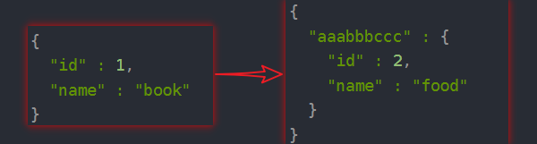
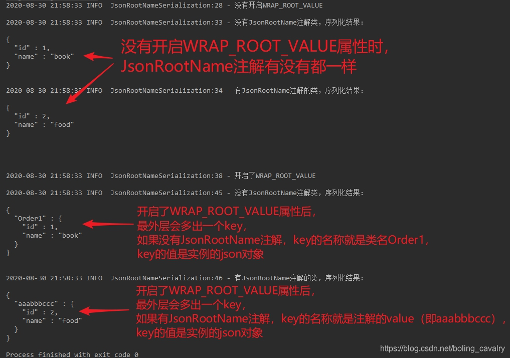
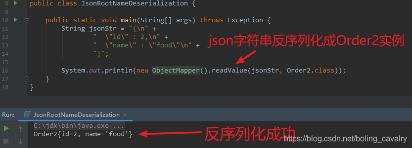
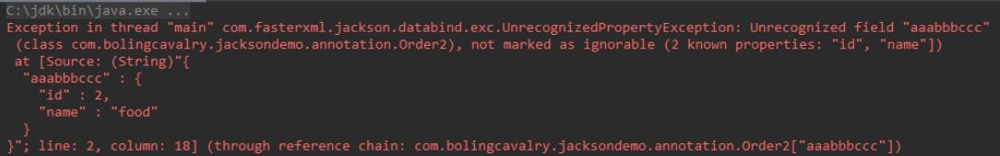
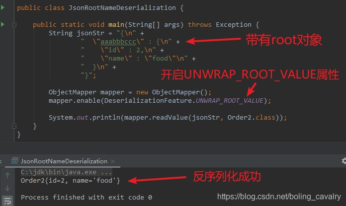
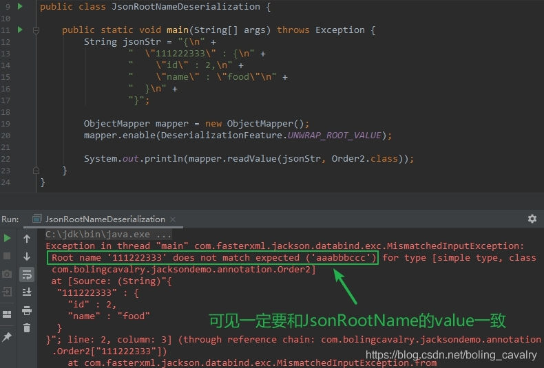

# jackson学习之四：WRAP\_ROOT\_VALUE（root对象）

## 目录

*   [关于root对象（WRAP\_ROOT\_VALUE）](#关于root对象wrap_root_value)

*   [序列化](#序列化)

*   [反序列化](#反序列化)

    *   [默认配置情况下](#默认配置情况下)

    *   [反序列化（开启UNWRAP\_ROOT\_VALUE属性）](#反序列化开启unwrap_root_value属性)

## 关于root对象（WRAP\_ROOT\_VALUE）

它的作用如下



## 序列化

**准备两个POJO类**

1）名为Order1.java的，没有JsonRootName注解：

```java
public class Order1 {
    private int id;
    private String name;
  // 省去get、set、toString方法
  ...
}

```

2）名为Order2.java的，有JsonRootName注解，value值为aaabbbccc：

```java
import com.fasterxml.jackson.annotation.JsonRootName;

@JsonRootName(value = "aaabbbccc")
public class Order2 {
  private int id;
    private String name;
  // 省去get、set、toString方法
  ...
}
```

3）开启WRAP\_ROOT\_VALUE和不开启的区别



## 反序列化

以上是序列化，那么反序列可以实现吗？

### 默认配置情况下

1）在没有做任何设置的时候，下面这个字符串用来反序列化成Order2对象

```java
{
  "id" : 2,
  "name" : "food"
}

```

2）成功



3）那下面这个字符串能反序列化成Order2对象吗？

```java
{
  "aaabbbccc" : {
    "id" : 2,
    "name" : "food"
  }
}

```

反序列化时jackson并不认识aaabbbccc这个key，因为jackson此时并不支持root对象。



4）默认情况下，反序列化时json字符串不能有root对象。

### 反序列化（开启UNWRAP\_ROOT\_VALUE属性）

1）开启属性

```java
mapper.enable(DeserializationFeature.UNWRAP_ROOT_VALUE);

```

2）代码和结果如下图，可见带有root对象的json字符串，可以反序列化成功，root对象的key就是JsonRootName注解的value属性：



3）值得注意的是，上述json字符串中，root对象的key为aaabbbccc，这和Order2的JsonRootName注解的value值是一致的，如果不一致就会反序列化失败，如下图：



4）至此，jackson的WRAP\_ROOT\_VALUE特性就学习完成了
