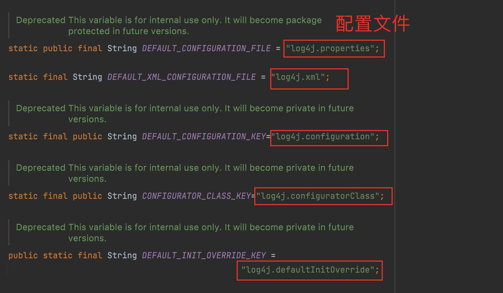
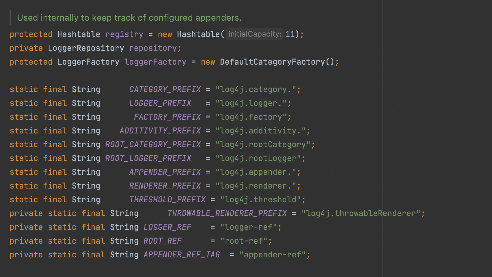

# Log4j的学习和使用

Log4j的使用步骤：

1. 导入相关jar包
2. 相关配置

## 1、Jar包导入

```Groovy
dependencies {

  implementation group: 'log4j', name: 'log4j', version: '1.2.17'

  compileOnly 'org.projectlombok:lombok:1.18.22'
  annotationProcessor 'org.projectlombok:lombok:1.18.22'

  implementation group: 'mysql', name: 'mysql-connector-java', version: '5.1.47'


  testCompileOnly 'org.projectlombok:lombok:1.18.22'
  testAnnotationProcessor 'org.projectlombok:lombok:1.18.22'

  testImplementation 'org.junit.jupiter:junit-jupiter-api:5.7.0'
  testRuntimeOnly 'org.junit.jupiter:junit-jupiter-engine:5.7.0'
}
```


## 2、相关配置

### 2.1 代码配置

1. 观察源码BasicConfigurator.configure();
	a. 创建了根节点的对象，Logger root = Logger.getRootLogger();
	b. 根节点添加了ConsoleAppender对象（表示默认打印到控制台，自定义的格式化输出）

### 2.2 配置文件

不使用BasicConfigurator.configure()，不执行代码提供Logger、Appender、Layout这3个组件信息。

使用配置文件提供信息：

分析：  

Logger logger = Logger.getLogger(Log4jTest01.class);  

进入到getLogger方法，会看到代码：  

```Java
LogManager.getLogger(clazz.getName());  

static public Logger getLogger(Class clazz) {
  return LogManager.getLogger(clazz.getName());
}
```


LogManager：日志管理器  

点击LogManager，看到很多常量信息，他们代表的就是不同形式（后缀名不同）的配置文件  

我们最常使用到的肯定是log4j.properties属性文件（语法简单，使用方便）



### 2.3 配置文件加载时机

**log4j.properties的加载时机?**

我们这里配置的是**log4j.properties**，所有就先讨论**log4j.properties**的加载机制。

继续观察LogManager，找到其中的静态代码块static ，在static代码块中，我们找到 `Loader.getResource("log4j.properties");  `

```Java
static {
  // By default we use a DefaultRepositorySelector which always returns 'h'.
  Hierarchy h = new Hierarchy(new RootLogger((Level) Level.DEBUG));
  repositorySelector = new DefaultRepositorySelector(h);

  /** Search for the properties file log4j.properties in the CLASSPATH.  */

  // 先在类路径下获取log4j.defaultInitOverride
  String override = OptionConverter.getSystemProperty(DEFAULT_INIT_OVERRIDE_KEY, null);

  // if there is no default init override, then get the resource
  // specified by the user or the default config file.
  if (override == null || "false".equalsIgnoreCase(override)) {
    // 获取log4j.configuration
    String configurationOptionStr = OptionConverter.getSystemProperty(DEFAULT_CONFIGURATION_KEY, null);
    // 获取 log4j.configuratorClass
    String configuratorClassName = OptionConverter.getSystemProperty(CONFIGURATOR_CLASS_KEY, null);

    URL url = null;

    // if the user has not specified the log4j.configuration property,
    // we search first for the file "log4j.xml" and then "log4j.properties"
    if (configurationOptionStr == null) {
      url = Loader.getResource(DEFAULT_XML_CONFIGURATION_FILE); // log4j.xml
      if (url == null) {
        url = Loader.getResource(DEFAULT_CONFIGURATION_FILE); // log4j.properties
      }
    } else {
      try {
        url = new URL(configurationOptionStr);
      } catch (MalformedURLException ex) {
        // so, resource is not a URL:
        // attempt to get the resource from the class path
        url = Loader.getResource(configurationOptionStr);
      }
    }

    // 如果我们有一个非空url，那么将其余的配置委托给OptionConverter.selectAndConfigure()方法。
    if (url != null) {
      LogLog.debug("Using URL [" + url + "] for automatic log4j configuration.");
      try {
        OptionConverter.selectAndConfigure(url, configuratorClassName,LogManager.getLoggerRepository());
      } catch (NoClassDefFoundError e) {
        LogLog.warn("Error during default initialization", e);
      }
    } else {
      LogLog.debug("Could not find resource: [" + configurationOptionStr + "].");
    }
  } else {
    LogLog.debug("Default initialization of overridden by " + DEFAULT_INIT_OVERRIDE_KEY + "property.");
  }
}
```


这行代码给我们最大的一个提示信息就是  

系统默认要从当前的类路径下找到`log4j.properties `，对于我们当前的项目是maven工程，那么理应在resources路径下去找  

加载完毕后我们来观察配置文件是如何读取的？  

`OptionConverter.selectAndConfigure(url, configuratorClassName, getLoggerRepository());  `

```Java
/**
 * 
 * @param url file:/Users/rsy/IdeaProjects/design/build/resources/test/log4j.properties
 * @param clazz log4j.configuratorClass 系统属性的字符串值，如果没有带有该键的属性，则为默认值。
 * @param hierarchy LoggerRepository
 */
public static void selectAndConfigure(URL url, String clazz, LoggerRepository hierarchy) {
  Configurator configurator = null;
  String filename = url.getFile();

  if (clazz == null && filename != null && filename.endsWith(".xml")) {
    clazz = "org.apache.log4j.xml.DOMConfigurator";
  }

  if (clazz != null) {
    LogLog.debug("Preferred configurator class: " + clazz);
    configurator = (Configurator) instantiateByClassName(clazz , Configurator.class , null);
    if (configurator == null) {
      LogLog.error("Could not instantiate configurator [" + clazz + "].");
      return;
    }
  } else { // clazz 为null的时候，创建一个对象
    configurator = new PropertyConfigurator();
  }

  configurator.doConfigure(url, hierarchy);
}
```


作为属性文件的加载，执行相应的properties配置对象：`configurator = new PropertyConfigurator();  `然后执行

`configurator.doConfigure(url, hierarchy);`实现在PropertyConfigurator中。

进入到`PropertyConfigurator`类中，观察到里面的常量信息 ，这些常量信息就是我们在properties属性文件中的各种属性配置项  



其中，我们看到了如下两项信息，这两项信息是必须要进行配置的  

`static final String ROOT_LOGGER_PREFIX = "log4j.rootLogger";  `

`static final String APPENDER_PREFIX = "log4j.appender.";  `

通过代码：  

`String prefix = "log4j.appender." + appenderName;  `

我们需要自定义一个appendername，我们起名叫做**console** （自定义命名，但是起名字也需要见名知意，

console那么我们到时候的配置应该配置的就是控制台输出）  

例如：log4j.appender.console  

取值就是log4j中为我们提供的appender类  

例如：`log4j.appender.console=org.apache.log4j.ConsoleAppender `

在appender输出的过程中，还可以同时指定输出的格式  

通过代码：  `String layoutPrefix = prefix + ".layout";  `

配置：  `log4j.appender.console.layout=org.apache.log4j.SimpleLayout  `

通过log4j.rootLogger继续在类中搜索  

找到`void configureRootCategory`方法  

在这个方法中执行了`this.parseCategory`方法  

`StringTokenizer st = new StringTokenizer(value, ",");  `

表示要以逗号的方式来切割字符串，证明了log4j.rootLogger的取值，其中可以有多个值，使用逗号进行分隔  

通过代码：`String levelStr = st.nextToken();  `

表示切割后的第一个值是日志的级别  

通过代码：  `while(st.hasMoreTokens())  `

表示接下来的值，是可以通过while循环遍历得到的  

第2~第n个值，就是我们配置的其他的信息，这个信息就是appenderName  

证明了我们配置的方式  

`log4j.rootLogger=日志级别,appenderName1,appenderName2,appenderName3....  `

表示可以同时在根节点上配置多个日志输出的途径，通过我们自己的配置文件，就可以将原有的加载代码覆盖掉。

### 2.4 LogLog日志开关

通过Logger中的开关，打开日志输出的详细信息，查看LogManager类中的方法 `getLoggerRepository()`， 找到代码`LogLog.debug(msg, ex); `

LogLog会使用debug级别的输出为我们展现日志输出详细信息 Logger是记录系统的日志，那么LogLog是用来记录Logger的日志 。进入到`LogLog.debug(msg, ex);`方法中，通过代码：`if (debugEnabled && !quietMode) {`

观察到if判断中的这两个开关都必须开启才行 `!quietMode`是已经启动的状态，不需要我们去管。` debugEnabled`默认是关闭的 所以我们只需要设置debugEnabled为true就可以了

# 3、日志输出格式说明

使用PatternLayout可以自定义格式输出，是我们最常用的方式

这种格式化输出采用类似于 C 语言的 printf 函数的打印格式格式化日志信息，具体的占位符及其含义如下：

`%m` 输出代码中指定的日志信息

`%p` 输出优先级，及 DEBUG、INFO 等

`%n` 换行符（Windows平台的换行符为 "\n"，Unix 平台为 "\n"）

`%r` 输出自应用启动到输出该 log 信息耗费的毫秒数

`%c` 输出打印语句所属的类的全名

`%t` 输出产生该日志的线程全名

`%d` 输出服务器当前时间，默认为 ISO8601，也可以指定格式，如：%d{yyyy年MM月dd日 HH:mm:ss}

`%l` 输出日志时间发生的位置，包括类名、线程、及在代码中的行数。如：Test.main(Test.java:10)

`%F` 输出日志消息产生时所在的文件名称

`%L` 输出代码中的行号

`%%` 输出一个 "%" 字符

可以在 % 与字符之间加上修饰符来控制最小宽度、最大宽度和文本的对其方式。如：

`%5c` 左边空格填充，如果类别名称少于5个字符长

`%-5c` 右边空格填充，如果类别名称少于5个字符长

`%.5c` 多于5个字符，就会从开始截断，少于5个不会有空格

`%20.30c` 用空格左侧垫，如果类别名称短于20个字符。但是，如果类别名称长度超过30个字符，那么从开始截断。

`%-20.30c`用空格右侧垫，如果类别名称短于20个字符。但是，如果类别名称长度超过30个字符，那么从开始截断。

# 4、相关配置

```properties
# 将文件输出到控制台
# rootLogger一般日志级别,appenderName1,appenderName2,appenderName3
# 表示可以同时在根节点上配置多个日志输出的途径
#log4j.rootLogger=trace,AConsole
log4j.logger.log4j=info,AConsole
log4j.logger.org.apache=error,BFile
# 配置console（A、B、C）的appender输出方式
log4j.appender.AConsole=org.apache.log4j.ConsoleAppender
# 配置输出的格式
log4j.appender.AConsole.layout=org.apache.log4j.PatternLayout
#log4j.appender.console.layout.conversionPattern=[%-5p]%r %c%t%d{yyyy-MM-dd HH:mm:ss:SSS} %m%n
log4j.appender.AConsole.layout.conversionPattern=[%-5p] %c %L %d{yyyy-MM-dd HH:mm:ss} %m%n
# 配置输出日志到文件
log4j.appender.BFile=org.apache.log4j.FileAppender
log4j.appender.BFile.layout=org.apache.log4j.PatternLayout
log4j.appender.BFile.layout.conversionPattern=[%-10p]%r %c%t%d{yyyy-MM-dd HH:mm:ss:SSS} %m%n
# 配置输出文件的位置（默认是当前项目的根目录/Users/rsy/IdeaProjects/java-slf4j/log4j.log）
log4j.appender.BFile.file=log4j.log
log4j.appender.BFile.encoding=UTF-8

# 追加输出日志到文件的时候，往往导致文件太大，所以需要拆分文件
# 配置分割文件
log4j.appender.CRollingFile=org.apache.log4j.RollingFileAppender
log4j.appender.CRollingFile.layout=org.apache.log4j.PatternLayout
log4j.appender.CRollingFile.layout.conversionPattern=[%-5p] %c %L %d{yyyy-MM-dd HH:mm:ss} %m%n
log4j.appender.CRollingFile.file=log4j.log
log4j.appender.CRollingFile.encoding=UTF-8
# 拆分文件的大小
log4j.appender.CRollingFile.maxFileSize=1MB
# 拆分文件的数量
# 如果拆分文件的数量超过了5个，尽量覆盖掉时间比较旧的文件，保留新的文件
log4j.appender.CRollingFile.maxBackupIndex=5


log4j.appender.dailyRollingFile=org.apache.log4j.DailyRollingFileAppender
log4j.appender.dailyRollingFile.layout=org.apache.log4j.PatternLayout
log4j.appender.dailyRollingFile.layout.conversionPattern=[%-5p] %c %L %d{yyyy-MM-dd HH:mm:ss} %m%n
log4j.appender.dailyRollingFile.file=log4j.log
log4j.appender.dailyRollingFile.encoding=UTF-8
log4j.appender.dailyRollingFile.datePattern='.'yyyy-MM-dd HH-mm-ss


log4j.appender.logDB=org.apache.log4j.jdbc.JDBCAppender
log4j.appender.logDB.layout=org.apache.log4j.PatternLayout
log4j.appender.logDB.Driver=com.mysql.jdbc.Driver
log4j.appender.logDB.URL=jdbc:mysql://localhost:3306/rty_230?useSSL=false&useUnicode=true&characterEncoding=utf8
log4j.appender.logDB.User=root
log4j.appender.logDB.Password=root
log4j.appender.logDB.Sql=INSERT INTO data_log(name,createTime,level,category,fileName,message) values('project_log','%d{yyyy-MM-dd HH:mm:ss}','%p','%c','%F','%m')

```

