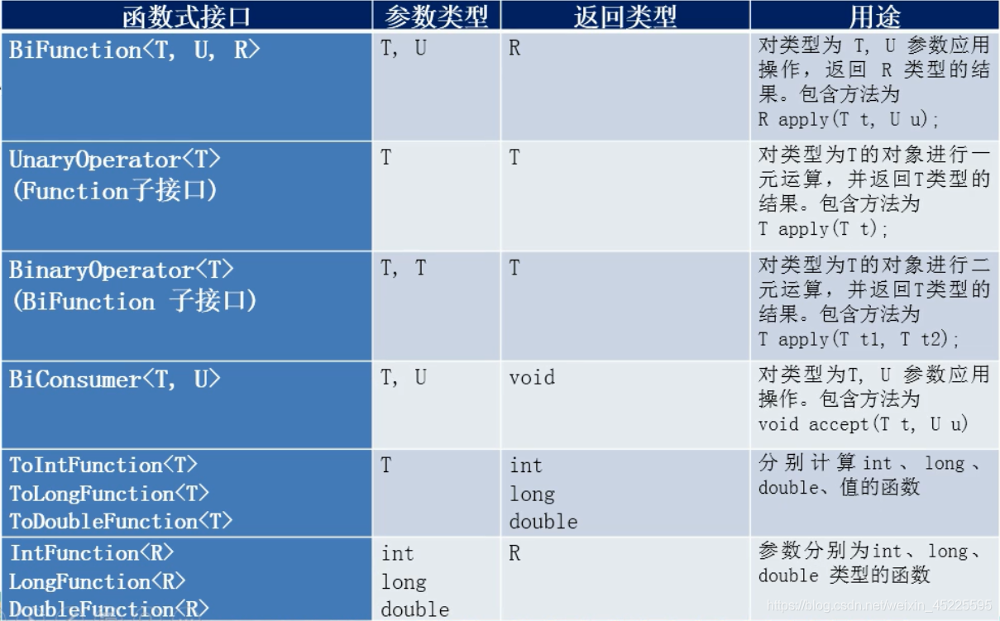

# 3、函数式接口

## 目录

*   [3.1 消费型接口](#31-消费型接口)

*   [3.2 提供型接口](#32-提供型接口)

*   [3.3 函数型接口](#33-函数型接口)

*   [3.4 断言型接口](#34-断言型接口)

*   [3.5 其他接口](#35-其他接口)

*   [接口default](#接口default)

## 3.1 消费型接口

```java
@Test
public void test01(){
    //Consumer
    Consumer<Integer> consumer = (x) -> System.out.println("消费型接口" + x);
    //test
    consumer.accept(100);
}
```

## 3.2 提供型接口

```java
@Test
public void test02(){
    List<Integer> list = new ArrayList<>();
    List<Integer> integers = Arrays.asList(1,2,3); 
    list.addAll(integers);
    //Supplier<T>
    Supplier<Integer> supplier = () -> (int)(Math.random() * 10);
    list.add(supplier.get());
    System.out.println(supplier);
    for (Integer integer : list) {
        System.out.println(integer);
    }
}
```

## 3.3 函数型接口

```java
@Test
public void test03(){
    //Function<T, R>
    String oldStr = "abc123456xyz";
    Function<String, String> function = (s) -> s.substring(1, s.length()-1);
    //test
    System.out.println(function.apply(oldStr));
}
```

## 3.4 断言型接口

```java
@Test
public void test04(){
    //Predicate<T>
    Integer age = 35;
    Predicate<Integer> predicate = (i) -> i >= 35;
    if (predicate.test(age)){
        System.out.println("你该退休了");
    } else {
        System.out.println("我觉得还OK啦");
    }
}
```

## 3.5 其他接口

&#x20;



## 接口default
