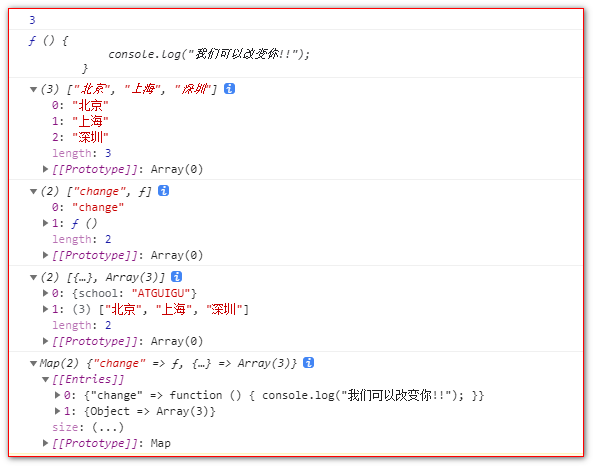
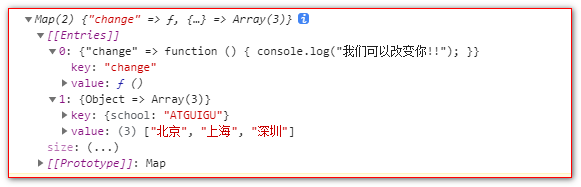

# map

```javascript
<script>
    //声明 Map
    let m = new Map();

    //添加元素
    m.set('name', '尚硅谷');
    m.set('change', function () {
        console.log("我们可以改变你!!");
    });
    let key = {
        school: 'ATGUIGU'
    };
    m.set(key, ['北京', '上海', '深圳']);

    //size
    console.log(m.size);

    //删除
    m.delete('name');

    //获取
    console.log(m.get('change'));
    console.log(m.get(key));

    //清空
    // m.clear();

    //遍历
    for (let v of m) {
        console.log(v);
    }

    console.log(m);

</script>
```




