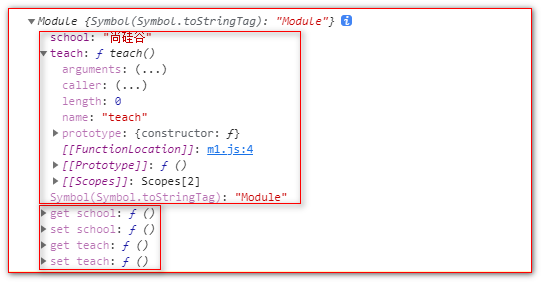
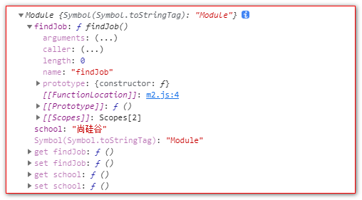
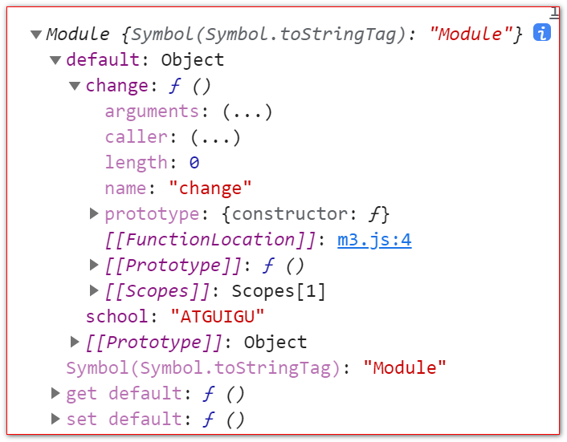

# module语法

## 分别暴露

```javascript
export let school = '尚硅谷';

export function teach() {
    console.log("我们可以教给你开发技能");
}
```



## 统一暴露

```javascript
//统一暴露
let school = '尚硅谷';

function findJob(){
  console.log("我们可以帮助你找工作!!");
}

export {school, findJob};
```



## 默认暴露

```javascript
//默认暴露
export default {
  school: 'ATGUIGU',
  change: function () {
      console.log("我们可以改变你!!");
  }
}
```



## 模块引入

```javascript
//模块引入
import * as m1 from "./m1.js";
import * as m2 from "./m2.js";
import * as m3 from "./m3.js";

console.log(m1);
console.log(m2);
console.log(m3);

m1.teach();
m2.findJob();
m3.default.change();

```

## 导入方式

```javascript
<script type="module">
    //1. 通用的导入方式
    //引入 m1.js 模块内容
    import * as m1 from "./src/js/m3.js";

    //2. 解构赋值形式
    import {school, teach} from "./src/js/m1.js";
    import {school as guigu, findJob} from "./src/js/m2.js";
    import {default as m3} from "./src/js/m3.js";

    //3. 简便形式  针对默认暴露
    import m3 from "./src/js/m3.js";
    console.log(m3);
</script>
```
