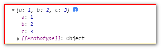

# rest参数

## 不定参数

```javascript
  <script>
      // ES6 引入 rest 参数，用于获取函数的实参，用来代替 arguments
      // ES5 获取实参的方式
      function date() {
          console.log(arguments);
      }
      date('白芷', '阿娇', '思慧');

      // rest 参数
      function date(...args) {
          console.log(args);// filter some every map 
      }
      date('阿娇', '柏芝', '思慧');

      // rest 参数必须要放到参数最后
      function fn(a, b, ...args) {
          console.log(a);
          console.log(b);
          console.log(args);
      }
      fn(1, 2, 3, 4, 5, 6);
  </script>
```

... 表示不定参数，该参数是一个数组，可以使用下标获得，**args\[0]**

## 不定参数对arguments对象的影响

```javascript
function add(b,...a){
    console.log(...a)
    console.log(arguments[0],arguments[1])
}
```

## 展开运算符

*   可以获得数组中所有的数据

```javascript
let values = [3,54,45,23,6453,324]
console.log(Math.max(...values))  //6453
```

*   可以额外添加参数

```javascript
console.log(Math.max(...values , 543545 , 43 , 54 , 23))  //543545
```

*   对象展开复制

```javascript
<script>
  const a = {
    a: 1,
    b: 2
  }
  const b = {
    ...a,
    c: 3,
  }
  console.log(b)
</script>
```



*   合并对象

```javascript
  const obj1 = { a: 10 };
  const obj2 = { b: 20 };
  const obj3 = { c: 30 };
  const obj4 = {
    ...obj1,
    ...obj2,
    ...obj3
  }
// ES2018
console.log({...obj1, ...obj2, ...obj3});    // → {a: 10, b: 20, c: 30}

// ES2015
console.log(Object.assign({}, obj1, obj2, obj3));    // → {a: 10, b: 20, c: 30}
```
