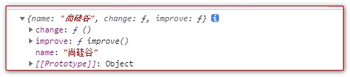

# 简化对象写法

ES6允许在大括号里面，直接 写入变量和函数，作为对象的属性和方法

```javascript
  <script>
      //ES6 允许在大括号里面，直接写入变量和函数，作为对象的属性和方法。
      //这样的书写更加简洁
      let name = '尚硅谷';
      let change = function () {
          console.log('我们可以改变你!!');
      }

      const school = {
          name,
          change,
          improve() {
              console.log("我们可以提高你的技能");
          }
      }

      console.log(school);

  </script>
```


