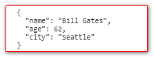

# JSON

## JSON简介

JSON: JavaScript Object Notation（JavaScript 对象标记法）。
JSON 是一种存储和交换数据的语法。
JSON 是通过 JavaScript 对象标记法书写的文本。

## 交换数据

*   当数据在浏览器与服务器之间进行交换时，这些数据只能是文本。

*   JSON 属于文本，并且我们能够把任何 JavaScript 对象转换为 JSON，然后将 JSON 发送到服务器。

*   我们也能把从服务器接收到的任何 JSON 转换为 JavaScript 对象。以这样的方式，我们能够把数据作为 JavaScript 对象来处理，无需复杂的解析和转译。

## 发送数据

js对象转json

```javascript
<script>
    var myObj = { name: "Bill Gates", age: 62, city: "Seattle" };
    var myJSON = JSON.stringify(myObj);
    console.log(myJSON)
    console.log(typeof myJSON)
</script>
```


## 接收对象

json转js对象

```javascript
<script>
    var myJSON = '{ "name":"Bill Gates",  "age":62, "city":"Seattle" }';
    var myObj = JSON.parse(myJSON);
    console.log(myObj)
    console.log(typeof myObj)
</script>
```


## 常用技巧

参考博客：[JS操作JSON常用方法\_小妖的博客-CSDN博客\_js json](https://blog.csdn.net/xujie3/article/details/52954940 "JS操作JSON常用方法_小妖的博客-CSDN博客_js json")

1.  JSON字符串美化
    语法：`JSON.stringify(value[, replacer [, space]])`

    JSON转化为字符串可以用JSON.stringify() 方法，stringify还有个可选参数space，可以指定缩进用的空白字符串，用于美化输出（pretty-print）；
    space参数是个数字，它代表有多少的空格；上限为10。该值若小于1，则意味着没有空格；如果该参数没有提供（或者为null）将没有空格。

    ```javascript
    <script>
        var myObj = { name: "Bill Gates", age: 62, city: "Seattle" };
        var myJSON = JSON.stringify(myObj, undefined, 2);
        console.log(myJSON)
        console.log(typeof myJSON)
    </script>
    ```

    

2.  JSON字符串的替换

3.  遍历JSON对象

    ```javascript
    var packJson  = {"name":"Liza", "password":"123"} ;
    for(var k in packJson ){//遍历packJson 对象的每个key/value对,k为key
       alert(k + " " + packJson[k]);
    }
    ```

4.  遍历JSON数组

    ```javascript
    var packJson = [{"name":"Liza", "password":"123"},
                    {"name":"Mike", "password":"456"}];
    for(var i in packJson){
       //遍历packJson 数组时，i为索引
       alert(packJson[i].name + " " + packJson[i].password);
    }
    ```

5.  递归遍历
