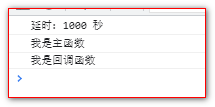
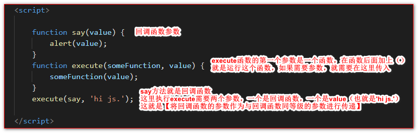
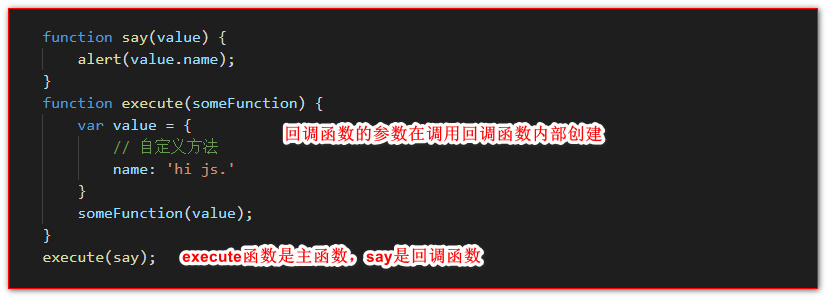

# 回调函数

## 目录

*   [代码实现](#代码实现)

*   [向回调方法传递参数](#向回调方法传递参数)

*   [函数中如何使用可选参数（包括可选回调函数）](#函数中如何使用可选参数包括可选回调函数)

## 代码实现

正常情况：

```javascript
<script>
    function fa() {
        console.log("执行a函数");
        setTimeout(function () {
            console.log("执行a函数的延迟函数");
        }, 1000);
        function fb() {
            console.log("执行函数b");
        };
    };
    fa();
    fb();
</script>
```

回调函数：

```javascript
<script>
    //定义主函数，回调函数作为参数
    function fa(value, callback) {
        callback(value);
        console.log('我是主函数');
    }
    //定义回调函数
    function fb(value) {
        console.log("延时："+value+" 秒")
        setTimeout("console.log('我是回调函数')", value);//模仿耗时操作  
    }
    //调用主函数，将函数B传进去
    fa(1000, fb);
</script>
```

输出结果：



回调函数易混淆点——传参

回调函数传参数，有两种方法

*   将回调函数的参数作为与回调函数同等级的参数进行传递

    

*   回调函数的参数在调用回调函数内部创建

    

## 向回调方法传递参数

> 参考：[向回调方法传递参数](https://www.jstips.co/zh_cn/javascript/passing-arguments-to-callback-functions/ "向回调方法传递参数")

通常下，你并不能给回调函数传递参数。 比如:

```javascript
function callback() {
  console.log('Hi human');
}

document.getElementById('someelem').addEventListener('click', callback);
```

你可以借助Javascript闭包的优势来传递参数给回调函数。看这个例子:

```javascript
function callback(a, b) {
  return function() {
    console.log('sum = ', (a+b));
  }
}

var x = 1, y = 2;
document.getElementById('someelem').addEventListener('click', callback(x, y));
```

**什么是闭包?** 闭包是指函数有自由独立的变量。换句话说，定义在闭包中的函数可以“记忆”它创建时候的环境。想了解更多请[参考MDN的文档](https://developer.mozilla.org/zh-CN/docs/Web/JavaScript/Closures "参考MDN的文档")。
这种方法使参数`x`和`y`在回调方法被调用时处于其作用域内。
另一个办法是使用`bind`方法。比如:

```javascript
var alertText = function(text) {
    alert(text);
};

document.getElementById('someelem')
    .addEventListener('click', alertText.bind(this, 'hello'));
```

## 函数中如何使用可选参数（包括可选回调函数）

```html
<script>

    function example(err, optionalA, optionalB, callback) {
        // 使用数组取出arguments
        var args = new Array(arguments.length);

        for (var i = 0; i < args.length; ++i) {
            args[i] = arguments[i];
        };

        // 第一个参数为错误参数
        // shift() 移除数组中第一个参数并将其返回
        err = args.shift();

        // 如果最后一个参数是函数，则它为回调函数
        // pop() 移除数组中最后一个参数并将其返回
        if (typeof args[args.length - 1] === 'function') {
            callback = args.pop();
        }

        // 如果args中仍有元素，那就是你需要的可选参数
        // 你可以像这样一个一个的将其取出：
        if (args.length > 0) optionalA = args.shift(); else optionalA = null;
        if (args.length > 0) optionalB = args.shift(); else optionalB = null;

        // 像正常一样继续：检查是否有错误
        if (err) {
            return callback && callback(err);
        }

        // 为了教程目的，打印可选参数
        console.log('optionalA:', optionalA);
        console.log('optionalB:', optionalB);
        console.log('callback:', callback);

        /* 你想做的逻辑 */

    }

    // ES6语法书写更简短
    function example(...args) {
        // 第一个参数为错误参数
        const err = args.shift();
        // 如果最后一个参数是函数，则它为回调函数
        const callback = (typeof args[args.length - 1] === 'function') ? args.pop() : null;

        // 如果args中仍有元素，那就是你需要的可选参数你可以像这样一个一个的将其取出：
        const optionalA = (args.length > 0) ? args.shift() : null;
        const optionalB = (args.length > 0) ? args.shift() : null;
        // ... 重复取更多参数

        if (err && callback) return callback(err);

        /* 你想做的逻辑 */
    }

    // 使用或不适用可选参数调用实例函数

    example(null, 'AA');

    example(null, function (err) {   /* do something */ });

    example(null, 'AA', function (err) { });

    example(null, 'AAAA', 'BBBB', function (err) { /* do something */ });

</script>
```
