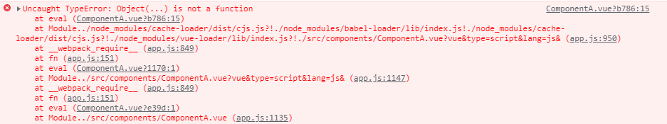
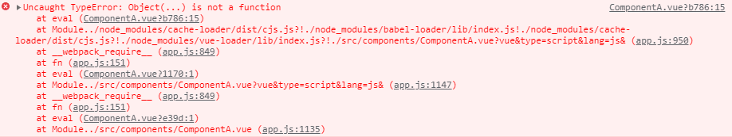

# 导入模块{}和不使用{}的区别

[具体查看文档：Module 的语法 - ECMAScript 6入门](https://es6.ruanyifeng.com/#docs/module#export-命令 "具体查看文档：Module 的语法 - ECMAScript 6入门")

*   第一组`export default`（不使用{}）

```javascript
export default function crc32() { // 输出
  // ...
}

import crc32 from 'crc32'; // 输入

```

或者（使用匿名函数）

```js\
export default function() { // 输出
  // ...
}

import crc32 from 'crc32'; // 输入
```

如果使用{}，报错



*   第二组`export`（使用{}）

不能使用匿名函数

```javascript
export function crc32() { // 输出
  // ...
};

import {crc32} from 'crc32'; // 输入
```

不使用{}，报错


