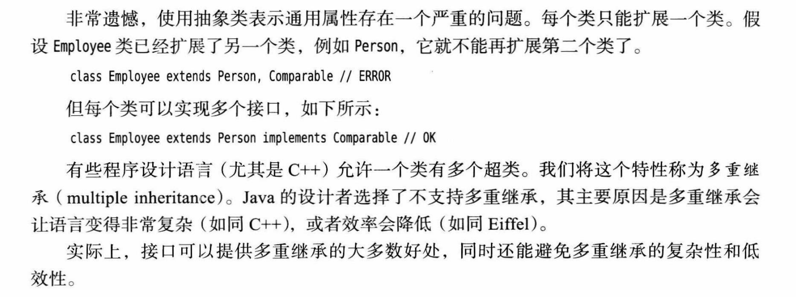
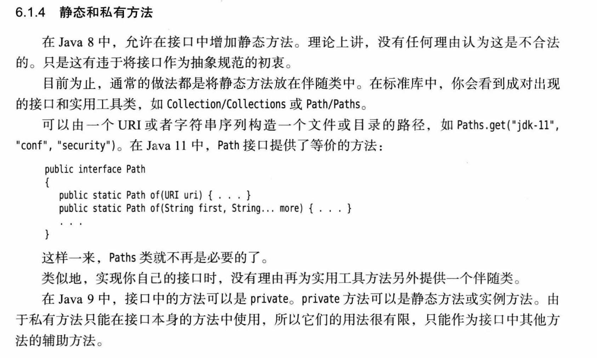
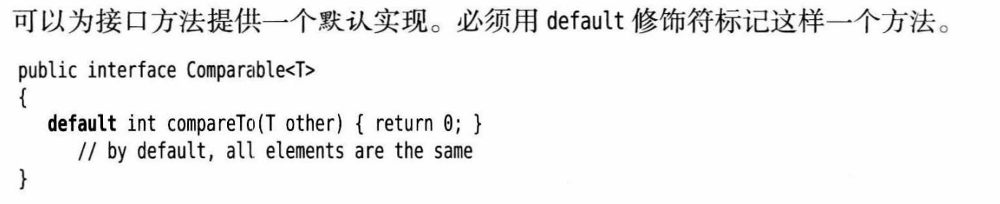
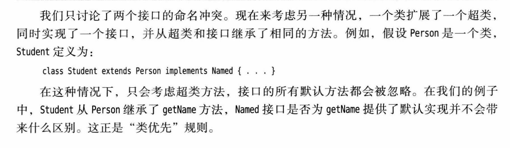
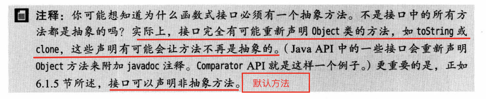

# Java 接口

## 目录

*   [1. 接口概念](#1-接口概念)

*   [2、静态和私有方法](#2静态和私有方法)

*   [3、默认方法](#3默认方法)

*   [4、“类优先”规则](#4类优先规则)

*   [5、lambda表达式](#5lambda表达式)

## 1. 接口概念

接口不是类，而是类的一组需求，这个类就是希望符合这个接口的类。

接口中所有的方法都自动是public方法。因此在接口中声明方法时，不必提供关键字public。

接口中的字段总是`public static final`。

接口还可以定义常量。

接口不能提供实例字段，不能实现方法，方法不能引用实例字段。

提供实例字段和方法实现的任务应该交给实现接口的类来完成。



## 2、静态和私有方法



## 3、默认方法



但是一般情况下都会被覆盖掉。

```java

public interface MyInterface {
    default int getAge() {
        return 0;
    }
}


public class InterfaceImpl implements MyInterface{
    @Override
    public int getAge() {
        return MyInterface.super.getAge();
    }
}

```

## 4、“类优先”规则



## 5、lambda表达式

**函数式接口：**

对于只有一个抽象方法的接口，需要这种接口的对象时，就可以提供一个lambda表达式。这种接口就是函数式接口。



默认方法不是抽象的。
