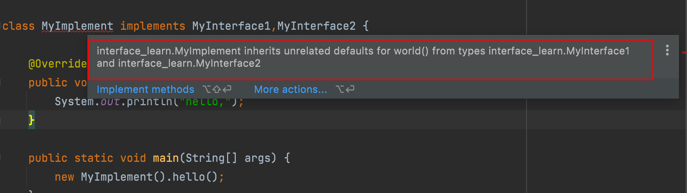
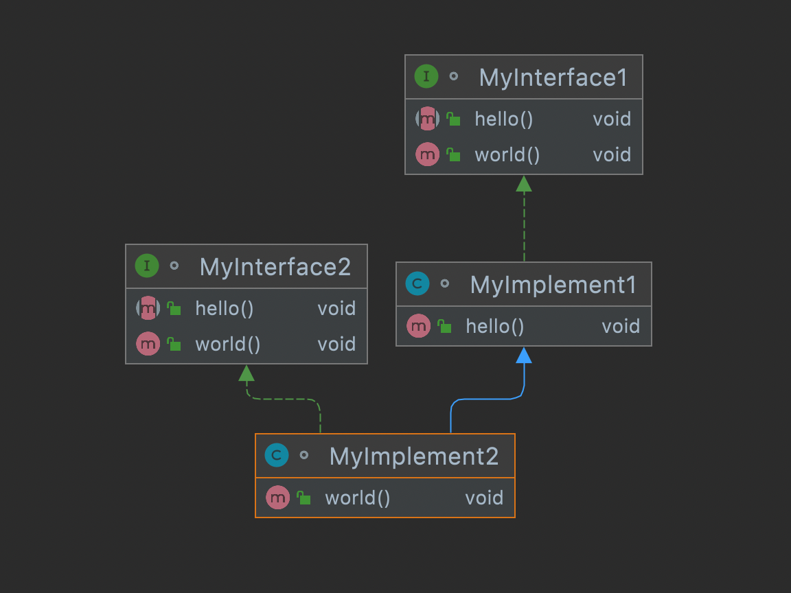
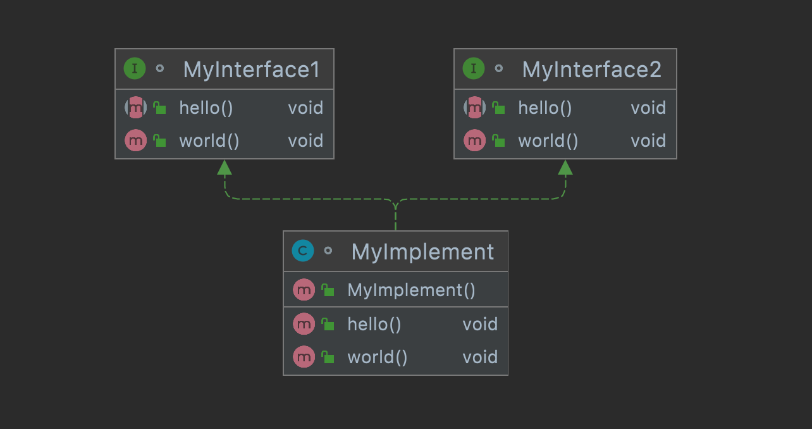

# Java8中的default关键字

## 目录

*   [如何使用](#如何使用)

    *   [1、实现类调用接口的默认实现default](#1实现类调用接口的默认实现default)

    *   [2、同时实现类两个接口](#2同时实现类两个接口)

## 如何使用

### 1、实现类调用接口的默认实现default

```java
interface MyInterface1 {
    void hello();

    default void world() {
        System.out.println("world");
    }
}
class MyImplement implements MyInterface1 {

    @Override
    public void hello() {
        System.out.println("hello,");
    }

    public static void main(String[] args) {
        new MyImplement().hello();
        new MyImplement().world();
    }

}

```

### 2、同时实现类两个接口

假如两个接口都有相同名字的被default修饰的默认方法，则编译就会报错。



因为都有相同的默认方法world，如果调用world方法，虚拟机将不知道执行哪个方法。

编译器此时已经被干懵了，当我们在MyImplement类中调用方法时，它不知道该去调用Interface1的默认方法还是去调用Interface2的方法。

**解决方法**

1 **、在实现类中实现该方法**

如果调用world方法，会先执行类中的world方法，这里也就是MyInterface1中的world方法。

因为类优先于接口，所以将会执行MyImplement1中的方法。

```java
interface MyInterface1 {
    void hello();

    default void world() {
        System.out.println("MyInterface1 world");
    }
}

interface MyInterface2 {
    void hello();

    default void world() {
        System.out.println("MyInterface2 world");
    }
}
class MyImplement1 implements MyInterface1 {
    @Override
    public void hello() {

    }
}
class MyImplement2 extends MyImplement1 implements MyInterface2{

    @Override
    public void world() {
        super.world();
    }
}

```



2、**显示调用**

```java
class MyImplement implements MyInterface1,MyInterface2 {

    @Override
    public void hello() {
        System.out.println("hello,");
    }

    @Override
    public void world() {
        MyInterface1.super.world();
    }

    public static void main(String[] args) {
        new MyImplement().hello();
    }

}
```


