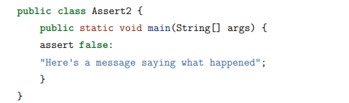
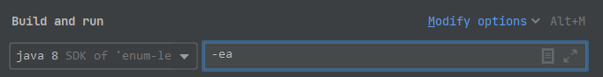
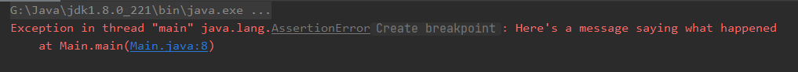
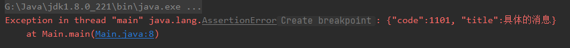

# 前置条件（Assert）

前置条件的概念来自契约设计DBC，利用断言机制实现。

# Java断言语法

*   assert boolean-expression；

*   assert boolean-expression: information-expression;

“我断言这个布尔表达式会产生 true”，否则，将抛出 AssertionError 异常。

AssertionError 是 Throwable 的派生类，因此不需要异常说明。



如果你正常运行程序，没有任何特殊的断言标志，则不会发生任何事情。你需要在运行程序时显式启用断言。一种简单的方法是使用 -ea 标志，它也可以表示为: -enableassertion，这将运行程序并执行任何断言语句。



如果你使用 information-expression ，将生成一条有用的消息作为异常堆栈跟踪的一部分。最有用的
information-expression 通常是一串针对程序员的文本：

information-expression 可以产生任何类型的对象，因此，通常将构造一个包含对象值的更复杂的字符串，它包含失败的断言。





# 断言开关

*   一般情况下使用【-ea标记】

*   还可以基于类名或包名打开或关闭断言

*   还可以通过编程的方式通过链接到类加载器对象（ClassLoader）来控制断言

类加载器中有几种方法允许动态启用和禁用断言，其中 `setDefaultAssertionStatus() `, 它为之后加载的所有类设置断言状态。这样就可以不使用-ea标记。

```java
public class Main {
    public static void main(String[] args) {
        // 开启断言
        ClassLoader.getSystemClassLoader().setDefaultAssertionStatus(true);
        new Loaded().go();
    }

    static class Loaded {
        public void go() {
            assert false : "Loaded.go()";
        }
    }
}

```

```纯文本
Exception in thread "main" java.lang.AssertionError: Loaded.go()
  at Main$Loaded.go(Main.java:15)
  at Main.main(Main.java:10)
```

*   决定在程序运行时是否启用断言，可以使用static静态代码块，该语句位于主类中；

```java
static {
    boolean assertionsEnabled = false;
    // Note intentional side effect of assignment:
    assert assertionsEnabled = true;
    if(!assertionsEnabled)
      throw new RuntimeException("Assertions disabled");
}
```

# Guava 断言

Java断言本地启动很麻烦，Guava 团队添加一个始终启用的用来替换断言的Verify 类。

他们建议静态导入 Verify 方法：

```java
import com.google.common.base.VerifyException;
import static com.google.common.base.Verify.*;
public class Main {
    public static void main(String[] args) {
        verify(2 + 2 == 4);
        try {
            verify(1 + 2 == 4);
        } catch (VerifyException e) {
            System.out.println(e);
        }

        try {
            verify(1 + 2 == 4, "Bad math");
        } catch (VerifyException e) {
            System.out.println(e.getMessage());
        }
        try {
            verify(1 + 2 == 4, "Bad math: %s", "not 4");
        } catch (VerifyException e) {
            System.out.println(e.getMessage());
        }

        String s = "";
        s = verifyNotNull(s);
        s = null;
        try {
            verifyNotNull(s);
        } catch (VerifyException e) {
            System.out.println(e.getMessage());
        }

        try {
            verifyNotNull(s, "Shouldn't be null: %s", "arg s");
        } catch (VerifyException e) {
            System.out.println(e.getMessage());
        }
    }
}

```

com.google.common.base.VerifyException
Bad math
Bad math: not 4
expected a non-null reference
Shouldn't be null: arg s
