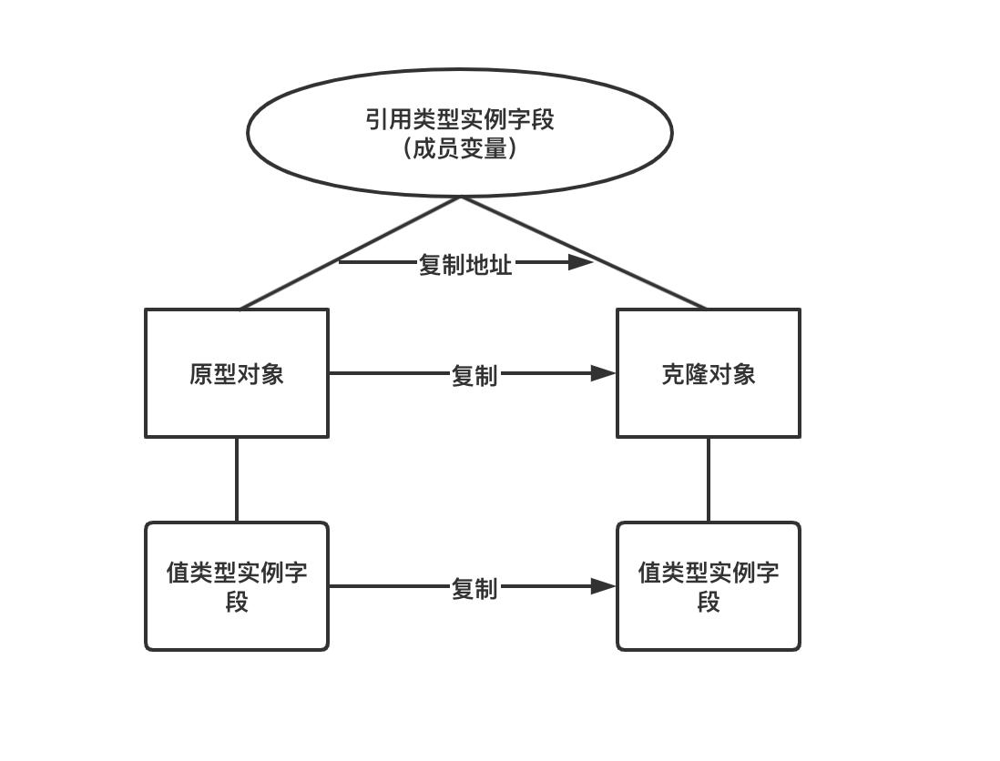
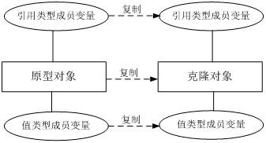

# Java克隆对象（复制）

## 目录

*   [问题引入](#问题引入)

*   [为什么要克隆？](#为什么要克隆)

*   [如何实现克隆？](#如何实现克隆)

    *   [浅克隆（步骤）：](#浅克隆步骤)

    *   [深克隆（步骤）](#深克隆步骤)

*   [浅克隆和深克隆](#浅克隆和深克隆)

    *   [浅克隆](#浅克隆)

    *   [深克隆](#深克隆)

*   [解决多层克隆问题](#解决多层克隆问题)

*   [总结](#总结)

# 问题引入

复制一个基本数据类型的变量很简单，但是复制一个对象，就有点难了。

```java
Student stu1 = new Student();  
stu1.setNumber(12345);  
Student stu2 = stu1;  
  
System.out.println("学生1:" + stu1.getNumber());  
System.out.println("学生2:" + stu2.getNumber());  
```

当然这种做法是错误的。

Object类有两个protected的方法，其中一个为clone方法。

在Java中所有的类都是缺省的继承自Java语言包中的Object类的，查看它的源码，你可以把你的JDK目录下的src.zip复制到其他地方然后解压，里面就是所有的源码。发现里面有一个访问限定符为protected的方法clone()：

```java
/*
  Creates and returns a copy of this object. The precise meaning of "copy" may depend on the class of the object.
  The general intent is that, for any object x, the expression:
  1) x.clone() != x will be true
  2) x.clone().getClass() == x.getClass() will be true, but these are not absolute requirements.
  3) x.clone().equals(x) will be true, this is not an absolute requirement.
*/
protected native Object clone() throws CloneNotSupportedException;
```

仔细一看，它还是一个native方法，大家都知道native方法是非Java语言实现的代码，供Java程序调用的，因为Java程序是运行在JVM虚拟机上面的，要想访问到比较底层的与操作系统相关的就没办法了，只能由靠近操作系统的语言来实现。

1\) x.clone() != x will be true
2\) x.clone().getClass() == x.getClass() will be true, but these are not absolute requirements.
3\) x.clone().equals(x) will be true, this is not an absolute requirement.

1.  第一次声明保证克隆对象将有单独的内存地址分配。

2.  第二次声明表明，原始和克隆的对象应该具有相同的类类型，但它不是强制性的。

3.  第三声明表明，原始和克隆的对象应该是平等的equals()方法使用，但它不是强制性的。

因为每个类直接或间接的父类都是Object，因此它们都含有clone()方法，但是因为该方法是protected，所以都不能在类外进行访问。

**要想对一个对象进行复制，就需要对clone方法覆盖。**

# 为什么要克隆？

大家先思考一个问题，为什么需要克隆对象？直接new一个对象不行吗？

答案是：

克隆的对象可能包含一些已经修改过的属性，而new出来的对象的属性都还是初始化时候的值，所以当需要一个新的对象来保存当前对象的“状态”就靠clone方法了。那么我把这个对象的临时属性一个一个的赋值给新new的对象不也行嘛？可以是可以，但是一来麻烦不说，二来，大家通过上面的源码都发现了clone是一个native方法，就是快啊，在底层实现的。

提个醒，我们常见的`Object a=new Object();Object b;b=a;`这种形式的代码复制的是引用，即对象在内存中的地址，a和b对象仍然指向了同一个对象。

而通过clone方法赋值的对象跟原来的对象时同时独立存在的。

# 如何实现克隆？

克隆有两种不同的方式：浅克隆和深克隆

先介绍一下两种不同的克隆方法，**浅克隆(ShallowClone)和**深克隆(DeepClone)：

*   在Java语言中，数据类型分为值类型（基本数据类型）和引用类型，**值类型包括int、double、byte、boolean、char等简单数据类型**，**引用类型包括类、接口、数组等复杂类型。**

*   浅克隆和深克隆的主要区别在于是否支持引用类型的成员变量的复制，下面将对两者进行详细介绍。

## 浅克隆（步骤）：

1.  **被复制的类需要实现Clonenable接口**（不实现的话在调用clone方法会抛出CloneNotSupportedException异常)， 该接口为标记接口(不含任何方法)

2.  **覆盖clone()方法，访问修饰符设为public**。**方法中调用super.clone()方法得到需要的复制对象**。（native为本地方法)

```java
public class Student implements Cloneable{
  private int number;

  public int getNumber() {
      return number;
  }

  public void setNumber(int number) {
      this.number = number;
  }

  @Override
  protected Object clone() throws CloneNotSupportedException {
      return super.clone();
  }
}

```

测试：

```java
Student student = new Student();
student.setNumber(1234);
Object clone = null;
try {
    clone = student.clone();
} catch (CloneNotSupportedException e) {
    e.printStackTrace();
}
Student student2 = (Student) clone;
System.out.println("student1=" + student.getNumber());
System.out.println("student2=" + student2.getNumber());

student.setNumber(123456789);
System.out.println("student1=" + student.getNumber());
System.out.println("student2=" + student2.getNumber());
```

运行结果：

> student1=1234
> student2=1234
> student1=123456789
> student2=1234

System.out.println(stu1 == stu2); // false &#x20;

这说明两个对象不是同一个

## 深克隆（步骤）

在student类中添加一个引用类型的属性，比如address类型

```java
class Address  {
    private String location;
}
public class Student implements Cloneable {
    private int number;
    private Address address;

}

```

测试：

```java
Address address = new Address("beijing");
Student student1 = new Student(1234,address);
Student student2 = (Student) student1.clone();
System.out.println(student1);
System.out.println(student2);
// 修改address对象，不要创建一个新的address对象
address.setLocation("shanghai");
student1.setAddress(address);
System.out.println(student1);
System.out.println(student2);
```

运行结果：

```text
Student{number=1234, address=Address{location='beijing'}}
Student{number=1234, address=Address{location='beijing'}}
Student{number=1234, address=Address{location='shanghai'}}
Student{number=1234, address=Address{location='shanghai'}}
```

如果真的要克隆出一个东西，那么这两个东西应该不会相互影响。而上面的代码明显违背的克隆的含义。

原因是浅复制只是复制了addr变量的引用，并没有真正的开辟另一块空间，将值复制后再将引用返回给新对象。

所以，为了达到真正的复制对象，而不是纯粹引用复制。我们需要将Address类可复制化，并且修改clone方法。

修改代码如下：

```java
class Address implements Cloneable {
    private String location;
    @Override
    protected Object clone() throws CloneNotSupportedException {
        return super.clone();
    }
}


public class Student implements Cloneable {
    private int number;
    private Address address;

    @Override
    protected Object clone() {
        Student stu = null;
        try {
            stu = (Student) super.clone();             // 浅复制
            stu.address = (Address) address.clone();   // 深度复制
        } catch (CloneNotSupportedException e) {
            e.printStackTrace();
        }
        return stu;
    }

}

```

运行结果：这样就符合预期的效果

```java
Student{number=1234, address=Address{location='beijing'}}
Student{number=1234, address=Address{location='beijing'}}
Student{number=1234, address=Address{location='shanghai'}}
Student{number=1234, address=Address{location='beijing'}}

```

# 浅克隆和深克隆

## 浅克隆

在浅克隆中，如果原型对象的成员变量是值类型，将复制一份给克隆对象；

如果原型对象的成员变量是引用类型，则将引用对象的地址复制一份给克隆对象，原型对象和克隆对象的成员变量指向相同的内存地址。

简单来说，在浅克隆中，当对象被复制时只复制它本身和其中包含的值类型的成员变量，而引用类型的成员对象并没有复制。

成员变量也称为实例字段。



在Java语言中，通过**覆盖Object类的clone()方法可以实现浅克隆**。

## 深克隆

无论原型对象的成员变量是值类型还是引用类型，都将复制一份给克隆对象，深克隆将原型对象的所有引用对象也复制一份给克隆对象。

简单来说，在深克隆中，除了对象本身被复制外，对象所包含的所有成员变量也将复制。



在Java语言中，如果需要**实现深克隆，可以通过**覆盖Object类的clone()方法实现，也**可以通过序列化(Serialization)等方式**来实现。

（**如果引用类型里面还包含很多引用类型，或者内层引用类型的类里面又包含引用类型，使用clone方法就会很麻烦。这时我们可以用序列化的方式来实现对象的深克隆。**）

> 序列化就是将对象写到流的过程，写到流中的对象是原有对象的一个拷贝，而原对象仍然存在于内存中。通过序列化实现的拷贝不仅可以复制对象本身，而且可以复制其引用的成员对象，因此通过序列化将对象写到一个流中，再从流里将其读出来，可以实现深克隆。需要注意的是能够实现序列化的对象其类必须实现Serializable接口，否则无法实现序列化操作。

> Java语言提供的Cloneable接口和Serializable接口的代码非常简单，它们都是空接口，这种空接口也称为标识接口，标识接口中没有任何方法的定义，其作用是告诉JRE这些接口的实现类是否具有某个功能，如是否支持克隆、是否支持序列化等。

# 解决多层克隆问题

如果引用类型里面还包含很多引用类型，或者内层引用类型的类里面又包含引用类型，使用clone方法就会很麻烦。这时我们可以用序列化的方式来实现对象的深克隆。

inner：

```java

public class Inner implements Serializable {

    private static final long serialVersionUID = 9124778603211185065L;

    private String name;

    public String getName() {
        return name;
    }

    public void setName(String name) {
        this.name = name;
    }

    public Inner(String name) {
        this.name = name;
    }

    @Override
    public String toString() {
        return "Inner的name值为：" + name;
    }
}
```

outter：

```java

public class Outer implements Serializable {
    private static final long serialVersionUID = -4262493597076539557L;//最好是显式声明ID
    private int number;
    public Inner inner;

    public Outer(int number, Inner inner) {
        this.number = number;
        this.inner = inner;
    }

    // Description:[深度复制方法,需要对象及对象所有的对象属性都实现序列化]
    public Outer getClone() {
        Outer outer = null;
        try {// 将该对象序列化成流,因为写在流里的是对象的一个拷贝，而原对象仍然存在于JVM里面。所以利用这个特性可以实现对象的深拷贝
            ByteArrayOutputStream baos = new ByteArrayOutputStream();
            ObjectOutputStream oos = new ObjectOutputStream(baos);
            oos.writeObject(this);
            // 将流序列化成对象
            ByteArrayInputStream bais = new ByteArrayInputStream(baos.toByteArray());
            ObjectInputStream ois = new ObjectInputStream(bais);
            outer = (Outer) ois.readObject();
        } catch (IOException e) {
            e.printStackTrace();
        } catch (ClassNotFoundException e) {
            e.printStackTrace();
        }
        return outer;
    }
}
```

测试：

```java
Inner inner = new Inner("hello");
Outer outer1 = new Outer(1, inner);
Outer outer2 = outer1.getClone();
System.out.println(outer1);
System.out.println(outer2);
inner.setName("world");
outer1.setInner(inner);
System.out.println(outer1);
System.out.println(outer2);

Outer{number=1, inner=Inner的name值为：hello}
Outer{number=1, inner=Inner的name值为：hello}
Outer{number=1, inner=Inner的name值为：world}
Outer{number=1, inner=Inner的name值为：hello}

```

注意：inner和outer都要实现Serializable。

这样也能使两个对象在内存空间内完全独立存在，互不影响对方的值。

# 总结

实现对象克隆有两种方式：

1\). 实现Cloneable接口并重写Object类中的clone()方法；

2\). 实现Serializable接口，通过对象的序列化和反序列化实现克隆，可以实现真正的深度克隆。

注意：基于序列化和反序列化实现的克隆不仅仅是深度克隆，更重要的是通过泛型限定，可以检查出要克隆的对象是否支持序列化，这项检查是编译器完成的，不是在运行时抛出异常，这种是方案明显优于使用Object类的clone方法克隆对象。让问题在编译的时候暴露出来总是优于把问题留到运行时。
