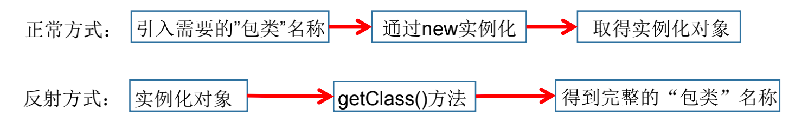
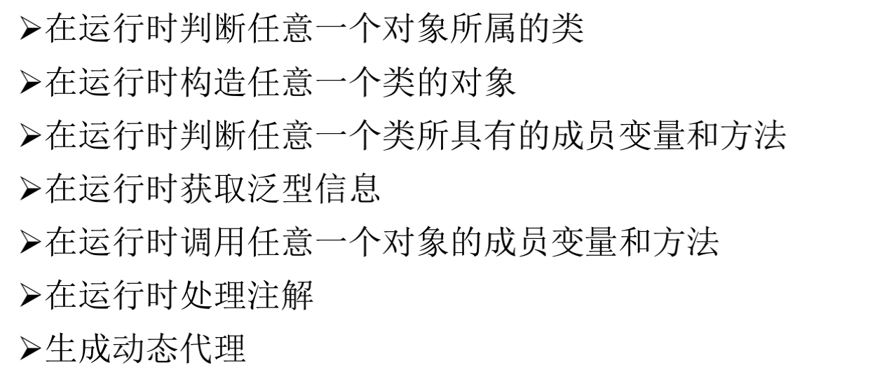
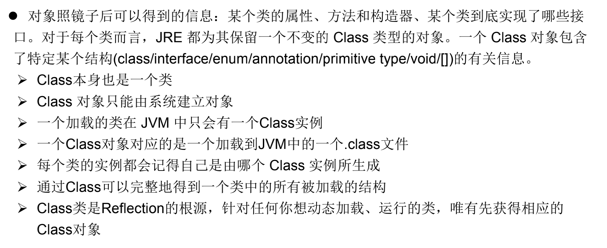
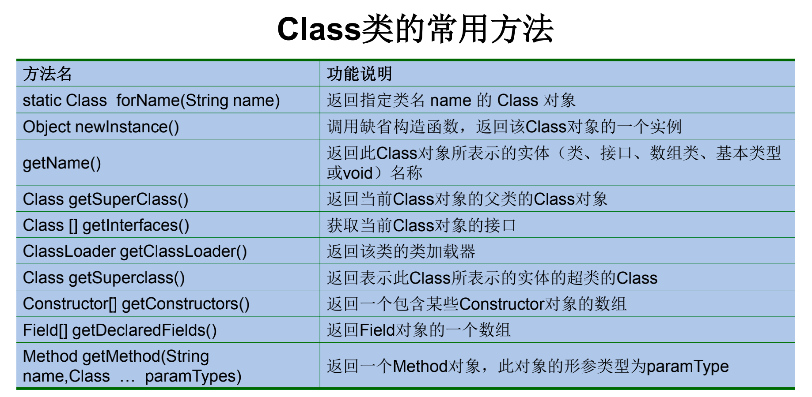
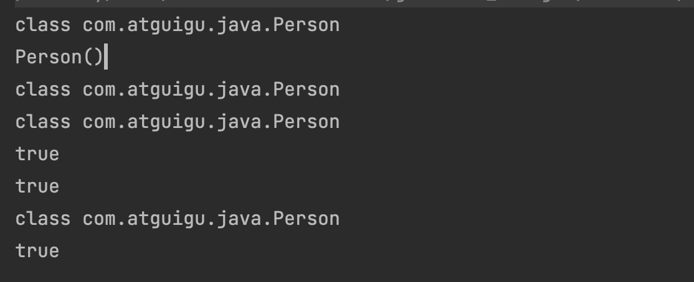
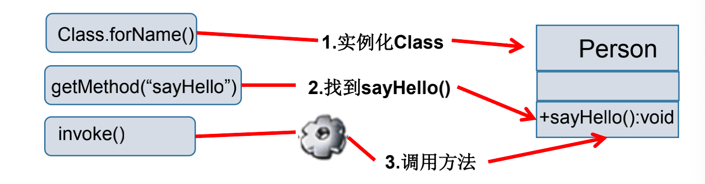
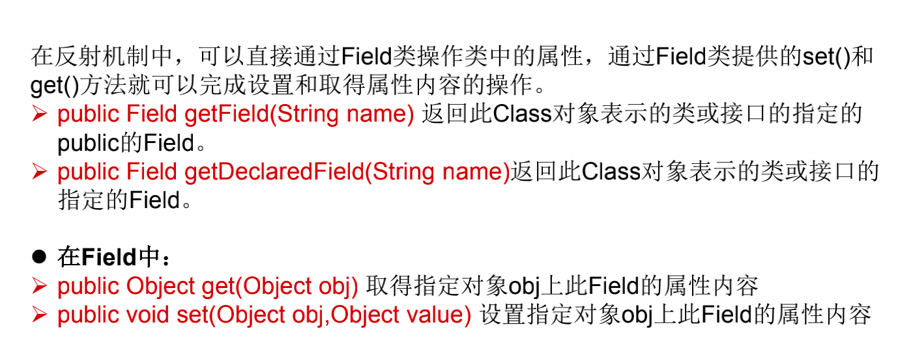
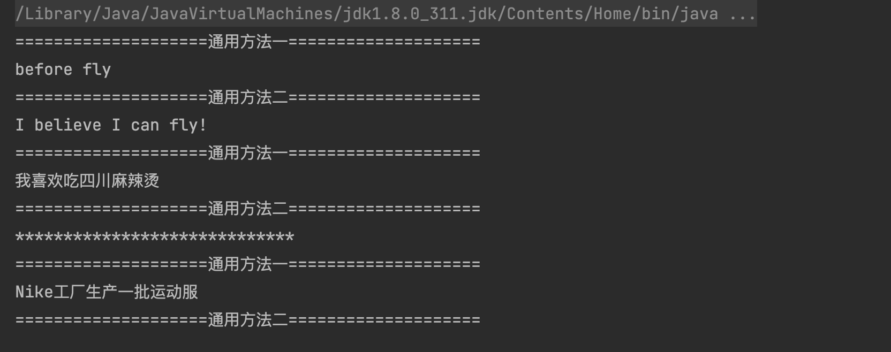

# Java反射机制

## 目录

*   [1、Java反射机制概述](#1java反射机制概述)

    *   [1.1 动态语言和静态语言](#11-动态语言和静态语言)

    *   [1.2 Java反射机制提供的功能](#12-java反射机制提供的功能)

*   [2、理解Class类并获取Class实例](#2理解class类并获取class实例)

    *   [2.1 反射的四种方法](#21-反射的四种方法)

    *   [2.2 哪些类型可以有Class对象](#22-哪些类型可以有class对象)

*   [3、类的加载与ClassLoader的理解](#3类的加载与classloader的理解)

*   [4、创建运行时类的对象](#4创建运行时类的对象)

*   [5、获取运行时类的完整结构](#5获取运行时类的完整结构)

*   [6、 调用运行时类的指定结构](#6-调用运行时类的指定结构)

    *   [6.1 调用指定方法](#61-调用指定方法)

    *   [6.2 调用指定属性](#62-调用指定属性)

    *   [6.3 关于setAccessible方法的使用](#63-关于setaccessible方法的使用)

*   [7、反射的应用：动态代理](#7反射的应用动态代理)

## 1、Java反射机制概述

*   Reflection反射是被视为**动态语言**的关键，反射机制允许程序在运行期借助于Reflection API取得任何类的内部信息，并能直接操作任意对象的内部属性和方法。

*   加载完类之后，在堆内存的方法区就产生了一个Class类型的对象，一个类只有一个Class对象，这个对象包含了完整的类的内部结构信息。因为我们可以通过这个对象看到类的内部结构信息，所以我们称之为：反射。



### 1.1 动态语言和静态语言

*   动态语言

    *   动态语言是一种在运行的时候可以改变其结构的语言：例如新的函数、对象、代码可以被引进来，已有的函数也可以被删除，或者是添加其他的新代码。**就是：在运行时代码可以根据某些条件改变自身结构。**

    *   主要动态语言：Object-C、C#、JavaScript、PHP、Python、Erlang。

*   静态语言

    *   **运行时结构不能改变的语言就是静态语言。**

    *   Java、C、C++。

*   Java不是动态语言，但Java可以称之为“准动态语言”。即Java有一定的动态性，我们可以利用反射机制、字节码操作获得类似动态语言的特性。Java的动态性让编程的时候更加灵活！

### 1.2 Java反射机制提供的功能



## 2、理解Class类并获取Class实例

| [](https://docs.oracle.com/javase/8/docs/api/java/lang/reflect/AccessibleObject.html)[AccessibleObject](https://docs.oracle.com/javase/8/docs/api/java/lang/reflect/AccessibleObject.html "AccessibleObject")     | The AccessibleObject class is the base class for Field, Method and Constructor objects.                                                                                                                                                                                                                                                                                                                                  |
| ----------------------------------------------------------------------------------------------------------------------------------------------------------------------------------------------------------------- | ------------------------------------------------------------------------------------------------------------------------------------------------------------------------------------------------------------------------------------------------------------------------------------------------------------------------------------------------------------------------------------------------------------------------ |
| [](https://docs.oracle.com/javase/8/docs/api/java/lang/reflect/Array.html)[Array](https://docs.oracle.com/javase/8/docs/api/java/lang/reflect/Array.html "Array")                                                 | The `Array` class provides static methods to dynamically create and access Java arrays.                                                                                                                                                                                                                                                                                                                                  |
| [](https://docs.oracle.com/javase/8/docs/api/java/lang/reflect/Constructor.html)[Constructor](https://docs.oracle.com/javase/8/docs/api/java/lang/reflect/Constructor.html "Constructor")                         | `Constructor` provides information about, and access to, a single constructor for a class.                                                                                                                                                                                                                                                                                                                               |
| [](https://docs.oracle.com/javase/8/docs/api/java/lang/reflect/Executable.html)[Executable](https://docs.oracle.com/javase/8/docs/api/java/lang/reflect/Executable.html "Executable")                             | A shared superclass for the common functionality of [](https://docs.oracle.com/javase/8/docs/api/java/lang/reflect/Method.html)[Method](https://docs.oracle.com/javase/8/docs/api/java/lang/reflect/Method.html "Method") and [](https://docs.oracle.com/javase/8/docs/api/java/lang/reflect/Constructor.html)[Constructor](https://docs.oracle.com/javase/8/docs/api/java/lang/reflect/Constructor.html "Constructor"). |
| [](https://docs.oracle.com/javase/8/docs/api/java/lang/reflect/Field.html)[Field](https://docs.oracle.com/javase/8/docs/api/java/lang/reflect/Field.html "Field")                                                 | A `Field` provides information about, and dynamic access to, a single field of a class or an interface.                                                                                                                                                                                                                                                                                                                  |
| [](https://docs.oracle.com/javase/8/docs/api/java/lang/reflect/Method.html)[Method](https://docs.oracle.com/javase/8/docs/api/java/lang/reflect/Method.html "Method")                                             | A `Method` provides information about, and access to, a single method on a class or interface.                                                                                                                                                                                                                                                                                                                           |
| [](https://docs.oracle.com/javase/8/docs/api/java/lang/reflect/Modifier.html)[Modifier](https://docs.oracle.com/javase/8/docs/api/java/lang/reflect/Modifier.html "Modifier")                                     | The Modifier class provides `static` methods and constants to decode class and member access modifiers.                                                                                                                                                                                                                                                                                                                  |
| [](https://docs.oracle.com/javase/8/docs/api/java/lang/reflect/Parameter.html)[Parameter](https://docs.oracle.com/javase/8/docs/api/java/lang/reflect/Parameter.html "Parameter")                                 | Information about method parameters.                                                                                                                                                                                                                                                                                                                                                                                     |
| [](https://docs.oracle.com/javase/8/docs/api/java/lang/reflect/Proxy.html)[Proxy](https://docs.oracle.com/javase/8/docs/api/java/lang/reflect/Proxy.html "Proxy")                                                 | 代理提供了用于创建动态代理类和实例的静态方法，它也是这些方法创建的所有动态代理类的超类。                                                                                                                                                                                                                                                                                                                                                                             |
| [](https://docs.oracle.com/javase/8/docs/api/java/lang/reflect/ReflectPermission.html)[ReflectPermission](https://docs.oracle.com/javase/8/docs/api/java/lang/reflect/ReflectPermission.html "ReflectPermission") | The Permission class for reflective operations.                                                                                                                                                                                                                                                                                                                                                                          |





### 2.1 反射的四种方法

```java
@Test
public void test3() throws ClassNotFoundException {
  //方式一：调用运行时类的属性：.class
  Class clazz1 = Person.class;
  System.out.println(clazz1);
  //方式二：通过运行时类的对象,调用getClass()
  Person p1 = new Person();
  Class clazz2 = p1.getClass();
  System.out.println(clazz2);

  //方式三：调用Class的静态方法：forName(String classPath)
  Class clazz3 = Class.forName("com.atguigu.java.Person");
  //        clazz3 = Class.forName("java.lang.String");
  System.out.println(clazz3);

  System.out.println(clazz1 == clazz2); // true
  System.out.println(clazz1 == clazz3); // true

  //方式四：使用类的加载器：ClassLoader  (了解)
  ClassLoader classLoader = ReflectionTest.class.getClassLoader();
  Class<?> clazz4 = classLoader.loadClass("com.atguigu.java.Person");
  System.out.println(clazz4);
  System.out.println(clazz1 == clazz4);

}
```



### 2.2 哪些类型可以有Class对象

1.  Class(外部类，成员(成员内部类，静态内部类)，局部内部类，匿名内部类)

2.  Interface

3.  \[]

4.  enum

5.  Annotation：注解

6.  Primitive type：基本数据类型

7.  void

## 3、类的加载与ClassLoader的理解

了解

## 4、创建运行时类的对象

*   无参构造器

    `java.lang.Class#newInstance()`

    调用newInstance()可以创建类的对象：

    1.  类必须有一个无参数的构造器

    2.  构造器的访问权限足够

*   有参数的构造器

先使用java.lang.Class#getDeclaredConstructor获取构造器，在执行newInstance()

```java
try {
    Constructor<Person> declaredConstructor = clazz.getDeclaredConstructor(String.class);
    declaredConstructor.newInstance("name");
} catch (InvocationTargetException | NoSuchMethodException e) {
    throw new RuntimeException(e.getMessage());
}
```

## 5、获取运行时类的完整结构

1.  接口

`public Class<?>[] getInterfaces() `

获取类实现的所有接口

1.  类

`public Class<? Super T> getSuperclass()`

返回表示此 Class 所表示的实体（类、接口、基本类型）的父类的Class

1.  构造器

`public Constructor<T>[] getConstructors()`

获取所有的public的构造器

`public Constructor<T>[] getDeclaredConstructors()`

获取所有的构造器

`public int getModifiers()`

获取构造器修饰符

`public String getName();`

获取构造器名称

`public Class<?>[] getParameterTypes();`

获取构造器参数类型

1.  方法

`public Method[] getMethods() `

获取所有public方法

`public Method[] getDeclaredMethods()`

获取所有方法

`public Class<?> getReturnType()`

获取方法所有返回类型

`public Class<?>[] getParameterTypes()`

获取方法所有参数类型

`public int getModifiers()`

获取方法的修饰符

`public Class<?>[] getExceptionTypes()`

获取方法异常类型

1.  属性

`public Field[] getFields()`

`public Field[] getDeclaredFields() `

`public int getModifiers()`

以整数形式返回此Field的修饰符

`public Class<?> getType()`

得到Field的属性类型

`public String getName()`

返回Field的名称

1.  **Annotation**

**getAnnotation(Class**

\*\* annotationClass)\*\* ​

**getDeclaredAnnotations**()

1.  范型

`Type getGenericSuperclass()`

获取父类泛型类型

`ParameterizedType`

获取泛型类型

`getActualTypeArguments()`

获取实际的泛型类型参数数

1.  所在的包

`Package getPackage()`

## 6、 调用运行时类的指定结构

### 6.1 调用指定方法

通过反射，调用类中的方法，需要使用Method类

1.  通过Class类的**getMethod(String name,Class…parameterTypes)** 方法取得一个Method对象，并设置此方法操作时所需要的参数类型。

2.  使用**Object invoke(Object obj, Object\[] args)** 进行调用，并向方法中传递要设置的obj对象的参数信息。



> **Object invoke(Object obj, Object … args)**
> Object对应原方法的返回值

1.  如果原方法无返回值，则返回null

2.  若原方法为静态方法，则形参Object obj可为null

3.  原方法形参列表为空，则Object\[] args 为null

4.  若原方法声明为private，则需要在调用此invoke()方法前，显示调用方法对象的**setAccessible(true)** 方法，打破封装后就可以访问private方法。

### 6.2 调用指定属性



### 6.3 关于setAccessible方法的使用

*   Method和Field、Constructor对象都有setAccessible()方法。

*   setAccessible启动和禁用访问安全检查的开关。

*   参数值为true则指示反射的对象在使用时应该取消Java语言访问检查。

    *   提高反射的效率。如果代码中必须用反射，而该句代码需要频繁的被调用，那么请设置为true。

    *   使得原本无法访问的私有成员也可以访问。

*   参数值为false则指示反射的对象应该实施Java语言访问检查。

## 7、反射的应用：动态代理

java代码：

```java
package com.atguigu.proxy;


import java.lang.reflect.InvocationHandler;
import java.lang.reflect.Method;
import java.lang.reflect.Proxy;

/**
 * 动态代理的举例
 *
 * @author shkstart
 * @create 2019 上午 10:18
 */

interface Human {

    String getBelief();

    void eat(String food);

}

//被代理类
class SuperMan implements Human {


    @Override
    public String getBelief() {
        System.out.println("before fly");
        return "I believe I can fly!";
    }

    @Override
    public void eat(String food) {
        System.out.println("我喜欢吃" + food);
    }
}

class HumanUtil {

    public void method1() {
        System.out.println("====================通用方法一====================");

    }

    public void method2() {
        System.out.println("====================通用方法二====================");
    }

}

/*
要想实现动态代理，需要解决的问题？
问题一：如何根据加载到内存中的被代理类，动态的创建一个代理类及其对象。
问题二：当通过代理类的对象调用方法a时，如何动态的去调用被代理类中的同名方法a。


 */

class ProxyFactory {
    //调用此方法，返回一个代理类的对象。解决问题一
    public static Object getProxyInstance(Object obj) {//obj:被代理类的对象
        MyInvocationHandler handler = new MyInvocationHandler();

        handler.bind(obj);

        return Proxy.newProxyInstance(obj.getClass().getClassLoader(), obj.getClass().getInterfaces(), handler);
    }

}

class MyInvocationHandler implements InvocationHandler {

    private Object obj;//需要使用被代理类的对象进行赋值

    public void bind(Object obj) {
        this.obj = obj;
    }

    //当我们通过代理类的对象，调用方法a时，就会自动的调用如下的方法：invoke()
    //将被代理类要执行的方法a的功能就声明在invoke()中
    @Override
    public Object invoke(Object proxy, Method method, Object[] args) throws Throwable {

        HumanUtil util = new HumanUtil();
        util.method1();

        //method:即为代理类对象调用的方法，此方法也就作为了被代理类对象要调用的方法
        //obj:被代理类的对象
        Object returnValue = method.invoke(obj, args);

        util.method2();

        //上述方法的返回值就作为当前类中的invoke()的返回值。
        return returnValue;
  
    }
}

public class ProxyTest {

    public static void main(String[] args) {
        SuperMan superMan = new SuperMan();
        //proxyInstance:代理类的对象
        Human proxyInstance = (Human) ProxyFactory.getProxyInstance(superMan);
        //当通过代理类对象调用方法时，会自动的调用被代理类中同名的方法
        String belief = proxyInstance.getBelief();
        System.out.println(belief);
        proxyInstance.eat("四川麻辣烫");

        System.out.println("*****************************");

        NikeClothFactory nikeClothFactory = new NikeClothFactory();

        ClothFactory proxyClothFactory = (ClothFactory) ProxyFactory.getProxyInstance(nikeClothFactory);

        proxyClothFactory.produceCloth();

    }
}
```


