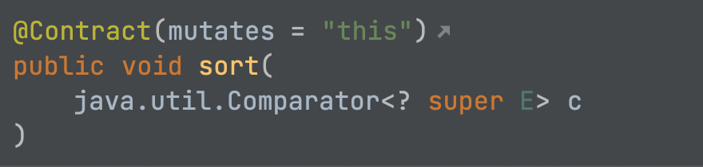
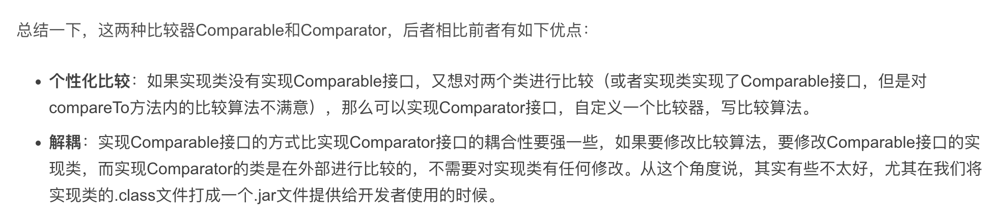

# 排序Comparable和Comparator

## 目录

*   [自然排序(推荐)](#自然排序推荐)

*   [比较器](#比较器)

*   [总结](#总结)

## 自然排序(推荐)

```java
import java.util.ArrayList;
import java.util.Arrays;
import java.util.Collections;
import java.util.List;

/**
 *
 */
public class SortPerson implements Comparable<SortPerson> {
  private String name;
  private int age;

  public SortPerson(String name, int age) {
    this.name = name;
    this.age = age;
  }

  public String getName() {

    return name;
  }

  public void setName(String name) {
    this.name = name;
  }

  public int getAge() {
    return age;
  }

  public void setAge(int age) {
    this.age = age;
  }

  @Override
  public String toString() {
    return "SortPerson{" + "name='" + name + '\'' + ", age=" + age + '}';
  }

  @Override
  public int compareTo(SortPerson o) {
    return this.getAge() - o.getAge();
  }

  public static void main(String[] args) {
    List list = new ArrayList();
    list.add(new SortPerson("aa1",1));
    list.add(new SortPerson("aa4",4));
    list.add(new SortPerson("aa3",3));
    list.add(new SortPerson("bb2",2));
    Collections.sort(list);
    // [SortPerson{name='aa1', age=1}, SortPerson{name='bb2', age=2}, SortPerson{name='aa3', age=3}, SortPerson{name='aa4', age=4}]
    SortPerson sort[] = new SortPerson[4];
    sort[0] = new SortPerson("aa1",1);
    sort[1] = new SortPerson("aa4",4);
    sort[2] = new SortPerson("aa3",3);
    sort[3] = new SortPerson("aa2",2);
    Arrays.sort(sort);
    // [SortPerson{name='aa1', age=1}, SortPerson{name='aa2', age=2}, SortPerson{name='aa3', age=3}, SortPerson{name='aa4', age=4}]
    System.out.println(list);
    System.out.println(Arrays.toString(sort));
  }

}

```

## 比较器



```java
list.sort((o1, o2) -> o1.getAge() - o2.getAge());     // 过时
list.sort(Comparator.comparingInt(SortPerson::getAge)); // 推荐
list.sort(Comparator.comparing(SortPerson::getName));
```

## 总结

1.  Comparable 自然排序。（实体类实现）

2.  Comparator 是定制排序。（无法修改实体类时，直接在调用方创建）

　　java中大部分我们常用的数据类型的类都实现了Comparable接口，而仅仅只有一个抽象类RuleBasedCollator实现了Comparator接口 ，还是我们不常用的类，这并不是要用Comparab而不要使用Comparator，在设计初时有需求就选择Comparable，若后期需要扩展或增加排序需求是，再增加一个比较器Comparator，毕竟能写Collections.sort(arg1),没人乐意写Collections.sort(arg1,arg2)。


