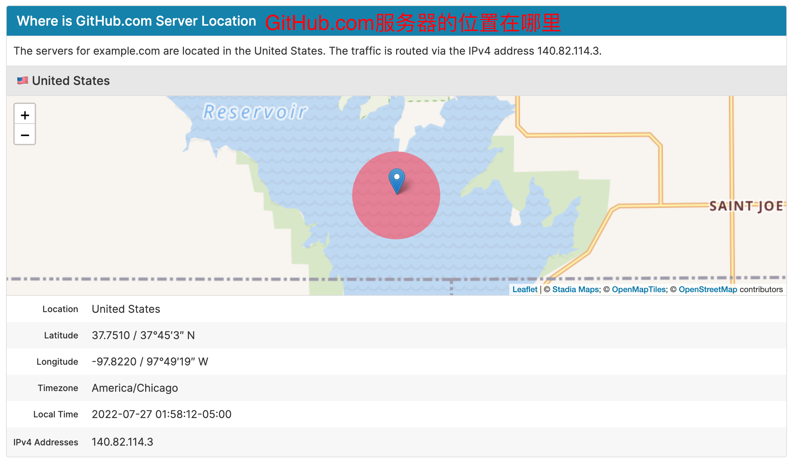

# 解决GitHub在Mac上无法访问

1、查询IP

https://ipaddress.com/website/github.com

IPv4 Addresses	

- 140.82.114.3



2、github域名查询

https://ipaddress.com/website/github.global.ssl.fastly.net

IPv4 Addresses	
*   199.232.69.194

3、github静态资源ip

https://ipaddress.com/website/assets-cdn.github.com

IPv4 Addresses	

- 185.199.108.153
- 185.199.110.153
- 185.199.111.153
- 185.199.109.153

hosts文件格式

```json
140.82.114.3  github.com
199.232.69.194  github.global.ssl.fastly.net
185.199.111.153 assets-cdn.github.com 
185.199.110.153 assets-cdn.github.com 
185.199.108.153 assets-cdn.github.com 
185.199.109.153 assets-cdn.github.com 
```

