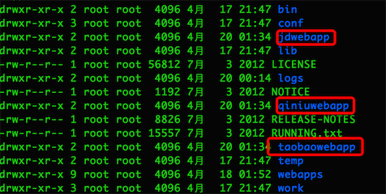

# HTTP请求Host字段

## 目录

*   [虚拟主机技术](#虚拟主机技术)

*   [Host概念](#host概念)

*   [参考博客](#参考博客)

## 虚拟主机技术

Host 是 HTTP 1.1 协议中新增的一个请求头，主要用来实现虚拟主机技术。

在http请求头中有host字段，该字段默认是request的URL，也可以自定义。

当我们发送一个请求的时候，先通过DNS域名解析，得到IP，然后建立TCP连接，当服务器(NGINX)收到请求的时候，就会解析HTTP请求的Host字段，进而判断需要访问哪一个server配置下的代码。


In this configuration nginx tests only the request’s header field “Host” to determine which server the request should be routed to. If its value does not match any server name, or the request does not contain this header field at all, then nginx will route the request to the default server for this port. In the configuration above, the default server is the first one — which is nginx’s standard default behaviour. It can also be set explicitly which server should be default, with the `default_server` parameter in the listen directive:


就是这样可以实现在一个服务器上通过HTTP的host字段实现虚拟主机技术。

一个IP可以对应多个域名，比如一台服务器上有三个服务，对应三个域名，[www.123.com、www.baidu.com、www.taobao.com，这样有一个问题，我们每次访问这些域名其实都是解析到服务器IP](http://www.123.com、www.baidu.com、www.taobao.com，这样有一个问题，我们每次访问这些域名其实都是解析到服务器IP) （比如192.168.1.1），那么如何来区分访问域名来显示不同的服务的网站的内容的？

这就需要用到用到请求头中的Host字段了，每一个Host都可以看作服务器上的一个服务站点，每次用不同的域名访问的时候都是会解析同一个IP，但是根据Host可以识别需要访问哪一个服务。

上面讲了这些如果还不能明白的话，我这里再举一个具体的Tomcat搭建网站站点的例子来说明这些Host具体在实际中是怎样设置的，我这里直接给出截图，因为只要是用Tomcat搭建过网站的应该都清楚，我直接在Tomcat目录中创建3个子目录来放我上面的3个站点就可以了，然后把具体的代码放到各个目录下面:



现在就需要我们来设置相关Host了，其实也比较简单，只需要编辑conf目录下的server.xml就可以了, 这里直接给出代码，可以看到其实是加了3个Host然后关联到以上3个目录下就可以了。

Host name="[www.qiniu.com](http://www.qiniu.com "www.qiniu.com")" appBase="qiniuwebapp"
Host name="[www.taobao.com](http://www.taobao.com "www.taobao.com")" appBase="taobaowebapp"
Host name="[www.jb.com](http://www.jb.com "www.jb.com")" appBase="jbwebapp"

```xml
<Engine name="Catalina" defaultHost="www.qiniu.com">
      <Realm className="org.apache.catalina.realm.UserDatabaseRealm"
             resourceName="UserDatabase"/>
 
       <Host name="www.qiniu.com" appBase="qiniuwebapp"  unpackWARs="true" autoDeploy="true" >     
           <Valve className="org.apache.catalina.valves.AccessLogValve" directory="logs"
               prefix="qiniuwebapp_access_log." suffix=".txt"
               pattern="%h %l %u %t "%r" %s %b" />
       </Host>
      <Host name="www.taobao.com" appBase="taobaowebapp"  unpackWARs="true" autoDeploy="true" >
            <Valve className="org.apache.catalina.valves.AccessLogValve" directory="logs"
               prefix="taobaowebapp_access_log." suffix=".txt"
               pattern="%h %l %u %t "%r" %s %b" />
     </Host> 
     <Host name="www.jb.com" appBase="jbwebapp"  unpackWARs="true" autoDeploy="true" >
            <Valve className="org.apache.catalina.valves.AccessLogValve" directory="logs"
               prefix="jbwebapp_access_log." suffix=".txt"
               pattern="%h %l %u %t "%r" %s %b" />
     </Host> 
 </Engine>
```

然后每次访问都会根据不同的Host的信息请求到不同的站点上面。

## Host概念

**Host** 请求头指明了请求将要发送到的服务器主机名和端口号。

*   服务器主机名

如果没有包含端口号，会自动使用被请求服务的默认端口（比如HTTPS URL使用443端口，HTTP URL使用80端口）。

所有HTTP/1.1 请求报文中必须包含一个`Host`头字段。对于缺少`Host`头或者含有超过一个`Host`头的HTTP/1.1 请求，可能会收到[400](https://developer.mozilla.org/zh-CN/docs/Web/HTTP/Status/400 "400")（Bad Request）状态码。

**语法**

```javascript
Host: <host>:<port>

```

**指令**
\<host>
服务器的域名（用于虚拟主机）。
\<port> 可选
服务器监听的 TCP 端口号。
**示例**

> Host: [developer.mozilla.org](http://developer.mozilla.org "developer.mozilla.org")

## 参考博客

可以了解一下IP、域名、主机名的区别

[https://blog.csdn.net/netdxy/article/details/51195560](https://blog.csdn.net/netdxy/article/details/51195560 "https://blog.csdn.net/netdxy/article/details/51195560")

[https://developer.mozilla.org/zh-CN/docs/Web/HTTP/Headers/Host](https://developer.mozilla.org/zh-CN/docs/Web/HTTP/Headers/Host "https://developer.mozilla.org/zh-CN/docs/Web/HTTP/Headers/Host")
