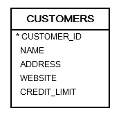
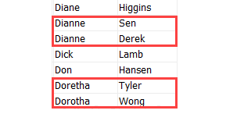
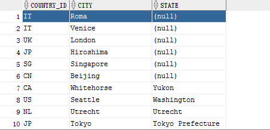

# 基础知识

## 目录

学习地址

<https://www.w3cschool.cn/oraclejc/oraclejc-21an2qtd.html>



### Select 语句

```sql
SELECT * FROM table_name;

SELECT 
  column_1, 
  column_2, 
FROM
  table_name;

```

### Order By

【语法】

```sql
SELECT
    column_1,
    column_2,
    column_3,
    ...
FROM
    table_name
ORDER BY
    column_1 [ASC | DESC] [NULLS FIRST | NULLS LAST],
    column_1 [ASC | DESC] [NULLS FIRST | NULLS LAST],
```

【按照名字升序】

```sql
SELECT name,address,credit_limit
FROM customers
ORDER BY name ASC;
```

【按照first\_name升序，last\_name降序】

```sql
SELECT first_name, last_name
FROM contacts
ORDER BY first_name, last_name DESC;
```



【null值在前面】

```sql
SELECT country_id, city, state
FROM
    locations
ORDER BY
    state ASC NULLS FIRST;
```



### Distinct

SELECT DISTINCT可以用来过滤结果集中的重复行，确保SELECT子句中返回指定的一列或多列的值是唯一的。

```sql
SELECT DISTINCT
    column_1
        FROM
    table_name;
```

【存在NULL值】：这时只会返回一个null值，位置在最上面

```sql
SELECT DISTINCT state
FROM locations
ORDER BY state NULLS FIRST;
```

### Where

```sql
SELECT
    column_1,
    column_2,
    ...
FROM
    table_name
WHERE
    search_condition
ORDER BY
    column_1,
    column_2;
```

| 编号                    | 运算符                    | 描述                        |
| --------------------- | ---------------------- | ------------------------- |
| 1                     | `=`                    | 等于                        |
| 2                     | `!=`,`<>`              | 不等于                       |
| 3                     | `>`                    | 大于                        |
| 4                     | `<`                    | 小于                        |
| 5                     | `>=`                   | 大于等于                      |
| 6                     | `<=`                   | 小于等于                      |
| 7                     | IN                     | 等于值列表中的任何值                |
| 8                     | ANY/SOME/ALL           | 将值与列表或子查询进行比较。它必须以另一个运算符  |
| (例如：`=`，`>`，`<`)作为前缀。 |                        |                           |
| 9                     | NOT IN                 | 不等于值列表中的任何值               |
| 10                    | \[NOT] BETWEEN n AND m | 相当于`[Not] >= n` 且 <`= m`。 |
| 11                    | \[NOT] EXISTS          | 如果子查询返回至少一行，则返回`true`     |
| 12                    | `IS [NOT] NULL`        | 测试`NULL`的值                |

### Fetch

仅能在Orace 12c以上版本中运行。

Oracle 11g及以下版本的，请参考以下语句：

```sql
SELECT * FROM QCRI_QCF128
   WHERE  rownum <= 5 
   ORDER BY A02 desc
```

### In

确定表达式是否与值列表匹配的 Oracle IN 运算符的语法如下所示：

`expression [NOT] IN (v1,v2,...)`

并且表达式的语法与子查询匹配：

`expression [NOT] IN (subquery)`

**【子查询示例】**

```sql
SELECT employee_id, first_name, last_name
FROM employees
WHERE
    employee_id IN(
        SELECT
            DISTINCT salesman_id
        FROM
            orders
        WHERE
            status = 'Canceled'
    )
ORDER BY first_Name;
```

### Between

`expression [ NOT ] BETWEEN low AND high`

BETWEEN 500 AND 600

一般使用在where表达式中

### \*Like

Oracle LIKE 运算符的语法如下所示：

```sql
expresion [NOT] LIKE pattern [ ESCAPE escape_characters ]
```

在上面的语法中，

*   expression：该表达式是一个列名称或一个表达式，要针对该模式 (pattern) 进行测试。

*   pattern：该模式是在表达式中搜索的字符串。此模式包含以下通配符：

    *   ％：匹配零个或多个字符的任何字符串。

    *   \_  ：匹配任何单个字符。

*   escape\_character：escape\_character 是出现在通配符前面的字符，用于指定通配符不应被解释为通配符而是常规字符。

escape\_character (如果指定)必须是一个字符，并且没有默认值。

如果表达式匹配模式，LIKE 运算符返回 true。 否则，它返回 false。

NOT 运算符(如果指定)可以否定 LIKE 运算符的结果。

### 连接查询

*   内连接

    1.  等值连接

    2.  &#x20;不等连接

*   外连接

    1.  左连接（left join）返回包括左表中的所有记录和右表中联结字段相等的记录。

    2.  右连接（right join）返回包括右表中的所有记录和左表中联结字段相等的记录。

    3.  全连接（full join）查询结果等于左外连接和右外连接的和。

**【左连接】**

```sql
SELECT a.*,b.stu_id,b.stu_name
from stuinfo a
left join stuinfo_2018 b
on a.stu_id = b.stu_id
```

左外连接（stuinfo表中数据都存在，stuinfo\_2018不在stuinfo中存在的学生相关字段为null值）

```sql
--左外连接（利用（+）在右边）另外一种写法
select a.*, b.stuid, b.stuname
  from stuinfo a,stuinfo_2018 b 
  where a.stuid=b.stuid(+);
```
