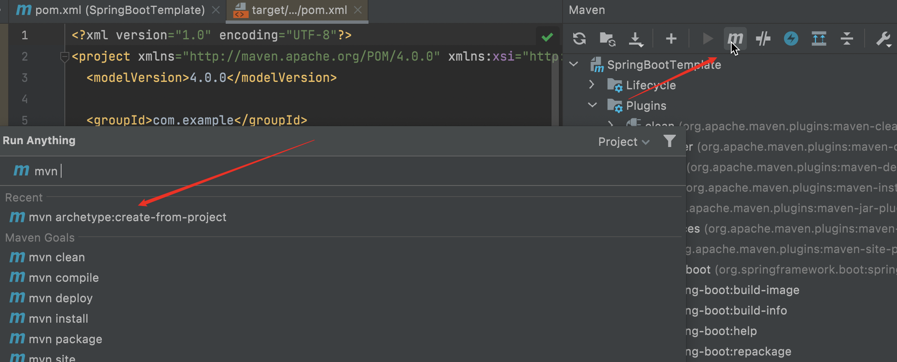
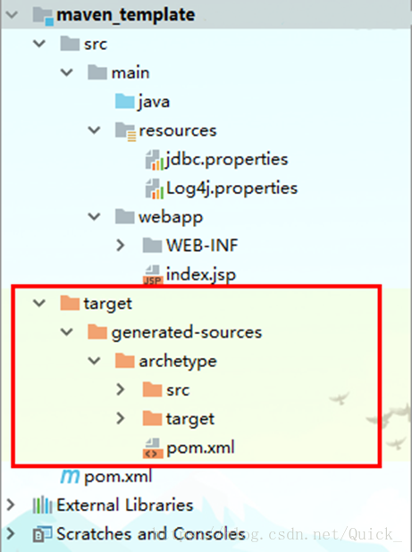

# Maven创建骨架模版(失败)

## 目录

*   [创建步骤](#创建步骤)

## 创建步骤

1.  新建maven项目
    创建相关配置，比如application.properties

2.  输入命令`mvn archetype:create-from-project`

    

3.  执行完毕之后，会出现一个编译之后新的maven工程（target文件夹），如下图:

    

4.  安装骨架

    安装对应骨架项目

    先进入骨架项目的pom文件目录：

    cd target\generated-sources\archetype

    执行安装：mvn clean install

    至此，骨架项目安装成功
