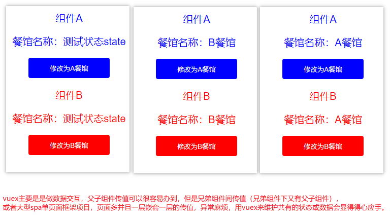

# Vuex入门案例

【[学习博客】vuex最详细完整的使用用法\_飞歌Fly的博客-CSDN博客\_vuex使用方法](https://blog.csdn.net/qq_35430000/article/details/79412664?utm_medium=distribute.pc_relevant.none-task-blog-2\~default\~BlogCommendFromMachineLearnPai2\~default-14.control\&depth_1-utm_source=distribute.pc_relevant.none-task-blog-2\~default\~BlogCommendFromMachineLearnPai2\~default-14.control "学习博客】vuex最详细完整的使用用法_飞歌Fly的博客-CSDN博客_vuex使用方法")

【推荐学习】[(1条消息) vue中使用vuex(超详细)\_一只前端小菜鸟-CSDN博客\_vuex](https://blog.csdn.net/qq_43363884/article/details/95948884?utm_medium=distribute.pc_relevant.none-task-blog-2\~default\~BlogCommendFromMachineLearnPai2\~default-2.control\&depth_1-utm_source=distribute.pc_relevant.none-task-blog-2\~default\~BlogCommendFromMachineLearnPai2\~default-2.control "(1条消息) vue中使用vuex(超详细)_一只前端小菜鸟-CSDN博客_vuex")

【Gitee仓库代码】[vue2-vuex-demo: vuex入门小案例](https://gitee.com/zzursy/vue2-vuex-demo "vue2-vuex-demo: vuex入门小案例")

【推荐学习】[vuex：弄懂mapState、mapGetters、mapMutations、mapActions - 知乎](https://zhuanlan.zhihu.com/p/100941659 "vuex：弄懂mapState、mapGetters、mapMutations、mapActions - 知乎")
