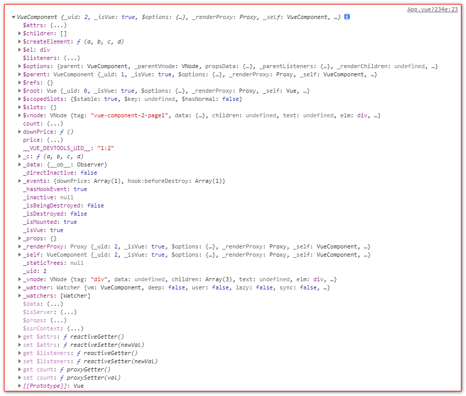
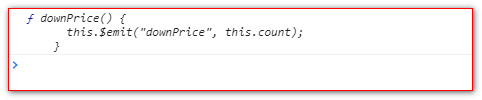
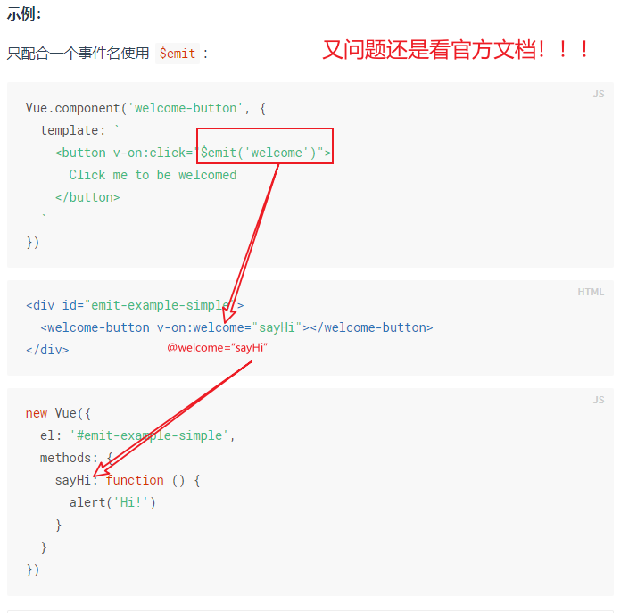

# Vue组件间通信

## 目录

*   [组件目录结构](#组件目录结构)

*   [父组件向子组件传值](#父组件向子组件传值)

*   [子组件向父组件中传值](#子组件向父组件中传值)

*   [父组件调用子组件方法](#父组件调用子组件方法)

    *   [方法一：使用ref](#方法一使用ref)

    *   [方法二：使用\$children](#方法二使用children)

*   [子组件调用父组件方法](#子组件调用父组件方法)

*   [【Bus】同级组件间通信](#bus同级组件间通信)

*   [关于组件之间传递参数的疑惑](#关于组件之间传递参数的疑惑)

*   [推荐使用Vuex](#推荐使用vuex)

## 组件目录结构

*   子组件

vue2-project\src\components
vue2-project\src\components\Page1.vue
vue2-project\src\components\Page2.vue

*   父组件

vue2-project\src\App.vue

## 父组件向子组件传值

1、在父组件中引入子组件

```javascript
import Page1 from './components/Page1'
```

2、注册子组件

```javascript
components:{
    Page1,Page2
}
```

3、使用子组件

\<Page1>\</Page1>

4、将需要传递给子组件的值通过`v-bind(如果传递的是固定值，则不需要v-bind，直接属性名，属性值传递即可)`

```javascript
<!-- price 就是传递给子组件的值 -->
<page1 :price="price"></page1>


data() {
  return { price: "" };
},

```

5、子组件使用props接收

props还有很多使用方式，具体查看官方文档

方式一：

```javascript
props:{
    price:{
        type:String,
        default:''
    }
}
```

方式二：

```javascript
export default {
  props: ["price"],
};
```

6、在子组件中使用price

```html
<span>单价：</span><span>{{ price }}</span>
```

## 子组件向父组件中传值

1、在子组件中触发当前实例上的事件，间接触发监听器，附加参数都会传给监听器回调。

在page1.vue中，通过触发子组件的方法(这里是自定义的`downPrice`方法),

```html
在子组件的methods的downPrice中，通过this.$emit()触发监听器,将事件和参数传递给父组件

<button @click="downPrice">降价10元</button>

<script>
export default {
  props: ["price"],
  data() {
    return {
      count: 10,
    };
  },
  methods: {
    downPrice() {
      this.$emit("toFatherDownPrice", this.count);
    },
  },
};
</script>

```

2、在父组件中创建监听器fatherDownPrice

```javascript
<page1 :price="price" @toFatherDownPrice="fatherDownPrice"></page1>
```

fatherDownPrice是传递给父组件的事件，父组件触发并相应这个方法

**注意：** 在组件中可以直接使用count，在js中需要使用this.count

3、在父组件中接受子组件传递的事件`fatherDownPrice`和数据

```javascript
methods: {
  fatherDownPrice(count) {
    // this.price = (this.price - 1).toString();
    this.price = (this.price - count).toString();
  },
},
```

## 父组件调用子组件方法

### 方法一：使用ref

父组件通过`this.$refs`即可找到该子组件，也可以操作子组件的方法

这是console.log(this.\$refs.page1)打印的信息



console.log(this.\$refs.page1.downPrice)打印的信息



### 方法二：使用\$children

通过`$children`，可以获取到所有子组件的集合

`this.$children[0].某个方法`

## 子组件调用父组件方法

1、通过`$parent`可以找到父组件，进而调用其方法

`this.$parent.父组件方法`

## 【Bus】同级组件间通信

同级组件不能直接传值，需要一个中间桥梁，可以先将数据传递给公共的父组件，然后父组件再将数据传递给需要的子组件。

1、定义一个公共文件eventBus.js

```javascript
代码很简单(就2句)，只是创建一个空的vue实例

import Vue from 'vue'
export default new Vue()
```

2、在需要通信的同级组件中分别引入`eventBus.js`文件

```javascript
import bus from  './eventBus.js'
```

3、在page1.vue中，通过`$emit`将事件和参数传递给page2.vue

```javascript
// 监听数据的变化
watch: {
  price(newPrice) {
    bus.$emit("priceChange", newPrice, this.count);
  },
},
```

4、在page2.vue 中，通过`$on`接收接收参数和相应事件

```javascript
<script>
import bus from "../common/eventBus";
export default {
  data() {
    return {
      total: 1000,
      balance: 1000,
    };
  },
  mounted() {
    bus.$on("priceChange", (price, count) => {
      this.balance = this.total - price * count;
    });
  },
};
</script>

```

## 关于组件之间传递参数的疑惑



## 推荐使用Vuex

一般大型的项目，推荐使用Vuex来管理组件之间的通信
