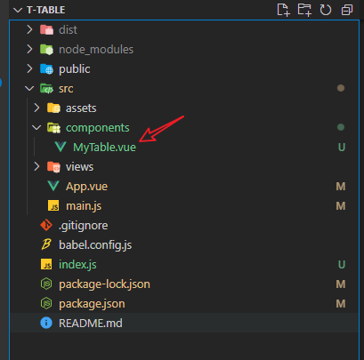
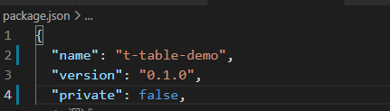
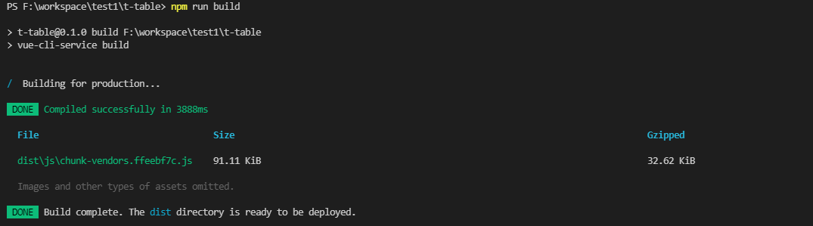
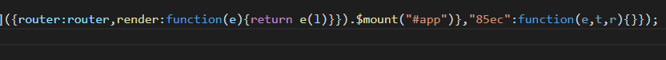
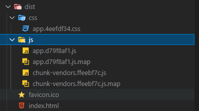
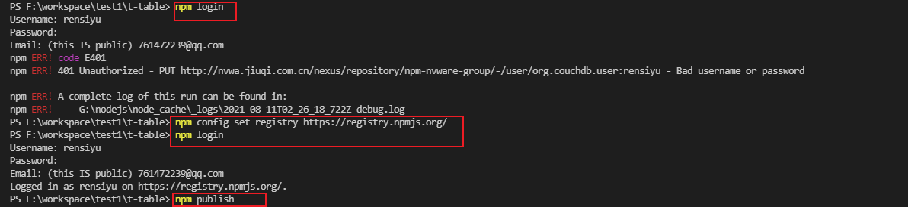
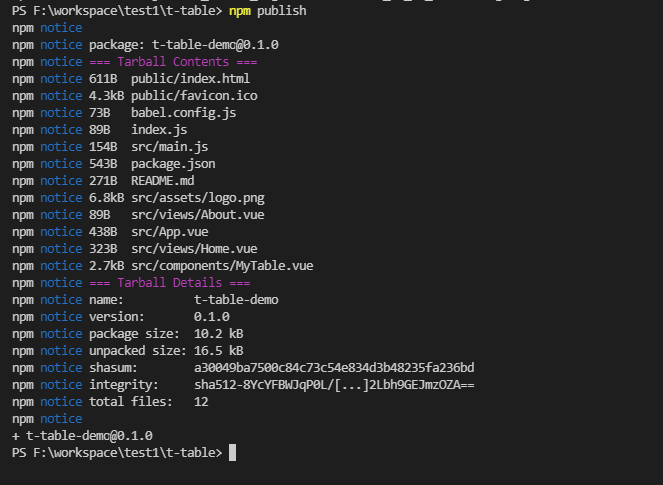
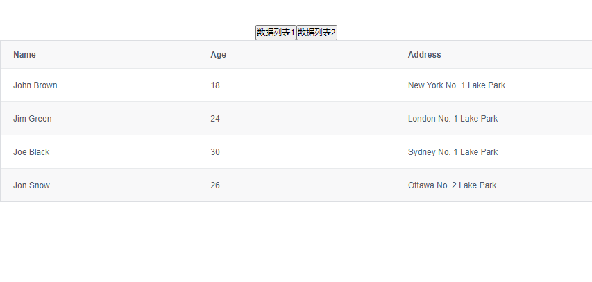
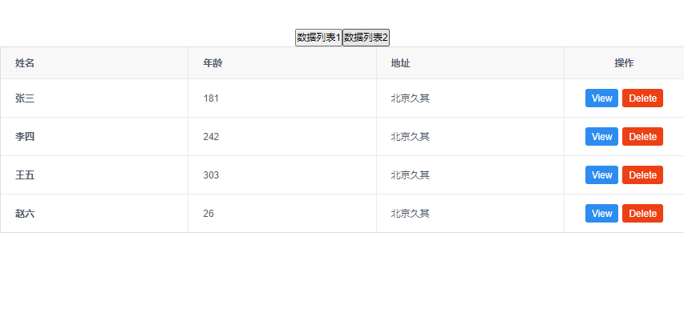

# 创建自己的组件并发布

## 目录

*   [1、首先需要创建自己的组件](#1首先需要创建自己的组件)

*   [2、 在根目录下创建index.js文件，并抛出所定义的插件名](#2-在根目录下创建indexjs文件并抛出所定义的插件名)

*   [3、修改package.json](#3修改packagejson)

*   [4、然后可以打包npm run build](#4然后可以打包npm-run-build)

*   [5、发布](#5发布)

*   [6、引入插件](#6引入插件)

*   [参考博客](#参考博客)

## 1、首先需要创建自己的组件



> 我这里使用的iView的data表格组件，进行简单的自定义

```html
<template>
  <div>
    <Table border :columns="columns7" :data="myData"></Table>
  </div>
</template>
<script>
export default {
  data() {
    return {
      columns7: [
        {
          title: "姓名",
          key: "name",
          render: (h, params) => {
            return h("div", [
              h("Icon", {
                props: {
                  type: "person",
                },
              }),
              h("strong", params.row.name),
            ]);
          },
        },
        {
          title: "年龄",
          key: "age",
        },
        {
          title: "地址",
          key: "address",
        },
        {
          title: "操作",
          key: "action",
          width: 150,
          align: "center",
          render: (h, params) => {
            return h("div", [
              h(
                "Button",
                {
                  props: {
                    type: "primary",
                    size: "small",
                  },
                  style: {
                    marginRight: "5px",
                  },
                  on: {
                    click: () => {
                      this.show(params.index);
                    },
                  },
                },
                "View"
              ),
              h(
                "Button",
                {
                  props: {
                    type: "error",
                    size: "small",
                  },
                  on: {
                    click: () => {
                      this.remove(params.index);
                    },
                  },
                },
                "Delete"
              ),
            ]);
          },
        },
      ],
      // 不需要原来的数据，我们使用新的数据myData
      data6: [
        {
          name: "John Brown",
          age: 18,
          address: "New York No. 1 Lake Park",
        },
        {
          name: "Jim Green",
          age: 24,
          address: "London No. 1 Lake Park",
        },
        {
          name: "Joe Black",
          age: 30,
          address: "Sydney No. 1 Lake Park",
        },
        {
          name: "Jon Snow",
          age: 26,
          address: "Ottawa No. 2 Lake Park",
        },
      ],
    };
  },
  props: ["myData"],
  methods: {
    show(index) {
      this.$Modal.info({
        title: "雨",
        content: `姓名：${this.myData[index].name}<br>年龄：${this.myData[index].age}<br>地址：${this.myData[index].address}`,
      });
    },
    remove(index) {
      this.myData.splice(index, 1);
    },
  },
};
</script>

```

> 其中在main.js中（应该不需要引入iView组件，引入之后也可以删除）最好引入并使用插件iView，可以用来测试效果。

## 2、 在根目录下创建index.js文件，并抛出所定义的插件名

```javascript
import TTable from './src/components/MyTable'
export { TTable };
export default TTable;
```

## 3、修改package.json

```javascript
"private": false // 将这里设置为false
                 // 如果你在你的package.json中设置了“private”：true，
                 // 那么npm将拒绝发布它。 这是防止私人存储库意外发布的一种方法。
"name": "t-table-demo" // 最好也要修改一下名字，不然发布的时候，会有很多重名的。
```



## 4、然后可以打包npm run build



> 打包成功，会生成dist目录[ Vue.js - 项目打包后 dist 文件目录详解\_牧码的博客-CSDN博客](https://blog.csdn.net/Dream_Weave/article/details/113695735 " Vue.js - 项目打包后 dist 文件目录详解_牧码的博客-CSDN博客")

1、app.\*\* \*.js  应该是封装的项目中的各个js文件，将格式进行了压缩。



2、app.\*\* \*.map

依然是一个Source map文件，Source map就是一个信息文件，里面储存着位置信息，转换后的代码的每一个位置，所对应的转换前的位置。 项目打包后，代码都是经过压缩加密的，如果运行时报错，输出的错误信息无法准确得知是哪里的代码报错。有了map就可以像未加密的代码一样，准确的输出是哪一行哪一列有错，方便我们开发的时候做调试使用。

3、chunk-vendors.js

放的是通过import包导入的第三方依赖包。防止该文件体积过大，可以使用webpack的externals配置。凡是声明在externals中的第三方依赖包，都不会被打包。同时需要在index.html文件的头部，添加CDN资源引用。



## 5、发布

先要登录到npm



发现仓库不对，切换源仓库，接着发布

**注意：** 发布的时候会发现名称冲突，修改package.json中的name即可

这样就是发布成功了



## 6、引入插件

1.  安装插件 `npm i t-table-demo`

2.  使用插件

    ```javascript
    // 引入自定义的插件
    import TTable from "t-table-demo";
    Vue.use(TTable)
    ```

3.  使用插件

    ```javascript
    <template>
      <div>
        <TTable :myData="myData"></TTable>
      </div>
    </template>
    <script>
    import { TTable } from "t-table-demo";
    export default {
      components: {
        TTable,
      },
      data() {
        return {
          myData: [
            {
              name: "张三",
              age: 181,
              address: "北京久其",
            },
            {
              name: "李四",
              age: 242,
              address: "北京久其",
            },
            {
              name: "王五",
              age: 303,
              address: "北京久其",
            },
            {
              name: "赵六",
              age: 26,
              address: "北京久其",
            },
          ],
        };
      },
    };
    </script>


    ```

4.  运行看效果`npm run serve`





## 参考博客

[从零开始开发一个vue组件打包并发布到npm (把vue组件打包成一个可以直接引用的js文件) - 进军的蜗牛 - 博客园](https://www.cnblogs.com/yalong/p/10388384.html "从零开始开发一个vue组件打包并发布到npm (把vue组件打包成一个可以直接引用的js文件) - 进军的蜗牛 - 博客园")
