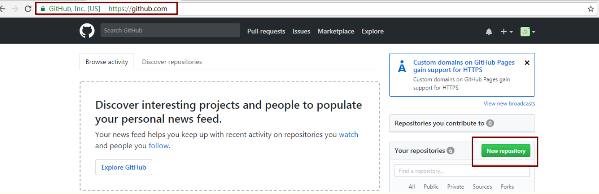
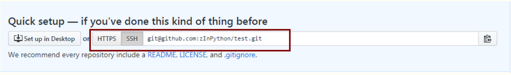
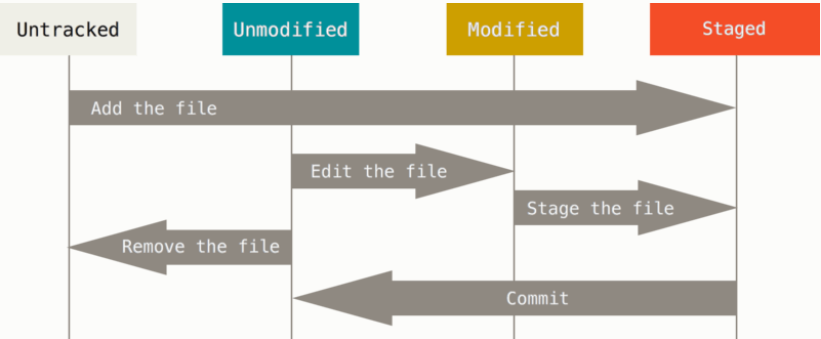
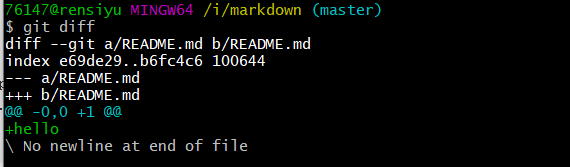
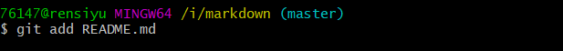
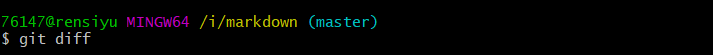
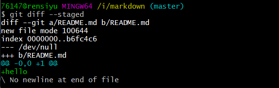

# 问题一

>*** Please tell me who you are.
>
>Run
>
>  git config --global user.email "you@example.com"
>  git config --global user.name "Your Name"
>
>to set your account's default identity.
>Omit --global to set the identity only in this repository.
>
>fatal: unable to auto-detect email address (got '76147@rensiyu.(none)')

```
76147@rensiyu MINGW64 /i/markdown (master)
$ git config --global user.email "761472239@qq.com"

76147@rensiyu MINGW64 /i/markdown (master)
$ git config --global user.name "761472239"

```

# 上传步骤

1. 登录自己的github账号，并创建一个存放项目代码的仓库
   

   


2. 打开本地的git

```
1.github上创建仓库，并复制一个提交代码的地址

2.git init 

3.git add . //其中，.表示你的项目，推荐直接用你的项目名。

4.git commit -m "提交说明" //提交代码，你可以添加提交说明，也可以不添加

5.git remote add origin http://.... 同步代码到github,代表的就是刚刚你copy的那个地址

6.git push -u origin master
```



在 `Untracked files` 下面，都是未跟踪文件

```console
$ git add README 跟踪新文件
```

 只要在 `Changes to be committed` 这行下面的，就说明是已暂存状态 

暂存状态的文件修改后，执行 `git status`出现

`Changes not staged for commit` 说明已跟踪文件的内容发生了变化，但还没有放到暂存区。 要暂存这次更新，需要运行 `git add` 命令。 

`README`文件的状态是 `modified:   README.md`

 **`git add`  这是个多功能命令：可以用它开始跟踪新文件，或者把已跟踪的文件放到暂存区，还能用于合并时把有冲突的文件标记为已解决状态等。 将这个命令理解为“添加内容到下一次提交中”而不是“将一个文件添加到项目中”要更加合适。** 


# 忽略文件  `.gitignore` 

```
##ignore this file##
/target/

.classpath
.project
.settings     
 ##filter databfile、sln file##
*.mdb  
*.ldb  
*.sln   
##class file##
*.com  
*.class  
*.dll  
*.exe  
*.o  
*.so 
# compression file
*.7z  
*.dmg  
*.gz  
*.iso  
*.jar  
*.rar  
*.tar  
*.zip  
*.via
*.tmp
*.err
# OS generated files #  
.DS_Store  
.DS_Store?  
._*  
.Spotlight-V100  
.Trashes  
Icon?  
ehthumbs.db  
Thumbs.db 

```

> GitHub 有一个十分详细的针对数十种项目及语言的 .gitignore 文件列表，你可以在 https://github.com/github/gitignore 找到它。

#  Git 常用命令速查 

```
git clone https://github.com/schacon/simplegit-progit
git add <fileName> //跟踪新文件
git status -s //状态简览 新添加的未跟踪文件前面有 ?? 标记，新添加到暂存区中的文件前面有 A 标记，修改过的文件前面有 M 标记。 你可能注意到了 M 有两个可以出现的位置，出现在右边的 M 表示该文件被修改了但是还没被放入暂存区，出现在靠左边的 M 表示该文件被修改了并被放入了暂存区。
git diff //比较的是工作目录中当前文件和暂存区域快照之间的差异,也就是修改之后还没有暂存起来的变化内容。
git diff --staged // 这条命令将比对已暂存文件与最后一次提交的文件差异
git diff --cached 查看已经暂存起来的变化：（--staged 和 --cached 是同义词）
git commit //提交暂存区的文件
git commit -a // Git 就会自动把所有已经跟踪过的文件暂存起来一并提交，从而跳过 git add 步骤
rm PROJECTS.md // 从工作目录中删除文件
git rm PROJECTS.md //连带从工作目录中删除指定的文件，从已跟踪文件清单中移除,记录此次移除文件的操作
git rm --cached README // 仅删除暂存区，不删除目录中的文件

git mv file_from file_to
	等于
    $ mv README.md README
    $ git rm README.md
    $ git add README
git log 查看提交历史
git log -p -2 //-p，它会显示每次提交所引入的差异，2 选项来仅显示最近的两次提交
git commit --amend //漏掉了几个文件没有添加，或者提交信息写错了。 此时，可以运行带有 --amend 选项的提交命令尝试重新提交
git reset HEAD CONTRIBUTING.md //取消暂存
git checkout -- CONTRIBUTING.md//撤销对文件的修改，将它还原成上次提交时的样子
git remote 查看远程仓库
git remote -v 会显示需要读写远程仓库使用的 Git 保存的简写与其对应的 URL

git remote add <shortname> <url> 添加一个新的远程 Git 仓库，同时指定一个你可以轻松引用的简写
git fetch pb 从远程仓库中抓取与拉取(命令会访问远程仓库，从中拉取所有你还没有的数据)执行完成后，你将会拥有那个远程仓库中所有分支的引用，可以随时合并或查看。


```










```
首先 知道git上项目的地址 ，然后挡到本地
git clone git://github.com/schacon/grit.git 从服务器上将代码给拉下来
最常用的  git pull  //更新
git add readme 文件名（例如：git add readme demo.php）         //代码上传到服务器
git status   //查看项目当前状态
git branch 查看本地所有分支
git status 查看当前状态 
git commit 提交 
git branch -a 查看所有的分支
git branch -r 查看远程所有分支
git commit -am "init" 提交并且加注释 
git remote add origin git@192.168.1.119:ndshow
git push origin master 将文件给推到服务器上 
git remote show origin 显示远程库origin里的资源 
git push origin master:develop
git push origin master:hb-dev 将本地库与服务器上的库进行关联 
git checkout --track origin/dev 切换到远程dev分支
git branch -D master develop 删除本地库develop
git checkout -b dev 建立一个新的本地分支dev
git merge origin/dev 将分支dev与当前分支进行合并
git checkout dev 切换到本地dev分支
git remote show 查看远程库
git add .
git rm 文件名(包括路径) 从git中删除指定文件

git config --list 看所有用户
git ls-files 看已经被提交的
git rm [file name] 删除一个文件
git commit -a 提交当前repos的所有的改变
git add [file name] 添加一个文件到git index
git commit -v 当你用－v参数的时候可以看commit的差异
git commit -m "This is the message describing the commit" 添加commit信息
git commit -a -a是代表add，把所有的change加到git index里然后再commit
git commit -a -v 一般提交命令
git log 看你commit的日志
git diff 查看尚未暂存的更新
git rm a.a 移除文件(从暂存区和工作区中删除)
git rm --cached a.a 移除文件(只从暂存区中删除)
git commit -m "remove" 移除文件(从Git中删除)
git rm -f a.a 强行移除修改后文件(从暂存区和工作区中删除)
git diff --cached 或 $ git diff --staged 查看尚未提交的更新
git stash push 将文件给push到一个临时空间中
git stash pop 将文件从临时空间pop下来
---------------------------------------------------------
git remote add origin git@github.com:username/Hello-World.git
git push origin master 将本地项目给提交到服务器中
-----------------------------------------------------------
git pull 本地与服务器端同步
-----------------------------------------------------------------
git push (远程仓库名) (分支名) 将本地分支推送到服务器上去。
git push origin serverfix:awesomebranch
------------------------------------------------------------------
git fetch 相当于是从远程获取最新版本到本地，不会自动merge
git commit -a -m "log_message" (-a是提交所有改动，-m是加入log信息) 本地修改同步至服务器端 ：
git branch branch_0.1 master 从主分支master创建branch_0.1分支
git branch -m branch_0.1 branch_1.0 将branch_0.1重命名为branch_1.0
git checkout branch_1.0/master 切换到branch_1.0/master分支
```

