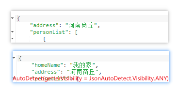

## Bean准备

### Home.java

```java
package com.example.jacksonannotation.bean;

import java.util.List;

import com.fasterxml.jackson.annotation.JsonAutoDetect;
import com.fasterxml.jackson.annotation.JsonIgnore;

/**
 * @author rensiyu
 **/
public class Home {
	private String homeName;
	private String address;
	private List<Person> personList;

	public Home() {
	}

	public Home(String homeName, String address, List<Person> personList) {
		this.homeName = homeName;
		this.address = address;
		this.personList = personList;
	}

	public String getHomeName() {
		return homeName;
	}

	public void setHomeName(String homeName) {
		this.homeName = homeName;
	}

	public String getAddress() {
		return address;
	}

	public void setAddress(String address) {
		this.address = address;
	}

	public List<Person> getPersonList() {
		return personList;
	}

	public void setPersonList(List<Person> personList) {
		this.personList = personList;
	}
}

```

### Person.java

```java
package com.example.jacksonannotation.bean;

import java.util.Map;

/**
 * @author rensiyu
 **/
public class Person {
	private String name;
	private int age;
	private Map<String, Item> itemMap;
	private String school;

	public Person() {
	}

	public Person(String name, int age, Map<String, Item> itemMap, String school) {
		this.name = name;
		this.age = age;
		this.itemMap = itemMap;
		this.school = school;
	}

	public String getSchool() {
		return school;
	}

	public void setSchool(String school) {
		this.school = school;
	}

	public String getName() {
		return name;
	}

	public void setName(String name) {
		this.name = name;
	}

	public int getAge() {
		return age;
	}

	public void setAge(int age) {
		this.age = age;
	}

	public Map<String, Item> getItemMap() {
		return itemMap;
	}

	public void setItemMap(Map<String, Item> itemMap) {
		this.itemMap = itemMap;
	}
}

```

### Item.java

```java
package com.example.jacksonannotation.bean;

/**
 * @author rensiyu
 **/
public class Item {
   private String id;
   private String name;
   
   public Item() {
   }
   
   public Item(String id, String name) {
      this.id = id;
      this.name = name;
   }
   
   public String getId() {
      return id;
   }
   
   public void setId(String id) {
      this.id = id;
   }
   
   public String getName() {
      return name;
   }
   
   public void setName(String name) {
      this.name = name;
   }
}
```

### 序列化结果

```json
{
	"homeName": "我的家",
	"address": "河南商丘",
	"personList": [
		{
			"name": "张三",
			"age": 11,
			"itemMap": {
				"111": {
					"id": "111",
					"name": "鼠标"
				},
				"112": {
					"id": "112",
					"name": "键盘"
				}
			},
			"school": "郑州大学"
		},
		{
			"name": "李四",
			"age": 12,
			"itemMap": {
				"113": {
					"id": "113",
					"name": "money"
				}
			},
			"school": "郑州大学"
		}
	]
}
```

## @JsonAutoDetect

类注释可用于定义自动检测要检测的方法种类，以及最低访问级别。 自动检测意味着使用名称约定和/或签名模板来查找用于数据绑定的方法。 例如，可以通过查找返回值、不带参数且名称中带有前缀“get”的公共成员方法来自动检测所谓的“getter”。

**所有访问器的默认设置是 JsonAutoDetect.Visibility.DEFAULT，这反过来意味着使用全局默认值。 不同访问器类型的默认值是不同的（例如，getter 需要是 public；setter 可以有任何访问修饰符）。** 如果您分配不同的 JsonAutoDetect.Visibility 类型，那么它将覆盖全局默认值：例如，要求所有设置器必须是公共的，您可以使用：

`@JsonAutoDetect(setterVisibility=Visibility.PUBLIC_ONLY)`

setter方法只有被public修饰的时候生效

再例如下面的设置

```java
@JsonAutoDetect(getterVisibility = JsonAutoDetect.Visibility.ANY)
public class Home {
	private String homeName;
	private String address;
	private List<Person> personList;

	private String getHomeName() {
		return homeName;
	}
}
```

getter方法只对public生效，如果声明为private，不加`@JsonAutoDetect(getterVisibility = JsonAutoDetect.Visibility.ANY)`，在序列化的时候拿不到值；加上之后可以拿到homeName的值。



- fieldVisibility：字段属性的可见范围。
- getterVisibility：getter的可见范围（对象序列化成json字符串时的可见范围）。
- isGetterVisibility：is-getter的可见范围（如boolean类型的getter）
- setterVisibility：setter的可见范围（json字符串反序列化成对象时的可见范围）。
- creatorVisibility：构造方法的可见范围。

可见范围是一个枚举，包括：

- Visibility.ANY：表示从private到public修饰，都可见。
- Visibility.NON_PRIVATE：表示除private修饰不可见外，其他都可见。
- Visibility.PROTECTED_AND_PUBLIC：protected和public可见。
- Visibility.PUBLIC_ONLY：仅public可见。
- Visibility.NONE：所以皆不可见。
- Visibility.DEFAULT：缺省，所有被public修饰的属性、getter和所有setter(不管能见度)皆可见。

## @JsonIgnore

用于忽略指定属性，当该注解出现在field、getter、setter或者构造方法中任意一个上时，都意味着忽略所有（即序列化和反序列化都被忽略）；

有一种情况，当getter上注解@JsonIgnore而setter上注解@JsonProperty，**就会出现“只读”情况**

（read from input, but is not written output）

- Field上加@JsonIgnore

```java
import com.fasterxml.jackson.annotation.JsonIgnore;
import com.fasterxml.jackson.annotation.JsonProperty;
 
public class House {

	private String name;

	// 仅仅注解 @JsonIgnore时，序列化和反序列化都忽略
	@JsonIgnore
	// @JsonProperty
	private String address;
 
	public String getName() {
		return name;
	}
 
	public void setName(String name) {
		this.name = name;
	}
 
	public String getAddress() {
		return address;
	}
 
	public void setAddress(String address) {
		this.address = address;
	}
 
	@Override
	public String toString() {
		return "House [name=" + name + ", address=" + address + "]";
	}
 
}
```

测试

```java
@Test
public void JsonIgnoreTest() throws Exception {
    House house = new House();
    house.setName("my house");
    house.setAddress("深圳");
    ObjectMapper objMapper = new ObjectMapper();
    // address被忽略
    String jsonStr = objMapper.writeValueAsString(house);
    System.out.println("序列化结果：" + jsonStr);
    // address被忽略
    House h = objMapper.readValue("{\"name\":\"your house\", \"address\":\"深圳南山\"}", House.class);
    System.out.println("反序列化结果：" + h);
}
```

序列化结果：`{"name":"my house"}`
反序列化结果：`House [name=your house, address=null]`

address被忽略

- Field加上@JsonIgnore和@JsonProperty

```java
import com.fasterxml.jackson.annotation.JsonIgnore;
import com.fasterxml.jackson.annotation.JsonProperty;
 
public class House {

	private String name;

	//仅仅注解 @JsonIgnore时，序列化和反序列化都忽略
	@JsonIgnore
	//在属性上添加 @JsonProperty，@JsonIgnore不生效
	@JsonProperty
	private String address;
 
	public String getName() {
		return name;
	}
 
	public void setName(String name) {
		this.name = name;
	}
 
	public String getAddress() {
		return address;
	}
 
	public void setAddress(String address) {
		this.address = address;
	}
 
	@Override
	public String toString() {
		return "House [name=" + name + ", address=" + address + "]";
	}
 
}
 
序列化结果：{"name":"my house","address":"深圳"}
反序列化结果：House [name=your house, address=深圳南山] 
```

- Field加@JsonIgnore，setter加@JsonProperty

```java
import com.fasterxml.jackson.annotation.JsonIgnore;
import com.fasterxml.jackson.annotation.JsonProperty;
 
public class House {
  
    private String name;
  
    //仅仅注解 @JsonIgnore时，序列化和反序列化都忽略
    @JsonIgnore
    private String address;
 
    public String getName() {
        return name;
    }
 
    public void setName(String name) {
        this.name = name;
    }
 
    public String getAddress() {
        return address;
    }
 
    //setter注解@JsonProperty，@JsonIgnore不生效，和注解在属性上一样结果
    @JsonProperty
    public void setAddress(String address) {
        this.address = address;
    }
 
    @Override
    public String toString() {
        return "House [name=" + name + ", address=" + address + "]";
    }
 
}
 
序列化结果：{"name":"my house","address":"深圳"}
反序列化结果：House [name=your house, address=深圳南山]
```

- getter加@JsonIgnore，setter加@JsonProperty

```java
import com.fasterxml.jackson.annotation.JsonIgnore;
import com.fasterxml.jackson.annotation.JsonProperty;
 
public class House {

	private String name;

	private String address;
 
	public String getName() {
		return name;
	}
 
	public void setName(String name) {
		this.name = name;
	}
 
	//getter注解 @JsonIgnore
	@JsonIgnore
	public String getAddress() {
		return address;
	}
 
	//setter注解@JsonProperty，出现“只读”情况
	@JsonProperty
	public void setAddress(String address) {
		this.address = address;
	}
 
	@Override
	public String toString() {
		return "House [name=" + name + ", address=" + address + "]";
	}
 
}
序列化结果：{"name":"my house"}
反序列化结果：House [name=your house, address=深圳南山]
```

结论：

- 当仅出现@JsonIgnore时，属性序列化和反序列化都被忽略；
- 当@JsonIgnore和@JsonProperty同时出现，并且不是getter注解@JsonIgnore，setter注解@JsonProperty时，属性忽略被取消，正常序列化反序列化；
- 当getter注解@JsonIgnore，setter注解@JsonProperty时，出现“只读”（getter注解@JsonProperty，setter注解@JsonIgnore是不存在只写的情况的）。

**可以通过设置@JsonIgnore和@JsonProperty，进而控制只读和只写**

**笔记！**Jackson 2.6，使用`JsonProperty.access()`注释定义“只读”和“只读”属性有一种新的改进方法：建议不要使用单独的JsonIgnore和JsonProperty注释。

## @JsonIgnoreProperties

作用于实体类的注解（注解在属性貌似没效果），用于忽略某些属性，如果指定- ---

- ignoreUnknown=true，则反序列化时忽略所有未知的属性；
- allowGetters使得被忽略的属性在序列化时是可见的，即序列化时忽略失效了；
- allowSetters对应反序列化

## @JsonIgnoreType

作用于类，表示被注解该类型的属性（这里不是指被注解类的成员变量，而是被注解类作为别的类的成员变量）将不会被序列化和反序列化。@JsonIgnoreType(value=false)表示该注解不起作用，默认为true。

```java
public class Car {

	private String name;

	private double price;

	private Owner owner;
 
	public String getName() {
		return name;
	}
 
	public void setName(String name) {
		this.name = name;
	}
 
	public double getPrice() {
		return price;
	}
 
	public void setPrice(double price) {
		this.price = price;
	}
 
	public Owner getOwner() {
		return owner;
	}
 
	public void setOwner(Owner owner) {
		this.owner = owner;
	}
 
}
```

```java
import com.fasterxml.jackson.annotation.JsonIgnoreType;
 
@JsonIgnoreType
public class Owner {

	private String name;

	public Owner() {
	}
 
	public Owner(String name) {
		super();
		this.name = name;
	}
 
	public String getName() {
		return name;
	}
 
	public void setName(String name) {
		this.name = name;
	}

}
```

```java
@Test
public void JsonIgnoreTypeTest() throws JsonProcessingException {
    Car car = new Car();
    car.setName("迈腾");
    car.setPrice(23.49);
    car.setOwner(new Owner("zyc"));

    ObjectMapper objMapper = new ObjectMapper();
    String jsonStr = objMapper.writeValueAsString(car);
    System.out.println("结果：" + jsonStr);
}
结果：{"name":"迈腾","price":23.49}
```

## @JsonInclude

**忽略null字段的序列化**

**使用的枚举如下：**

ALWAYS
NON_NULL
NON_ABSENT
NON_EMPTY
NON_DEFAULT
CUSTOM
USE_DEFAULTS

## @JacksonInject

### 1）使用ID的方式

假设json字段有一些缺少的属性，转换成实体类的时候没有的属性将为null，但是我们在某些需求当中需要将为null的属性都设置为默认值，这时候我们就可以用到这个注解了，它的功能就是在**反序列化**的时候将没有的字段设置为我们设置好的默认值。

```java
//value 相当于id,之后会用到，
//userInput为FALSE的时候是属性值不覆盖默认值,相当于定死了这个字段的值。默认为true是会覆盖
//@JacksonInject("defaultUsername")如果我们就是为了值为空的时候注入默认的值，这么写就行了
@JacksonInject(value= "defaultUsername", useInput= OptBoolean.FALSE)
private String username; 
```

测试代码:

```java
public static void main(String[] args) throws IOException {

    ObjectMapper mapper = new ObjectMapper();
    InjectableValues.Std injectableValues = new InjectableValues.Std();
    //如果username字段为空，那么就默认是小明
    injectableValues.addValue("defaultUsername","小明");
    //也可以使用类型参数，代表凡是加了注解的String类型字段，为空的时候都是默认值“--”，
    //这样就直接在String类型属性上面加注解就行了，不用在写value值了。
    //injectableValues.addValue(String.class,"--");
    mapper.setInjectableValues(injectableValues);
    String jsonValue = "{}";
    User user = mapper.readValue(jsonValue, User.class);
    System.out.println(user);
}
```

结果:

```
User{username='小明', password='null', age=null}
```

### 2）按照数据类型type进行数据注入

除了可以按照属性id进行数据的注入，还可以使用java type数据类型进行数据注入。这种方法在一个java 类中，多个成员变量数据类型重复的时候，比如定义多个LocalDateTime成员变量，用起来就不太方便了。所以还是建议大家使用属性id的方法进行注入数据注入。

当然我们也可以在注解上这么写，这样会导致加了注解的String的类型的字段，在反序列化的时候都会被默认值覆盖。

```JAVA
@JacksonInject
private String username; 

InjectableValues.Std injectableValues = new InjectableValues.Std();
injectableValues.addValue(String.class,"nullValue");
```

### 3）使用注解

```java
package com.example.jacksonannotation.bean;

import java.util.Date;
import java.util.List;

import com.fasterxml.jackson.annotation.JacksonInject;
import com.fasterxml.jackson.annotation.JsonAutoDetect;
import com.fasterxml.jackson.annotation.OptBoolean;

/**
 * @author rensiyu
 **/
public class Home {
   private String homeName;
   @JacksonInject(value = "addressMy", useInput = OptBoolean.TRUE)
   private String address;
   @JacksonInject(value = "personListMy", useInput = OptBoolean.TRUE)
   private List<Person> personList;
   @JacksonInject("responseTime")      //注意这里
   private Date responseTime;
   @JacksonInject("goodMy")
   private Boolean good;
   @JacksonInject(value = "numberMy", useInput = OptBoolean.TRUE)
   private Integer number;
   @JacksonInject("numbersMy")
   private int numbers;
   
   public int getNumbers() {
      return numbers;
   }
   
   public void setNumbers(int numbers) {
      this.numbers = numbers;
   }
   
   public Integer getNumber() {
      return number;
   }
   
   public void setNumber(Integer number) {
      this.number = number;
   }
   
   public Home() {
   }
   
   public Home(String homeName, String address, List<Person> personList) {
      this.homeName = homeName;
      this.address = address;
      this.personList = personList;
   }
   
   public Date getResponseTime() {
      return responseTime;
   }
   
   public void setResponseTime(Date responseTime) {
      this.responseTime = responseTime;
   }
   
   public Boolean getGood() {
      return good;
   }
   
   public void setGood(Boolean good) {
      // this.good = good;
   }
   
   private String getHomeName() {
      return homeName;
   }
   
   public void setHomeName(String homeName) {
      this.homeName = homeName;
   }
   
   public String getAddress() {
      return address;
   }
   
   public void setAddress(String address) {
      // this.address = address;
   }
   
   public List<Person> getPersonList() {
      return personList;
   }
   
   public void setPersonList(List<Person> personList) {
//      this.personList = personList;
   }
}
```

测试：

```java
ObjectMapper objectMapper = new ObjectMapper();
InjectableValues.Std iv = new InjectableValues.Std();
iv.addValue("responseTime", new Date());
iv.addValue("numbersMy", 100);
iv.addValue("numberMy", 10);
iv.addValue("addressMy", "ha ha ha");
iv.addValue("personListMy", null);
iv.addValue("goodMy", true);
objectMapper.setInjectableValues(iv);
try {
    Home home = objectMapper.readValue(json, Home.class);
    String s = objectMapper.writeValueAsString(home);
    System.out.println(s);
} catch (JsonProcessingException e) {
    e.printStackTrace();
}
```

结果：

- 添加注释（分别将good、address、personList的setter方法注释掉）

```json
{
  "homeName": "我的家",
  "address": "ha ha  ha",
  "responseTime": 1637566776705,
  "good": true,
  "number": 10,
  "numbers": 100
}
```

- 不添加注释

```json
{
  "homeName": "我的家",
  "personList": [
    {
      "name": "张三",
      "age": 11,
      "itemMap": {
        "111": {
          "id": "111",
          "name": "鼠标"
        },
        "112": {
          "id": "112",
          "name": "键盘"
        }
      },
      "school": "郑州大学"
    },
    {
      "name": "李四",
      "age": 12,
      "itemMap": {
        "113": {
          "id": "113",
          "name": "money"
        }
      },
      "school": "郑州大学"
    }
  ],
  "responseTime": 1637566928278,
  "good": false,
  "number": 10,
  "numbers": 100
}
```

**!!怪事**

只有将good、address、personList的setter方法注释掉才能方式，才能防止重新将其的默认值重新赋值。

而Integer、Int、Date每次都会自动赋值


### 4）参考博客

[ jackSon中@JacksonInject 注解详解_灬叛逆丿文的博客-CSDN博客](https://blog.csdn.net/weixin_44130081/article/details/89675657)
