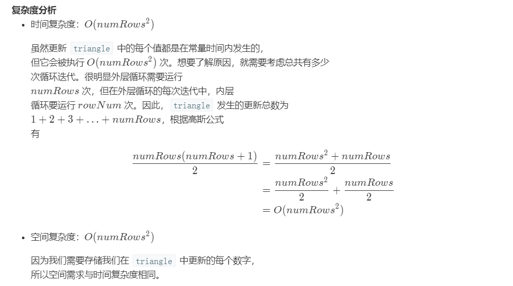

1. [112. 路径总和 - 力扣（LeetCode）](https://leetcode-cn.com/problems/path-sum/) [本地题解](#112. 路径总和)

2. [118. 杨辉三角 - 力扣（LeetCode）](https://leetcode-cn.com/problems/pascals-triangle/) [本地题解](#118. 杨辉三角)

3. [119. 杨辉三角 II - 力扣（LeetCode）](https://leetcode-cn.com/problems/pascals-triangle-ii/) [本地题解](#119. 杨辉三角 II)

4. [206. 反转链表 - 力扣（LeetCode）](https://leetcode-cn.com/problems/reverse-linked-list/) [本地题解](#206. 反转链表 )


# 112. 路径总和

给定一个二叉树和一个目标和，判断该树中是否存在根节点到叶子节点的路径，这条路径上所有节点值相加等于目标和。

说明: 叶子节点是指没有子节点的节点。

示例: 
给定如下二叉树，以及目标和 sum = 22，

              5
             / \
            4   8
           /   / \
          11  13  4
         /  \      \
        7    2      1
返回 true, 因为存在目标和为 22 的根节点到叶子节点的路径 5->4->11->2。


**方法 1：递归**

```java
/**
 * Definition for a binary tree node.
 * public class TreeNode {
 *     int val;
 *     TreeNode left;
 *     TreeNode right;
 *     TreeNode(int x) { val = x; }
 * }
 */
class Solution {
   
    public boolean hasPathSum(TreeNode root, int sum) {
        if(root==null){
            return false;
        }
        sum-=root.val;
        if(root.left==null&&root.right==null){
            return sum==0;
        }
        return hasPathSum(root.left,sum)||hasPathSum(root.right,sum);
    }
}
```

```java
class Solution {
    boolean isExist;//保存结果

    public boolean hasPathSum(TreeNode root, int sum) {
        //为null情况
        if (root == null)
            return false;
        //初始化为false
        isExist = false;
        find(root, sum);
        return isExist;
    }

    public void find(TreeNode root, int sum) {
        //sum的值减当前节点的值
        sum -= root.val;
        //叶子结点
        if (root.left == null && root.right == null) {
            //到了叶子结点，刚好减为了0
            if (sum == 0)
                isExist = true;
            return;
        }
        //存在左子树，往左子树走
        if (!isExist && root.left != null)
            find(root.left, sum);
        //往右子树走
        if (!isExist && root.right != null)
            find(root.right, sum);
    }
}
```

**方法 2：迭代**

**算法**

我们可以用栈将递归转成迭代的形式。深度优先搜索在除了最坏情况下都比广度优先搜索更快。最坏情况是指满足目标和的 `root->leaf` 路径是最后被考虑的，这种情况下深度优先搜索和广度优先搜索代价是相通的。

> 利用深度优先策略访问每个节点，同时更新剩余的目标和。

所以我们从包含根节点的栈开始模拟，剩余目标和为 `sum - root.val`。

然后开始迭代：弹出当前元素，如果当前剩余目标和为 `0` 并且在叶子节点上返回 `True`；如果剩余和不为零并且还处在非叶子节点上，将当前节点的所有孩子以及对应的剩余和压入栈中。

```java
class Solution {
  public boolean hasPathSum(TreeNode root, int sum) {
    if (root == null)
      return false;

    LinkedList<TreeNode> node_stack = new LinkedList();
    LinkedList<Integer> sum_stack = new LinkedList();
    node_stack.add(root);
    sum_stack.add(sum - root.val);

    TreeNode node;
    int curr_sum;
    while ( !node_stack.isEmpty() ) {
      node = node_stack.pollLast();
      curr_sum = sum_stack.pollLast();
      if ((node.right == null) && (node.left == null) && (curr_sum == 0))
        return true;

      if (node.right != null) {
        node_stack.add(node.right);
        sum_stack.add(curr_sum - node.right.val);
      }
      if (node.left != null) {
        node_stack.add(node.left);
        sum_stack.add(curr_sum - node.left.val);
      }
    }
    return false;
  }
}
```

# 118. 杨辉三角

```
输入: 5
输出:
[
     [1],
    [1,1],
   [1,2,1],
  [1,3,3,1],
 [1,4,6,4,1]
]
```

```java
class Solution {
    public List<List<Integer>> generate(int numRows) {

        List<List<Integer>> lists = new ArrayList<>();
        for (int i = 0; i < numRows; i++) {
            List<Integer> list = new ArrayList<>();
            list.add(1);
            if (i >= 1) {
                for (int j = 1; j < i; j++) {
                    list.add(lists.get(i - 1).get(j - 1) + lists.get(i - 1).get(j));
                }
                list.add(1);
            }
            lists.add(list);
        }
        return lists;
    }
}
```

**递推关系**

---

让我们从帕斯卡三角形内的递推关系开始。

首先，我们定义一个函数 f(i,j) ，它将会返回帕斯卡三角形`第 i 行`、`第 j 列`的数字。

我们可以用下面的公式来表示这一递推关系：

$f(i,j)=f(i−1,j−1)+f(i−1,j) $

**基本情况**

---

可以看到，每行的最左边和最右边的数字是 `基本情况`，在这个问题中，它总是等于 1。

因此，我们可以将基本情况定义如下:

$f(i,j)=1  ,where  ,j=1 or j=i$

```java
public static  List<List<Integer>> generate(int numRows) {
        List<List<Integer>> result=new ArrayList<List<Integer>>();
        for (int i=0;i<numRows;i++){
            
            ArrayList<Integer> sub=new ArrayList<Integer>();
            for (int j=0;j<=i;j++){
            	//第一个位置和最后一个位置的元素为1
                if (j==0 || j==i){
                    sub.add(1);
                }else {
                    //上一行的元素进行相加
                    sub.add(result.get(i-1).get(j-1)+result.get(i-1).get(j));
                }
            }
            result.add(sub);

        }
        return result;
}
```

**标准答案**

**方法：动态规划**

```java
class Solution {
    public List<List<Integer>> generate(int numRows) {
        List<List<Integer>> triangle = new ArrayList<List<Integer>>();
        if (numRows == 0) {
            return triangle;
        }
        triangle.add(new ArrayList<>());
        triangle.get(0).add(1);

        for (int rowNum = 1; rowNum < numRows; rowNum++) {
            List<Integer> row = new ArrayList<>();
            List<Integer> prevRow = triangle.get(rowNum-1);

            row.add(1);
            for (int j = 1; j < rowNum; j++) {
                row.add(prevRow.get(j-1) + prevRow.get(j));
            }
            
            row.add(1);
            triangle.add(row);
        }

        return triangle;
    }
}
```



# 119. 杨辉三角 II

```
输入: 3
输出: [1,3,3,1]
```

 你可以优化你的算法到 **O(k) 空间**复杂度吗？ 


```java
class Solution {
    public List<Integer> getRow(int rowIndex) {
        List<Integer> result = new ArrayList<>(rowIndex);
        result.add(1);

        for (int i = 1; i <= rowIndex; i++) {

            Integer pre = result.get(0);
            for (int j = 1; j < i; j++) {
                Integer tmp = pre;
                pre = result.get(j);
                result.set(j, tmp + pre);
            }
            result.add(1);
        }

        return result;
    }
}

```


# 206. 反转链表 

**方法一：迭代**

假设存在链表 `1 → 2 → 3 → Ø`，我们想要把它改成 `Ø ← 1 ← 2 ← 3`。

在遍历列表时，将当前节点的 `next` 指针改为指向前一个元素。由于节点没有引用其上一个节点，因此必须事先存储其前一个元素。在更改引用之前，还需要另一个指针来存储下一个节点。不要忘记在最后返回新的头引用！

```java
public ListNode reverseList(ListNode head) {
    ListNode prev = null;
    ListNode curr = head;
    while (curr != null) {
        ListNode nextTemp = curr.next;
        curr.next = prev;
        prev = curr;
        curr = nextTemp;
    }
    return prev;
}
```

**复杂度分析**

- 时间复杂度：O(n) 。 假设 n是列表的长度，时间复杂度是 O(n)。
- 空间复杂度：O(1)。

**方法二：递归**

递归版本稍微复杂一些，其关键在于反向工作。假设列表的其余部分已经被反转，现在我该如何反转它前面的部分？假设列表为：n1 → … → nk-1 → nk → nk+1 → … → nm → Ø

若从节点 nk+1 到 nm 已经被反转，而我们正处于 nk。

n1 → … → nk-1 → **nk** → nk+1 ← … ← nm

我们希望 nk+1 的下一个节点指向 nk。

所以，

nk.next.next = nk;

要小心的是 n1 的下一个必须指向 Ø 。如果你忽略了这一点，你的链表中可能会产生循环。如果使用大小为 2 的链表测试代码，则可能会捕获此错误。

```java
public ListNode reverseList(ListNode head) {
    if (head == null || head.next == null) return head;
    ListNode p = reverseList(head.next);
    head.next.next = head;
    head.next = null;
    return p;
}
```

**复杂度分析**

- 时间复杂度：O(n)。 假设 n 是列表的长度，那么时间复杂度为 O(n)。
- 空间复杂度：O(n)。 由于使用递归，将会使用隐式栈空间。递归深度可能会达到 n层。