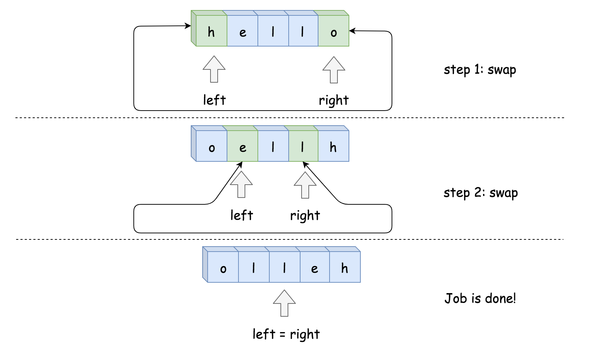
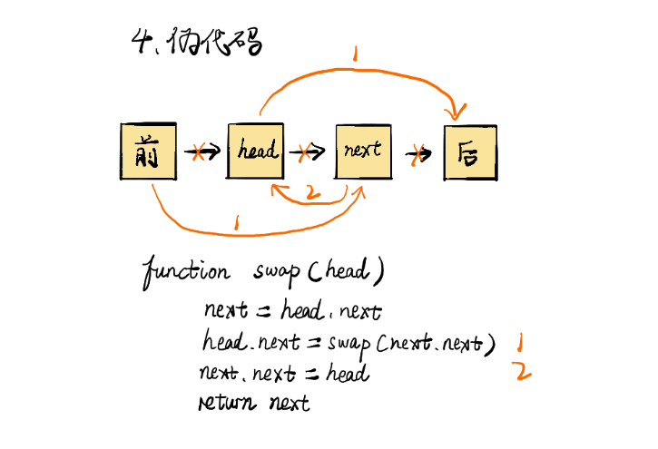

# 目录

- 1. [344. 反转字符串 - 力扣（LeetCode）](https://leetcode-cn.com/problems/reverse-string/) [本地题解](# 344. 反转字符串)
  2. [24. 两两交换链表中的节点 - 力扣（LeetCode）](https://leetcode-cn.com/problems/swap-nodes-in-pairs/) [本地题解](# 24. 两两交换链表中的节点)
  3. 


# 344. 反转字符串


编写一个函数，其作用是将输入的字符串反转过来。输入字符串以字符数组 `char[]` 的形式给出。

不要给另外的数组分配额外的空间，你必须**[原地](https://baike.baidu.com/item/原地算法)修改输入数组**、使用 O(1) 的额外空间解决这一问题。

你可以假设数组中的所有字符都是 [ASCII](https://baike.baidu.com/item/ASCII) 码表中的可打印字符。

**示例 1：**

**输入：**\["h","e","l","l","o"\]
**输出：**\["o","l","l","e","h"]

## 方法一：递归

**算法：**
我们实现递归函数 helper，它接受两个参数：left 左指针和 right 右指针。

- 如果 **left>=right**，不做任何操作。
- 否则交换 s[left] 和 s[right] 和调用 helper(left + 1, right - 1)。
  首次调用函数我们传递首尾指针反转整个字符串 return helper(0, len(s) - 1)。

```java
class Solution {
  public void helper(char[] s, int left, int right) {
    if (left >= right) return;
    char tmp = s[left];
    s[left++] = s[right];
    s[right--] = tmp;
    helper(s, left, right);
  }

  public void reverseString(char[] s) {
    helper(s, 0, s.length - 1);
  }
}
```

**复杂度分析**

- 时间复杂度：$\mathcal{O}(N)$。执行了 N/2 次的交换。
- 空间复杂度：$\mathcal{O}(N)$，递归过程中使用的堆栈空间。	

## 方法二：双指针法
双指针法是使用两个指针，一个左指针 left，右指针 right，开始工作时 left 指向首元素，right 指向尾元素。交换两个指针指向的元素，并向中间移动，直到两个指针相遇。	

 **算法：**

- 将 left 指向首元素，right 指向尾元素。
- 当 left<right：
  - 交换 s[left] 和 s[right]。
  - left++
  - right- -

 

```java
class Solution {
    public void reverseString(char[] s) {
        int left = 0, right = s.length - 1;
        while (left < right) {
            char tmp = s[left];
            s[left++] = s[right];
            s[right--] = tmp;
        }
    }
}
```

**复杂度分析**

*   时间复杂度：$O(N)$ 。执行了 N/2 次的交换。
*   空间复杂度：O(1)，只使用了常数级空间。


# 24. 两两交换链表中的节点


给定一个链表，两两交换其中相邻的节点，并返回交换后的链表。

你不能只是单纯的改变节点内部的值，而是需要实际的进行节点交换。

 

示例:

给定 1->2->3->4, 你应该返回 2->1->4->3.


## 方法一：递归


```java
/**
 * Definition for singly-linked list.
 * public class ListNode {
 *     int val;
 *     ListNode next;
 *     ListNode(int x) { val = x; }
 * }
 */
class Solution {
    public ListNode swapPairs(ListNode head) {

        // If the list has no node or has only one node left.
        if ((head == null) || (head.next == null)) {
            return head;
        }

        // Nodes to be swapped
        ListNode firstNode = head;
        ListNode secondNode = head.next;

        // Swapping
        firstNode.next  = swapPairs(secondNode.next);
        secondNode.next = firstNode;

        // Now the head is the second node
        return secondNode;
    }
}

```

```java
/**
 * Definition for singly-linked list.
 * public class ListNode {
 *     int val;
 *     ListNode next;
 *     ListNode(int x) { val = x; }
 * }
 */
class Solution {
    public ListNode swapPairs(ListNode head) {
        if (head == null) {
            return null;
        }
        return swap(head, head);
    }

    private ListNode swap(ListNode head, ListNode last) {
        if (last == null||last.next == null) {
            return head;
        }
    
        int t = last.val;
        last.val = last.next.val;
        last.next.val = t;
        return swap(head, last.next.next);
    }
}
```

## 方法二：迭代

 https://leetcode-cn.com/problems/swap-nodes-in-pairs/solution/hua-jie-suan-fa-24-liang-liang-jiao-huan-lian-biao/ 

```java
class Solution {
    public ListNode swapPairs(ListNode head) {
        ListNode pre = new ListNode(0);
        pre.next = head;
        ListNode temp = pre;
        while(temp.next != null && temp.next.next != null) {
            ListNode start = temp.next;
            ListNode end = temp.next.next;
            temp.next = end;
            start.next = end.next;
            end.next = start;
            temp = start;
        }
        return pre.next;
    }
}
```



