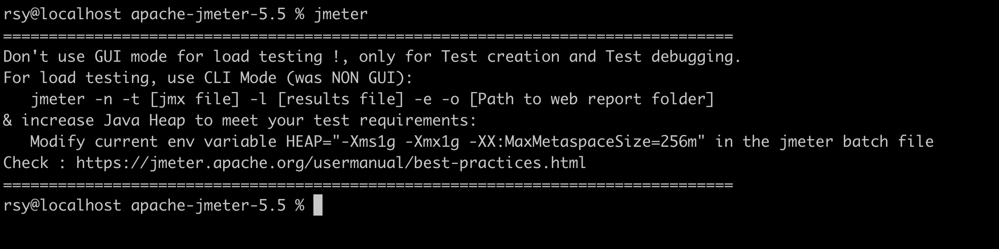

安装Jmeter

[Mac 下安装压力测试工具JMeter_阿甘兄的技术博客_51CTO博客](https://blog.51cto.com/u_15294985/5138658)

启动提示

中文解释：

不要使用GUI模式进行负载测试！此模式仅适用于测试创建和测试调试。
对于负载测试，请使用NON GUI模式：
jmeter -n -t [jmx file] -l [results file] -e -o [Path to web report folder]
并增加Java堆以满足您的测试要求：
在jmeter.bat/jmeter.sh文件修改当前的env变量HEAP =“ - Xms1g -Xmx1g -XX：MaxMetaspaceSize = 256m”
具体请查看官方文档：https://jmeter.apache.org/usermanual/best-practices.html

官方文档中文翻译：[jmeter之最佳实践](https://www.cnblogs.com/zhengna/p/9503764.html)

原因：由于在负载测试时，界面模式会耗费大量的内存，尤其是查看结果树，会依次把每条请求的结果写入内存，降低性能。

解决方式：正式测试时最好使用命令行模式。具体如何使用可参考此篇博客：[Jmeter命令行运行实例讲解](https://www.cnblogs.com/leeboke/p/5238269.html)