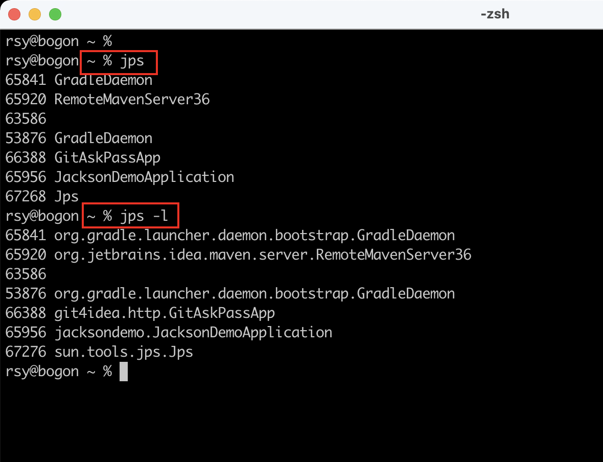
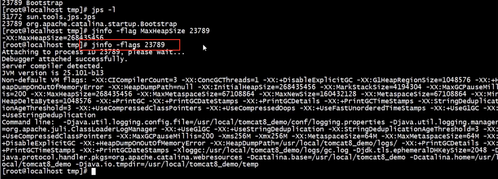
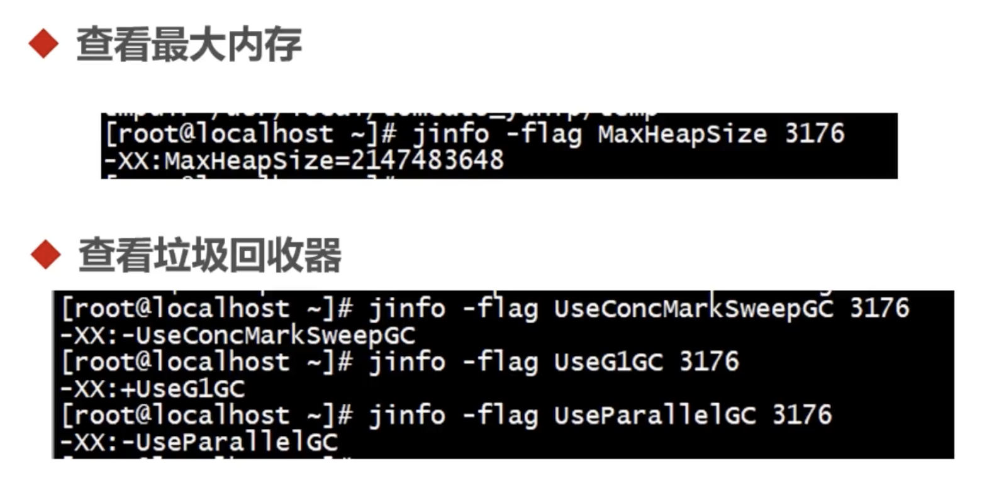

# 调优

## 目录

*   [2-1JVM的参数类型](#2-1jvm的参数类型)

    *   [标准参数](#标准参数)

    *   [X参数](#x参数)

    *   [XX参数](#xx参数)

    *   [-Xmx -Xms -Xss ](#-xmx--xms--xss-)

*   [2-2查看JVM运行时参数](#2-2查看jvm运行时参数)

    *   [用法举例](#用法举例)

    *   [jps](#jps)

    *   [JINFO](#jinfo)

*   [2-3 Jstat查看JVM统计信息](#2-3-jstat查看jvm统计信息)

*   [2-4演示内存溢出](#2-4演示内存溢出)

*   [2-5导出内存映像文件](#2-5导出内存映像文件)

## 2-1JVM的参数类型

### 标准参数

1.  \-help

2.  \-server -client

3.  \-version -showversion

4.  \-cp -classpath

    特点:各个JVM版本稳定(啥是稳定,就是JVM版本更新,这些不会改变) &#x20;

### X参数

(非标准化参数,不稳定)

1.  \-Xint:解释执行

2.  \-Xcomp:第一次使用就编译成本地代码

3.  \-Xmixed:混合模式,JVM自己来决定是否编译成本地代码 &#x20;

### XX参数

(非标准化参数、相对不稳定、主要用于JVM调优、DeBug)

分类:

1.  格式:-XX:\<name>=\<value>表示name属性的值是value

2.  比如:-XX:MaxGCPauseMillis=500 GC最大停顿时间

3.  \-XX:GCTimeRatio=19

4.  Boolean类型

    格式: -XX:\[+-]\<name> 表示启用或者禁用name属性

    比如: -XX:+UseConcMarkSweepGC

    \-XX:+UseG1GC.  +表示启用 -表示不启用

5.  非Boolean类型

### -Xmx -Xms -Xss&#x20;

属于XX参数

\-Xms等价于-XX:InitialHeapSize 初始化堆的大小

\-Xmx等价于-XX:MaxHeapSize 最大的堆大小

\-Xss 线程堆栈的大小

## 2-2查看JVM运行时参数

\-XX:+PrintFlagsInitial 查看所有JVM参数启动的初始值

\-XX:+PrintFlagsFinal 查看JVM最终值,如果某个默认值被新值覆盖，显示新值

\-XX:+UnlockExperimentalVMOptions 解锁实验参数

\-XX:+PrintCommandLineFlags 是打印那些被新值覆盖的项(打印命令行参数)

### 用法举例

`java -XX:+PrintFlagsFinal -version`&#x20;

`java -XX:+PrintFlagsFinal -version | grep ":"` 只查看被修改项

结果:

```java
[Global flags]
uintx AdaptivePermSizeWeight               = 20               {product}
uintx AdaptiveSizeDecrementScaleFactor     = 4                {product}
uintx AdaptiveSizeMajorGCDecayTimeScale    = 10               {product}
....

uintx InitialHeapSize                     := 57505088         {product}
uintx MaxHeapSize                         := 920649728        {product}
uintx ParallelGCThreads                   := 4                {product}
 bool PrintFlagsFinal                     := true             {product}
 bool UseParallelGC                       := true             {product}


```

表格的每一行包括五列，来表示一个参数。第一列表示参数的数据类型，第二列是名称，第四列为值，第五列是参数的类别。第三列"`=`"表示第四列是参数的默认值，而"`:=`" 表明了参数被用户或者JVM赋值了。

`java  -XX:+PrintCommandLineFlags -version`

```text
-XX:InitialHeapSize=536870912 -XX:MaxHeapSize=8589934592 -XX:+PrintCommandLineFlags 
-XX:+UseCompressedClassPointers -XX:+UseCompressedOops -XX:+UseParallelGC
java version "1.8.0_311"
Java(TM) SE Runtime Environment (build 1.8.0_311-b11)
Java HotSpot(TM) 64-Bit Server VM (build 25.311-b11, mixed mode)

```

### jps

学习jinfo之前,先看看jps

专门用来查看Java进程的命令



### JINFO

`jinfo -flag MaxHeapSize 53876`

`jinfo -flags 53876`



jinfo举例



## 2-3 Jstat查看JVM统计信息

可以查看类装载信息

查看垃圾收集信息

JIT编译信息

继续学习

## 2-4演示内存溢出

\-Xmx32M -Xms32M&#x20;

一个 是加JVM参数，让JVM在发生内存溢出时，自动导出内存快照。 -XX:+HeapDumpOnOutOfMemoryError -XX:HeapDumpPath=导出路径 二是 利用jmap命令 来导出命令执行时的内存快照。jmap -dump:format=b,file=导出的文件路径 .hprof  pid

## 2-5导出内存映像文件

1、内存溢出自动导出

在程序运行之前,可以将堆栈设小一点

```text
-Xmx32M -Xms32M 
-XX:+HeapDumpOnOutOfMemoryError
-XX:HeapDumpPath=./ 导出文件的路径
```

2、使用Jmap命令手动导出
