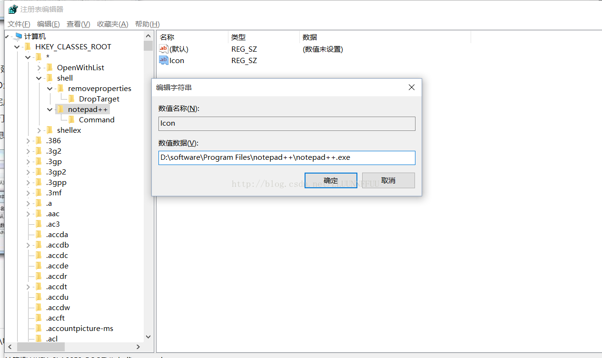
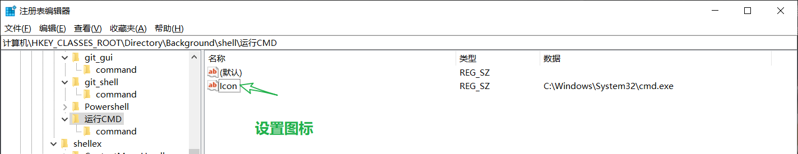

# 1、 windows系统鼠标右键设置

## 1.1  为用右键菜单选择打开此文件的软件

```
计算机\HKEY_CLASSES_ROOT\Directory\Background\shell
```

（1）【以添加notepad++程序为例】选择`HKEY_CLASSES_ROOT → * → shell`，选中shell文件夹，点击鼠标右键，新建->项，命名为：notepad++；

（2）【为右键菜单添加图标】选中Notepad++文件夹，点击右键，新建->字符串值(S)，命名为：Icon；修改数值数据为："D:\Program Files (x86)\Notepad++\notepad++.exe"，即notepad++.exe文件所在的位置。对于桌面快捷方式的图标，可以通过属性->快捷方式->目标来确定具体位置。

 （3）【为右键菜单项添加运行程序】选中Notepad++文件夹，新建->项，命名为：Command，选中Command右侧的默认子项，修改数值数据为："D:\Program Files (x86)\Notepad++\notepad++.exe" "%1"，（注意：" "中间的两个冒号之间有一个空格）点击确定。至此，配置完成。选中一个.txt文件，鼠标右击，可以看到Notepad++的图标，左击该图标，就可以打开文件了，非常方便。其他的软件图标添加到右键也是类似的方法，只需要将相应的信息修改一下即可。 


 （4）到此，为文件右键菜单添加打开运用程序已经完成。 


## 1.2 为空白处右键菜单添加启动


 （1）【以添加CMD为例】依次找到：`HKEY_CLASSES_ROOT(这个项下面有很多项，请请耐心找到下面 的  Directory)  -> Background ->shell` ，然后新建 ->项,命名为：CMD。此一栏添加的应用程序是作为空白处时执行的。 


2）【为右键菜单CMD图标】选中CMD文件夹，点击右键，新建->字符串值(S)，命名为：Icon；修改数值数据为："C:\Windows\System32\cmd.exe"，即cmd.exe文件所在的位置。



（3）【为右键菜单CMD添加应用程序】【注意：此步骤的不同点来了】选中CMD文件夹，新建->项，命名为：Command，选中Command右侧的默认子项，修改数值数据为："C:\Windows\System32\cmd.exe"


（4）【效果如下】


# 2、使用键盘快速打出各种序号、符号、生僻字【搜狗输入法】


参考——[V 模式中文数字(包括金额大写) - 搜狗输入法](https://pinyin.sogou.com/help.php?list=3&q=10)

## 2.1  输入**序号**：

输入一些不常见的序号，可以在键盘上点击“**v2**”，即可自动出现数字序号，点击“+”、“-”可以翻页，并最终选择所需的符号。


## 2.2  输入**符号**：

在键盘上输入“**v1**”，输入框中即可自动出现各类符号


## 2.3  特殊符号快捷入口v1-v9

只需输入v1-v9就可以像打字一样翻页选择想要的特殊字符了。v1-v9代表的特殊符号快捷入口分别是：

```
v1 标点符号
v2 数字序号
v3 数学单位
v4 日文平假名
v5 日文片假名
v6 希腊/拉丁文
v7 俄文字母
v8 拼音/注音
v9 制表符 
```

# 3、设置Windows 10 开机默认开启NUMLOCK

> 对于设置了开机密码的用户，一般开机时NUMLOCK默认关闭，无法直接输入数字，这种日复一复先点击`NUMLOCK`再输入数字密码的体验十分糟糕。下面是解决方案。

1. 键盘点击 `Win + R`，输入`regedit` 进入注册表；
2. 找到 `HKEY_USERS\.DEFAULT\Control Panel\Keyboard` 目录；
3. 将 `InitialKeyboardIndicators` 的数值改为`80000002`。

最后一位数值与功能的对应关系如下：

| 值   | 作用                       |
| ---- | -------------------------- |
| 0    | 关闭全部锁定               |
| 1    | 单独开启大写锁定CapsLock   |
| 2    | 单独开启数字锁定NumLock    |
| 3    | 开启大写和数字锁定         |
| 4    | 单独开启滚动锁定ScrollLock |
| 5    | 开启大写和滚动锁定         |
| 6    | 开启数字和滚动锁定         |
| 7    | 3开启全部锁定、            |