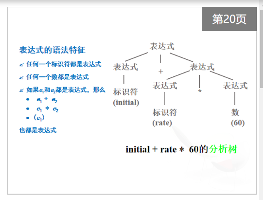

遍

编译阶段也常常划分为两大步骤，百度分析步骤和综合步骤 

  分析步骤是指对源程序的分析  

 －线性分析(词法分析或扫描)  

 －层次分析(语法分析)

  －语义分析 
  综合步骤是指后端的工作，为目标程序的生成而进行的综合  
  你分析过吗？若按照这种组合方式实现编译程序，可以设想，某一编译程序的前端加上相应不同的后端则可以为不同的机器构成同一个源语言的编译程序。也可以设想，不同语言编译的前端生成同一种中间语言，再使用一个共同的后端，则可为同一机器生成几个语言的编译程序。   
  一个编译过程可由一遍、两遍或多遍完成。所谓"遍"，也称作"趟"，是对源程序或其等价的中间语言程序从头到尾扫视并完成规定任务的过程。每一遍扫视可完成上述一个阶段或多个阶段的工作。例如一遍可以只完成词法分析工作；一遍完成词法分析和语法分析工作；甚至一遍完成整个编译工作。对于多遍的编译程序，第一遍的输入是用户书写的源程序，最后一遍的输出是目标语言程序，其余是上一遍的输出为下一遍的输入。  
  在实际的编译系统的设计中，编译的几个阶段的工作究竟应该怎样组合，即编译程序究竟分成几遍，参考的因素主要是源语言和机器(目标机)的特征。比如源语言的结构直接影响编译的遍的划分；像PL/1或ALGOL 68 那样的语言，允许名字的说明出现在名字的使用之后，那么在看到名字之前是不便为包含该名字的表达式生成代码的，这种语言的编译程序至少分成两遍才容易生成代码。另外机器的情况，即编译程序工作的环境也影响编译程序的遍数的划分。遍数多一点，整个编译程序的逻辑结构可能清晰些，但遍数多即意味着增加读写中间文件的次数，势必消耗较多时间，一般会比一遍的编译要慢。 
